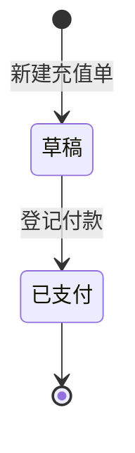
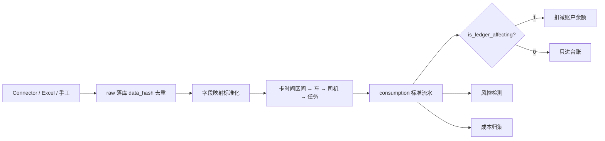

# 能源中心 - 产品方案与功能设计

> 上级文档：[00.模块总览](00.模块总览.md)
>
> 数据落库见 [02.数据与账本设计](02.数据与账本设计.md)
>
> **文档状态**：已落地（一期）
>
> **最近更新**：2026-08-15

## 一、推荐使用路径

先建主数据，再动资金，最后才有可对账的消费：

没有账户就充值、没有卡绑定就匹配，都会把流水堆进异常池。设置页应先于日常作业完成。

## 二、页面与职责

前端目录 `frontend/client/src/views/energy/<page>/index.vue`，API 封装 `src/api/energy/`。二级菜单图标 `sub-energy-*.svg`，总览配置 `config/module-overview/energy.ts`。

| 页面 | path | 用户在做什么 | 关键动作 |
|------|------|-------------|---------|
| 模块总览 | `/energy`（自动注入） | 看模块在管什么、先去哪 | 快捷入口：账户、消费 |
| 能源账户 | `/energy/account` | 看各供应商余额、冻结、调账 | 新增账户、调账、查看流水 |
| 能源卡 | `/energy/card` | 管卡号、挂账户、绑车/人 | 新增、绑定（写历史区间，不覆盖） |
| 充值管理 | `/energy/recharge` | 登记向供应商打的钱 | 新增草稿、提交、登记付款（入账） |
| 能源消费 | `/energy/consumption` | 看加油/加气/充电流水 | 手工录入、按来源渠道区分垫付 |
| 数据接入 | `/energy/connector` | 配 Excel / 手工 / HTTP 样板 | 上传导入、触发拉取 |
| 能源对账 | `/energy/recon` | 账户余额对账或流水对账 | 生成对账单、处理差异、结清 |
| 异常中心 | `/energy/exception` | 处理风控命中与未匹配流水 | 处理 / 忽略 |
| 成本分析 | `/energy/analysis` | 看钱花在哪、会不会沉淀 | KPI + 单车/供应商对比图 |
| 供应商与站点 | `/energy/supplier` | 维护对手方与加油点 | 供应商 CRUD、站点 |
| 能源设置 | `/energy/setting` | 商品、车辆档案、风控阈值 | 商品 / 档案 / 规则 |

分析页顶部固定说明：**油补是付给司机的补贴，能源消费是付给供应商的能源费，两笔钱不重复。** 消费列表按 `source_channel` 区分；垫付类须能看出「已在任务费用单计成本，此处仅作台账」。

## 三、主流程

### 3.1 充值入账

一期不走审批中心、不进出纳打款批次。登记付款时：

1. 记录付款银行账户快照与回单号；
2. 调用 `EnergyLedgerService.post(txn_type=充值)` 增加账面余额；
3. 回写 `ledger_txn_id`。

充值**不计能源成本**（预付）。钱只是从公司银行到供应商账户，成本发生在消费确认。

### 3.2 消费入账

匹配优先级：

1. 能源卡：按**消费时间**查 `biz_energy_card_binding` 的 `[start_time, end_time]`，还原当时绑的车/人；
2. 车牌号；
3. 司机；
4. 任务：车辆匹配且消费时间落在任务时间区间。

结果写 `match_status`（`MATCHED` / `PARTIAL` / `UNMATCHED` / `CONFLICT`）和 `match_trace_json`。未匹配进异常池，供人工指派。

幂等：优先 `external_transaction_id`；供应商不给唯一 ID 时用 `hash(supplier + card_no + txn_time + amount + quantity + station)` 落 `data_hash` 唯一索引。

### 3.3 对账

两层，不要混在一张单里：

| 类型 | `recon_type` | 比什么 |
|------|--------------|--------|
| 账户余额对账 | 1 | 系统 `ledger_balance` vs 供应商侧余额 |
| 消费流水对账 | 2 | 系统消费 vs 外部账单行 |

明细结果：`MATCHED` / `MISSING_INTERNAL` / `MISSING_EXTERNAL` / `AMOUNT_DIFF` / `QTY_DIFF` / `DUPLICATED`。差异可确认、调账或忽略后结清对账单。

### 3.4 风控

阈值在 `biz_energy_rule` 可配，禁止写死在代码里。一期规则：

| 规则编码 | 检测什么 |
|----------|---------|
| `OVER_TANK` | 单次加注超过油箱/气瓶容量 × 阈值倍数 |
| `REPEAT_FILL` | 短时间窗内同一车/卡重复加注 |
| `ABNORMAL_PRICE` | 单价相对近期均价偏离超过比例 |
| `ABNORMAL_CONSUMPTION` | 百公里能耗相对车辆档案标准值偏离 |
| `UNBOUND_VEHICLE` | 消费车辆不在该卡当时绑定区间 |
| `UNBOUND_DRIVER` | 消费司机不在该卡当时绑定区间 |

命中写入 `biz_energy_exception`，状态 `pending` / `processed` / `ignored`。

### 3.5 分析指标

| 指标 | 算法（一期） | 注意 |
|------|-------------|------|
| 账面 / 可用余额 | 账户表汇总 | 可用余额不落库 |
| 本月充值 / 消费 | 当月流水 / 入账消费 | 消费只计 `is_ledger_affecting=1` |
| 预计可用天数 | 账面余额 ÷ 本月日均消费 | 日均为 0 则空 |
| 单车能源成本 | 归集表按 vehicle 汇总 | 百公里成本 = 金额 / 里程 × 100，里程为 0 则空 |
| 供应商对比 | 归集表按 supplier | 余额 / 日均消费 > 60 天标「资金沉淀偏高」 |
| 周转率 | 区间消费 ÷ 日均账面余额 | 依赖每日快照，无快照时退化 |

Worker 每日 01:10 刷新余额快照与成本归集。分析页用 ECharts 5 + `v-chart`。

## 四、连接器产品策略

真实三方（中石油、中石化、万金油、G7）接口各不相同，一期不承诺「接上就能拉账单」。产品上只提供：

| 连接器 | 用户感知 | 实现 |
|--------|---------|------|
| Excel 账单导入 | 下载模板、上传文件 | `ExcelConnector` |
| 手工录入 | 表单记一笔 | `ManualConnector` |
| HTTP 对接 | 配置地址 / 鉴权 / 字段映射（给实施用） | `HttpApiConnectorTemplate` 样板，含分页、游标、重试 |

Connector **只负责取原始数据**。标准化一律走 `normalizer.py` + `field_mapping_json`，供应商差异尽量收敛在配置。新供应商：复制 HTTP 样板，注册一个 `connector_code`，不要改消费主链路。

## 五、权限与文案

权限点随菜单入库（`energy:account:list` 等），页面按钮跟菜单码走。面向用户的 Toast / 空态 / `BizException` 用业务口吻，不出现接口失败、字段名、状态码。

推荐：

| 场景 | 文案 |
|------|------|
| 充值入账中 | 正在登记充值，请稍候… |
| 仅草稿可付款 | 只有草稿状态的充值单才能登记付款 |
| 预付账户余额不足 | 这个账户余额不够扣，请先充值或改用调账 |
| 导入重复 | 这几笔账单系统里已经有了，已自动跳过 |

## 六、验收清单（运维 / 测试）

- [ ] 专业版侧边栏可见「能源中心」及 10 个二级页；标准版仅账户相关页（供应商 / 账户 / 卡 / 充值 / 设置）
- [ ] 充值登记付款后，账户账面余额增加，流水 `txn_type=充值`，且 `ledger_balance == Σ delta`
- [ ] 同一笔 Excel 再导一次，raw 因 `data_hash` 去重，不重复扣账
- [ ] 卡先绑 A 车三个月，再改绑 B 车：三个月前的消费仍匹配到 A
- [ ] 司机垫付流水出现在消费列表，账户余额不变，归集金额不含该笔
- [ ] 分析页能读到油补 vs 能源费说明
- [ ] 独立容器 `zhitu-backend-energy-worker` 在 compose 中存在；API 进程默认不内嵌跑同步（`ENERGY_SYNC_WORKER_ENABLED` 默认关）
