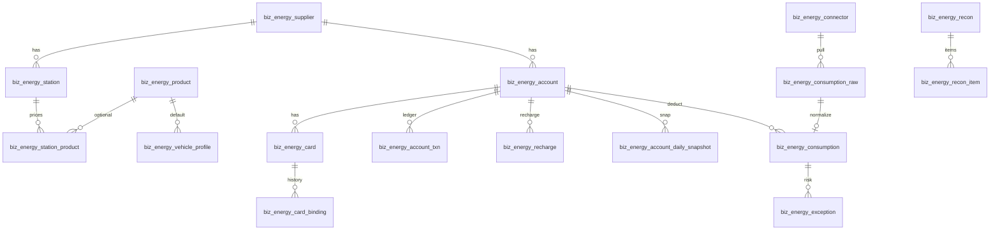

# 能源中心 - 数据与账本设计

> 上级文档：[00.模块总览](00.模块总览.md)
>
> 产品流程见 [01.产品方案与功能设计](01.产品方案与功能设计.md)
>
> 本文回答：20 张表怎么分域、余额为什么只能由流水改、消费如何去重与匹配、迁移和线上运维看什么。
>
> **适用技术栈**：MySQL 8 + SQLAlchemy 2.0 异步；全部落**租户库** `zt_biz_{tenant_code}`（开发环境带 `_ci` 后缀）
>
> **文档状态**：已落地（一期）
>
> **最近更新**：2026-08-15
>
> **事实源**：`backend/app/modules/client/models/energy/`。改 ORM 必须走 `scripts.migration.check` → `autogen tenant` → `runner` 实际应用，并更新 `scripts/migration/snapshots/tenant_schema.json`。

## 一、分库与基类

| 约定 | 说明 |
|------|------|
| 库 | 只写租户库。身份在平台库，能源业务按租户物理隔离 |
| 无 `tenant_id` | 本系统分库隔离，参考方案里的租户列全部删除 |
| 基类 | `TenantModelBase`：`id` / `created_at` / `updated_at` / `is_deleted`。下文字段表不再重复这四列 |
| 层级 | 全部 `__table_tier__ = business`，由 feature `required_tables` 在 runner Phase 1 建表 |
| 单据 mixin | 充值单、对账单继承 `FinanceDocBaseMixin`（`doc_no` / `status` / 审批人时间 / `pay_method` / `is_locked` / `idempotency_key` 等），`doc_kind` 分别为 `energy_recharge`、`energy_recon` |

标准状态码（mixin）：`0` 草稿 `1` 待审批 `2` 已审批 `3` 已支付 `4` 已撤销 `5` 已结清。一期充值常用 0→3。

## 二、表清单（20）

| # | 表名 | 中文 | 域 | 写入特征 |
|---|------|------|----|---------|
| 1 | `biz_energy_supplier` | 能源供应商 | 主数据 | CRUD |
| 2 | `biz_energy_station` | 能源站点 | 主数据 | CRUD |
| 3 | `biz_energy_station_product` | 站点商品结算价 | 主数据 | 按站点替换当前价 |
| 4 | `biz_energy_product` | 能源商品 | 主数据 | CRUD |
| 5 | `biz_energy_vehicle_profile` | 车辆能源档案 | 主数据 | 按 `vehicle_id` upsert |
| 6 | `biz_energy_account` | 能源账户 | 账户介质 | 余额字段禁止业务直接 UPDATE |
| 7 | `biz_energy_card` | 能源卡 | 账户介质 | CRUD |
| 8 | `biz_energy_card_binding` | 卡绑定历史 | 账户介质 | 只追加区间，解绑写 `end_time` |
| 9 | `biz_energy_account_txn` | 资金流水 | 资金账本 | **append-only** |
| 10 | `biz_energy_recharge` | 充值单 | 资金账本 | 单据状态机 |
| 11 | `biz_energy_account_daily_snapshot` | 每日余额快照 | 资金账本 | worker 按日 upsert |
| 12 | `biz_energy_consumption_raw` | 消费原始层 | 消费 | 只增；`data_hash` 唯一 |
| 13 | `biz_energy_consumption` | 标准消费流水 | 消费 | 标准化后写入 |
| 14 | `biz_energy_connector` | 连接器实例 | 接入 | 含映射与游标 |
| 15 | `biz_energy_sync_task` | 同步任务队列 | 接入 | 形态对齐 `biz_cost_calc_task` |
| 16 | `biz_energy_recon` | 对账单 | 对账风控 | 单据 |
| 17 | `biz_energy_recon_item` | 对账明细 | 对账风控 | 随对账单生成 |
| 18 | `biz_energy_rule` | 风控规则 | 对账风控 | 阈值可配 |
| 19 | `biz_energy_exception` | 异常记录 | 对账风控 | 形态对齐成本计算异常 |
| 20 | `biz_energy_cost_allocation` | 成本归集 | 归集 | worker 增量刷新 |



逻辑外键用 `BigInteger` 存 ID，**不建数据库 FK**（与租户库现有习惯一致，避免跨模块删档级联）。

## 三、记账内核（运维必读）

对标驾驶员资金账户：余额不是可以手改的字段。

| 规则 | 实现 |
|------|------|
| 唯一入口 | `EnergyLedgerService.post()` |
| 锁 | `SELECT ... FOR UPDATE` 锁账户行 |
| 恒等式 | `ledger_balance == Σ delta`（未软删流水） |
| 快照 | 每笔写 `balance_before` / `balance_after` |
| 纠错 | **禁止 UPDATE 流水**；只能 `reverse()` 再记一笔反向冲正 |
| 冻结 | `txn_type` 冻结/解冻只改 `frozen_amount`，不改账面 |
| 调账 / 冲正 | 调用方传入**带符号** `amount`，作为 `delta` |
| 允许为负 | 仅 `POSTPAID` / `CREDIT`；预付账户扣成负数应被服务拒绝 |

`available_balance`、`diff_amount` 是 Python `@property`，**不要加列**，否则会出现第三份余额。

流水类型：

| 值 | 含义 | 账面 delta 符号 |
|----|------|----------------|
| 1 充值 | 向供应商打款入账 | + |
| 2 消费 | 加油等扣款 | − |
| 3 退款 | 退回账户 | + |
| 4 / 5 转入转出 | 账户间 | + / − |
| 6 调账 | 人工 | 调用方符号 |
| 7 冲正 | 冲原流水 | 原 delta 取反 |
| 8 / 9 冻结解冻 | 可用余额 | 账面 0 |
| 10 手续费 | 扣费 | − |

并发：同一账户两笔扣减必须串行在行锁上。单元测试见 `backend/tests/client/test_energy_ledger.py`。

## 四、消费管线与归集

1. Connector `fetch` → `biz_energy_consumption_raw`（`data_hash` 冲突视为重复，不抛业务事故）。
2. `normalizer` 按 `field_mapping_json` 映到标准字段。
3. `matcher` 写 `match_status` / `match_trace_json`。
4. 落 `biz_energy_consumption`；`is_ledger_affecting=1` 才 `post(消费)`。
5. `risk_engine` 写异常；`allocation_service` 刷新归集。

归集表按 `(dimension, dimension_id, period_start, energy_type)` 唯一。`amount` **只含入账消费**。`EnergyQueryAdapter` 与分析页都读这张表，避免每次扫全量流水。

`source_channel`：`1` 直连 `2` Excel `3` 手工 `4` 司机垫付引用 `5` 月结账单。

## 五、字段说明

下列省略基类四列。类型按 ORM。

### 5.1 主数据

**`biz_energy_supplier`**

| 字段 | 类型 | 说明 |
|------|------|------|
| `supplier_code` | varchar(64) UK | 租户内唯一 |
| `supplier_name` | varchar(128) | |
| `supplier_type` | smallint | 1 石油石化 2 燃气 3 充电 4 能源平台 5 民营油站 9 其他 |
| `status` | smallint | 0 停用 1 正常 |
| `contact_name` / `contact_phone` | varchar | 可空 |
| `remark` | varchar(500) | |

**`biz_energy_station`**

| 字段 | 类型 | 说明 |
|------|------|------|
| `supplier_id` | bigint | |
| `station_code` | varchar(64) | 与 supplier 组成唯一 |
| `station_name` | varchar(128) | |
| `address` | varchar(255) | |
| `longitude` / `latitude` | numeric(10,6) | 异常地点风控预留 |
| `status` / `remark` | | |

索引：`uk_energy_station_code(supplier_id, station_code)`，`idx_energy_station_supplier`。

**`biz_energy_station_product`**

| 字段 | 类型 | 说明 |
|------|------|------|
| `station_id` | bigint | |
| `energy_type` | varchar(16) | `OIL` / `GAS` / `ELECTRIC` / `OTHER` |
| `product_id` | bigint | 0 表示按能源类型定价；非 0 指向 `biz_energy_product` |
| `product_name` | varchar(128) | 名称快照 |
| `settlement_price` | numeric(18,4) | **供应商给我们的当前结算单价**，一期不记历史 |
| `unit` | varchar(16) | `L` / `kg` / `kWh` |
| `status` / `remark` | | |

唯一：`uk_energy_station_product(station_id, energy_type, product_id)`。保存站点时按该键 upsert。

**`biz_energy_product`**

| 字段 | 类型 | 说明 |
|------|------|------|
| `energy_type` | varchar(16) | `OIL` / `GAS` / `ELECTRIC` / `OTHER` |
| `product_code` | varchar(64) UK | |
| `product_name` | varchar(128) | 如 0#柴油、LNG |
| `standard_unit` | varchar(16) | `L` / `kg` / `m3` / `kWh` |
| `status` / `remark` | | |

**`biz_energy_vehicle_profile`**

| 字段 | 类型 | 说明 |
|------|------|------|
| `vehicle_id` | bigint UK | `biz_vehicle.id`，只读引用 |
| `energy_type` | varchar(16) | 运输车辆自身燃料 |
| `default_product_id` | bigint | |
| `tank_capacity` | numeric(10,2) | 油箱/气瓶 |
| `battery_capacity` | numeric(10,2) | kWh |
| `standard_consumption_per_100km` | numeric(10,3) | 风控与百公里对比用 |
| `remark` | varchar(255) | |

### 5.2 账户与介质

**`biz_energy_account`**

| 字段 | 类型 | 说明 |
|------|------|------|
| `account_code` | varchar(64) UK | |
| `account_name` | varchar(128) | |
| `supplier_id` | bigint | |
| `energy_type` | varchar(16) | |
| `account_type` | varchar(16) | `PREPAID` / `POSTPAID` / `CREDIT` / `CARD_POOL` / `VIRTUAL` |
| `external_account_no` | varchar(128) | 供应商侧账号 |
| `currency` | varchar(8) | 默认 CNY |
| `ledger_balance` | numeric(18,2) | **仅 ledger 服务改** |
| `supplier_balance` | numeric(18,2) | 对账用，可空 |
| `frozen_amount` | numeric(18,2) | |
| `status` | smallint | 0 停用 1 正常 2 冻结 3 已关闭 |
| `last_sync_time` / `last_txn_at` | datetime | |
| `remark` | varchar(500) | |

**`biz_energy_card`**：`account_id`，`card_no` UK，`external_card_id`，`card_type`，`energy_type`，`status`（0 停用 1 正常 2 冻结 3 已注销 4 挂失 5 未激活），`valid_from` / `valid_to`。

**`biz_energy_card_binding`**：`card_id`，`vehicle_id`，`driver_id`，`start_time` 必填，`end_time` 空=当前有效，`status` 0 已解绑 1 绑定中。索引 `(card_id, start_time)`。

### 5.3 资金账本

**`biz_energy_account_txn`**

| 字段 | 类型 | 说明 |
|------|------|------|
| `account_id` | bigint | |
| `txn_no` | varchar(50) UK | 系统生成 |
| `txn_type` | smallint | 见第三节 |
| `amount` | numeric(18,2) | 正数，展示用 |
| `delta` | numeric(18,2) | 账面带符号变动 |
| `frozen_delta` | numeric(18,2) | |
| `balance_before` / `balance_after` | numeric(18,2) | |
| `external_txn_id` | varchar(128) | |
| `biz_type` / `biz_id` | | `recharge` / `consumption` / `manual` |
| `reversed_txn_id` | bigint | 被冲正的原流水 |
| `transaction_time` | datetime | 业务发生时间 |
| `operator_id` / `operator_name` | | |
| `remark` | varchar(512) | |

索引：`(account_id, created_at)`，`external_txn_id`，`(biz_type, biz_id)`。

**`biz_energy_recharge`**：mixin 字段 + `account_id`，`supplier_id`，`recharge_time`，`bank_account_id`，`bank_account_label`，`payment_reference`，`ledger_txn_id`。银行账户只记录，不驱动出纳。

**`biz_energy_account_daily_snapshot`**：唯一 `(account_id, snapshot_date)`。期初/当日充值/消费/退款/调账/期末/供应商侧/冻结。缺这张表，周转率和沉淀资金只能扫全量流水。

### 5.4 消费与接入

**`biz_energy_consumption_raw`**：`supplier_id`，`connector_id`，`external_transaction_id`，`raw_data` JSON，`data_hash` varchar(64) **UK**，`process_status`（pending/processed/duplicate/failed），`error_message`，`received_at`，`processed_at`，`consumption_id`。

**`biz_energy_consumption`**（核心表）

| 字段 | 说明 |
|------|------|
| `consumption_no` | UK |
| `supplier_id` / `station_id` / `station_name` | 站点名快照 |
| `account_id` / `card_id` / `card_no` | |
| `vehicle_id` / `plate_number` | 车牌快照 |
| `driver_id` / `driver_name` | |
| `task_id` / `waybill_id` / `route_id` | 只读引用，可空 |
| `energy_type` / `energy_product_id` / `product_name` | |
| `quantity` numeric(18,4) / `unit` / `unit_price` numeric(18,6) / `amount` | |
| `mileage` / `odometer` | 分析分母；任务表无里程字段 |
| `consumption_time` | |
| `external_transaction_id` | |
| `source_channel` | 1–5 |
| `is_ledger_affecting` | 垫付必须为 0 |
| `match_status` / `match_trace_json` | |
| `recon_status` / `exception_status` | |
| `raw_id` / `ledger_txn_id` | |

**`biz_energy_connector`**：`connector_code`（`excel` / `manual` / `http_api`），`connector_name`，`supplier_id`，`account_id`，`auth_config_json`（一期明文 JSON，二期加密），`field_mapping_json`，`sync_mode`（realtime/interval/cron/manual），`cron`，`last_success_cursor`，`last_sync_time`，`last_error`，`status`。

**`biz_energy_sync_task`**：`task_type`（pull/import/normalize/allocate/snapshot），`connector_id`，`target_type` / `target_id`，`status`，`priority`，`retry_count` / `max_retry_count`，`error_message`，`payload_json`，`started_at` / `finished_at`。索引 `(status, priority, created_at)`。

### 5.5 对账、风控、归集

**`biz_energy_recon`**：mixin + `account_id`，`supplier_id`，`recon_type`（1 余额 2 流水），`external_amount` / `internal_amount` / `difference_amount`，`matched_count` / `diff_count`。

**`biz_energy_recon_item`**：`recon_id`，`consumption_id`，`external_transaction_id`，内外部金额与差异，`recon_result`，`process_status`（pending/confirmed/adjusted/ignored）。

**`biz_energy_rule`**：`rule_code`，`rule_name`，`energy_type`（空=全部），`threshold_value`，`extra_config_json`，`risk_level`，`status`。

**`biz_energy_exception`**：`consumption_id`，`account_id`，`exception_type`，`risk_level`，`exception_message`，`context_json`，`status`，`processor_id`，`processed_at`，`process_remark`。

**`biz_energy_cost_allocation`**：`dimension`（vehicle/driver/task/waybill/route/supplier），`dimension_id`，`period_start` / `period_end`，`energy_type`，`amount`，`quantity`，`mileage`，`record_count`。唯一键 `(dimension, dimension_id, period_start, energy_type)`。

## 六、feature 与建表

`sys_product_feature.required_tables`（快照 `platform_sync/snapshots/product_feature.json`）：

| feature | 表 |
|---------|----|
| `energy_account` | supplier, station, product, vehicle_profile, account, card, card_binding, account_txn, recharge, account_daily_snapshot |
| `energy_consumption` | consumption_raw, consumption, connector, sync_task, cost_allocation |
| `energy_recon` | recon, recon_item |
| `energy_risk` | rule, exception |
| `energy_analysis` | account_daily_snapshot, cost_allocation（与上表并集，重复无妨） |

runner Phase 1 按租户已开通版本的并集 `create_all` 缺表。versioned 迁移 `scripts/migration/versions/20260814_003_energy_center.py` 对新建表是空操作（刻意避免与 Phase 1 重复 DDL），**必须先 seed feature，再跑 runner**，否则专业版租户会缺表。

本地自检：

```bash
cd backend
python -m scripts.migration.check          # 须 0
python -m scripts.migration.runner --dry-run
python scripts/seed/seed_product_features.py
python scripts/seed/seed_client_menus.py --insert-only
```

## 七、运维注意

| 项 | 说明 |
|----|------|
| Worker 进程 | compose service `backend-energy-worker`，命令 `python -m app.workers.energy_sync_main`。只改代码不改 compose = 线上永远不跑（`cost_calc_main` 曾漏过） |
| 环境变量 | `ENERGY_SYNC_WORKER_ENABLED`（独立进程用 `start_force`，API 进程默认 0）、`_INTERVAL`（秒，默认 30）、`_BATCH`（默认 10） |
| 日批 | cron 01:10 快照 + 归集 |
| 表缺失 | worker 扫 `sys_tenant.db_initialized=1`，缺表静默跳过并记住，避免刷错误日志 |
| 软删 | 流水与 raw 业务上视为不可改；`is_deleted` 仅防误操作，对账与 Σ delta 必须排除已删行 |
| 鉴权 JSON | `auth_config_json` 一期未加密，生产对接前要补加密，不要把密钥打进日志 |
| 菜单 | 事实源 `platform_sync/snapshots/client_menu.json`，id 1284–1324；改菜单必须 seed 入库，只改快照本地看不见 |

排查余额不对：先按账户 `SUM(delta)` 对 `ledger_balance`，再查是否有人绕过 `EnergyLedgerService` 改了账户行。有绕过就是事故，应补冲正而不是再 UPDATE 余额。
