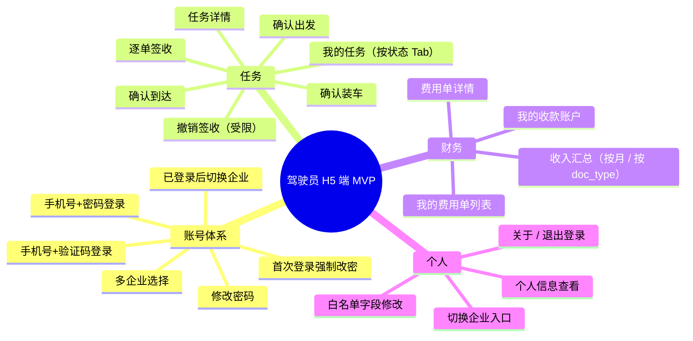
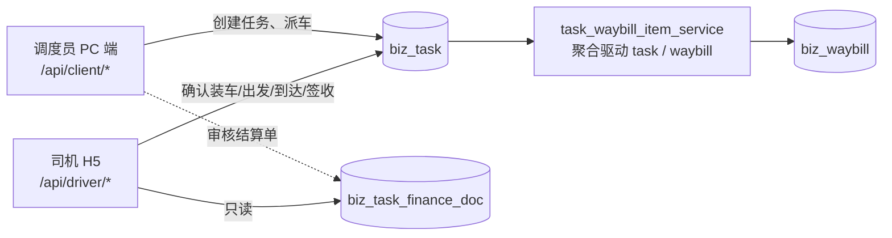
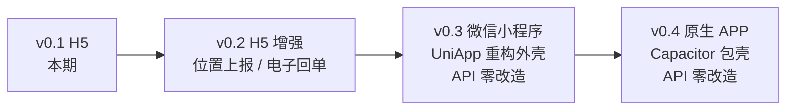

# 驾驶员 H5 端 - 模块总览

## 一、定位

智途驾驶员 H5 端是面向 **驾驶员（`user_type=3`）** 的轻量级移动端应用，
解决"运输任务流转过程中司机的查看与操作"问题。一期目标：

- 司机能在手机上看到属于自己的任务清单
- 能依次完成「装车 → 出发 → 到达 → 逐单签收」全流程
- 能查看本企业内的预付/补款/结算费用单，了解收入与未结算金额
- 能在多个雇佣企业之间安全切换，业务/财务数据完全隔离

## 二、技术栈与端口

| 维度 | 选型 |
|------|------|
| 框架 | Vue 3.5 + TypeScript 5.9 |
| 构建 | Vite 7.1 |
| UI | Vant 4.x（移动端社区主流） |
| 状态 | Pinia 3 |
| 路由 | Vue Router 4 |
| HTTP | Axios 1.12 |
| 工程 | 已加入 frontend/ pnpm monorepo，子包 `zhitu-driver-h5` |
| 端口 | 5176（避开 console=5173 / client=5174 / website=5175） |
| API 基路径 | `/api/driver` |

## 三、范围（v0.1 MVP）

## 四、与企业端（运营端）的协同关系

- **任务来源**：任务由调度员在 PC 端创建/派车，司机端**不允许创建任务**
- **状态联动**：司机端所有动作均通过 **薄层包装** `client/services/task/*`
  现有 Service 推进；状态机、聚合规则与 PC 端共享一份代码
- **财务可见性**：司机仅能看到 `payee_type=1 AND payee_id=当前 driver_id`
  的费用单，金额、明细均由 PC 端结算流程生成

## 五、远期演进路径

- 所有 `/api/driver/*` 接口在设计上就是"通用移动端接口"，**与前端壳无关**
- 远期 UniApp 小程序 / Capacitor APP 仅替换"展示层"，业务层共享

## 六、关键风险与对策

| 风险 | 对策 |
|------|------|
| 司机误操作导致状态推进 | 所有写操作弹窗二次确认；撤销签收受限（需 `operation:task:revert-sign`） |
| 多企业切换数据串扰 | JWT 必带 `tenant_code` + `TenantMiddleware` 自动切库；切换时清空前端 task store |
| 私人手机网络弱 | 关键写接口幂等；前端配合 Vant `Toast` + `disabled` 防重复 |
| 财务数据泄露 | 后端 `DriverContext.driver_id` 锁定，所有 finance 查询硬过滤 payee_id |
