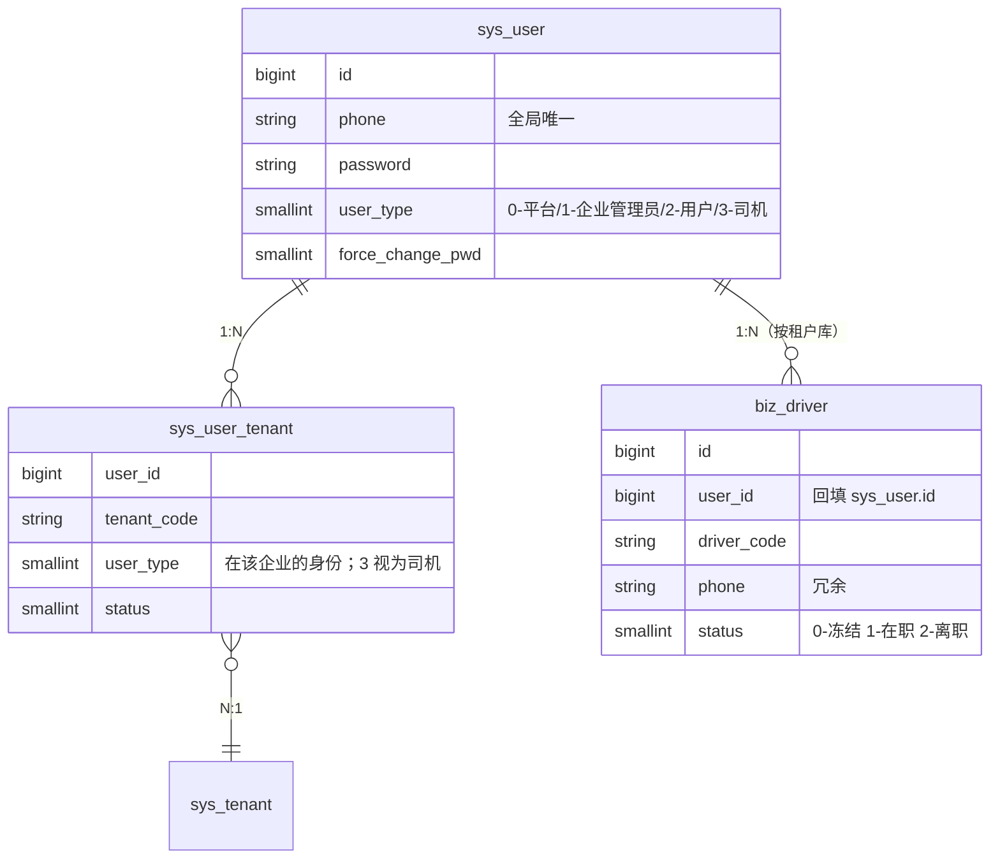
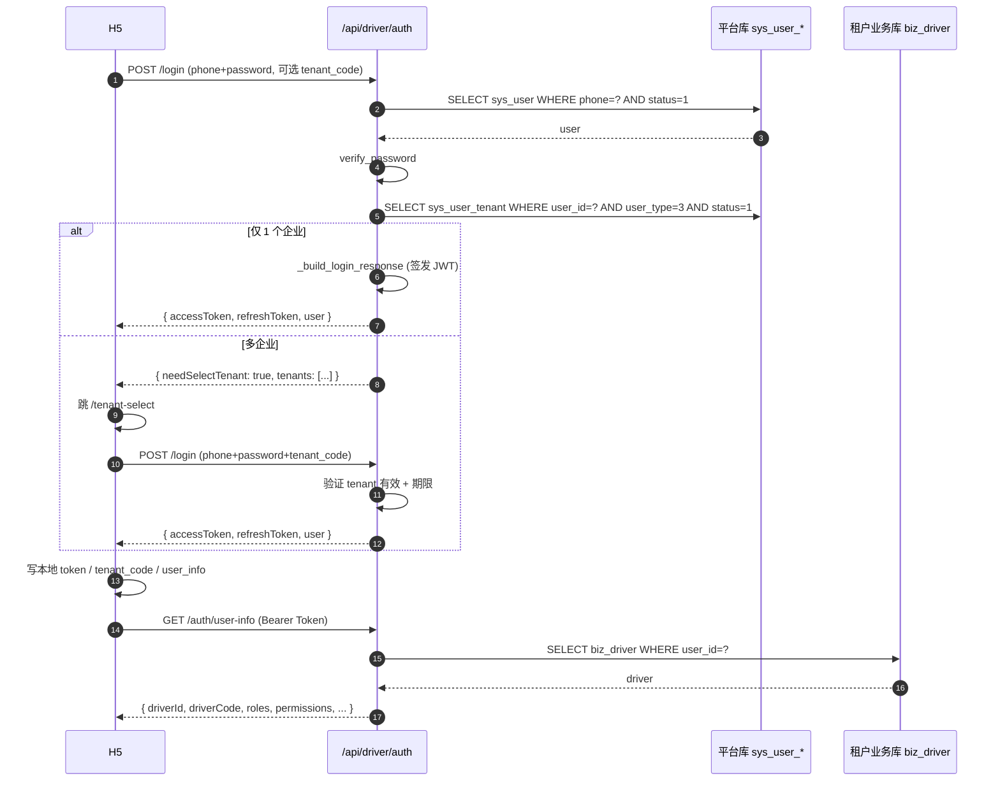
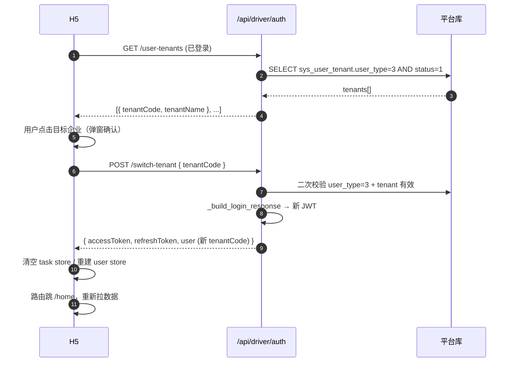

# 账号体系与多企业切换

## 一、账号身份模型

驾驶员账号沿用平台统一的 **`sys_user + sys_user_tenant + biz_driver`** 三表模型，
不引入司机专属用户表，确保后续 APP / 小程序与 PC 端**共享同一份手机号 → 用户**映射。



### 关键约束

- **手机号全局唯一**：同一手机号在所有企业共享 `sys_user.id`
- **`sys_user_tenant.user_type=3`**：驾驶员 H5 登录入口**强制此过滤**
- **`biz_driver.user_id == sys_user.id`**：租户库内通过 `user_id` 锁定司机档案；
  历史数据回退到 `phone` 匹配
- **开通方式**：仅企业管理员可在 PC 端创建驾驶员，**禁止司机自助注册**

## 二、登录流程（密码 + 验证码）



### 验证码登录差异

| 步骤 | 与密码登录的不同 |
|------|--------------------|
| 验证码下发 | 调 `POST /api/open/sms/send` `purpose=1, app_type=client`；与企业端共用模板 |
| 校验 | `SmsService.verify_code(consume=False)` 先校验、命中租户时再 `consume=True` |
| 失败重试 | 同手机号 60s 防抖；连续 5 次失败临时锁定（沿用 client 端策略） |

## 三、多企业切换

### 登录态切换



### 切换语义

- 切换企业 = **重签 JWT**，新 token 的 `tenant_code` 指向目标企业
- `TenantMiddleware` 根据新 JWT 自动切到目标租户业务库（`zt_biz_{tenant_code}`）
- 前端清空 `task` store，避免上一个企业的列表/详情泄露

## 四、首次登录强制改密

- `sys_user.force_change_pwd=1` 时：登录成功后路由守卫强制跳 `/change-password`
- 修改密码调用 `PUT /api/driver/auth/password`，复用 `AuthService.change_password`
- 修改完成后清除 `force_change_pwd` 标记（已在通用 Service 内处理）

```mermaid
flowchart LR
    Login[登录成功] --> Check{force_change_pwd=1?}
    Check -- 是 --> Force[强制 /change-password]
    Check -- 否 --> Force2{needSelectTenant?}
    Force --> Save[修改完成, 标记清零]
    Save --> Home[跳 /home]
    Force2 -- 是 --> Tenant[/tenant-select]
    Force2 -- 否 --> Home
```

## 五、登出与令牌过期

- 登出：前端调 `clearAll()` 清空 localStorage，路由跳 `/login`，可选调用未来的 `/api/driver/auth/logout` 黑名单接口
- 401 拦截：axios 响应拦截器统一处理，清 token 后跳 `/login?redirect=原路径`
- Refresh：响应头若返回新 token 自动透写；过期前业务接口不主动 refresh（一期省去后台 silent refresh）

## 六、风险与边界

| 场景 | 说明 |
|------|------|
| 已是某企业内的"管理员"，又被另一企业开通为"司机" | H5 登录入口仅显示 `user_type=3` 的企业；管理员企业不可见 |
| 司机离职 / 冻结 | `biz_driver.status != 1` 时 `DriverContext` 抛 PermissionException |
| 同手机号短时间内被多企业重开为司机 | 切换企业即时生效；本地 store 切换时清空 |
| Token 跨企业残留 | 切换企业一定 **重签 JWT**，不复用旧 access_token |
