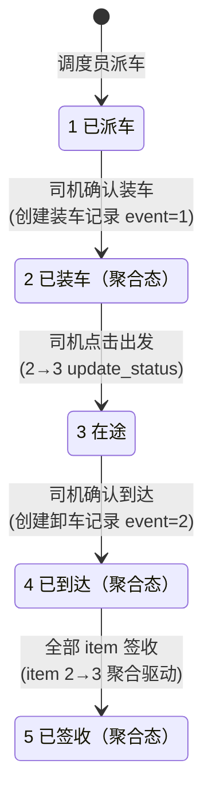
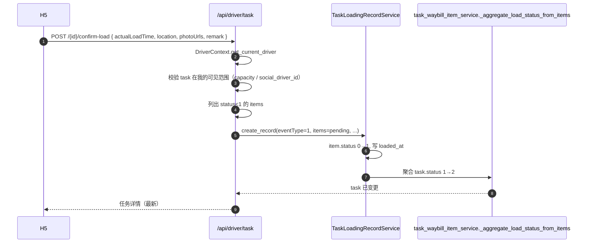
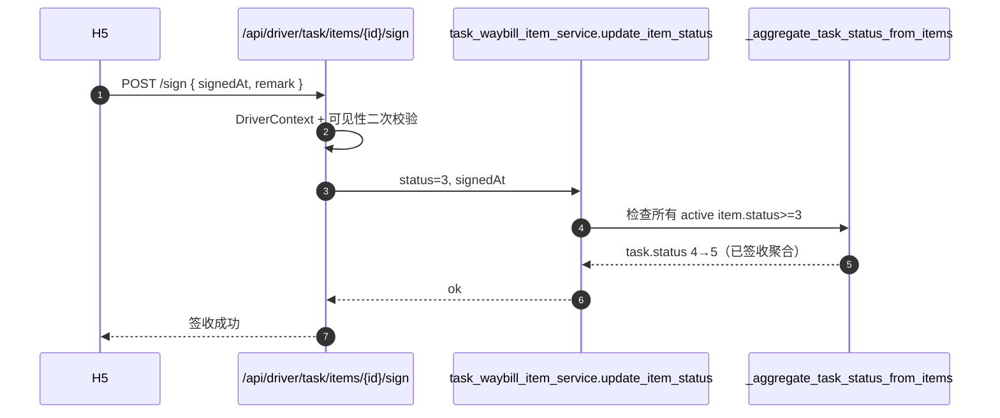
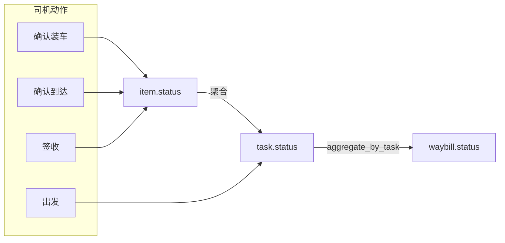

# 任务流转与司机动作

## 一、状态机回顾

司机端涉及的是 `biz_task` 与 `biz_task_waybill_item` 两套状态机；详见
[02.运单与任务单状态机联动设计.md](../../02.企业端/06.运营调度模块/02.运单与任务单状态机联动设计.md)。

> 1→2 与 3→4 已经下沉为聚合态：司机端通过创建装/卸车记录推进 item，
> 由 `_aggregate_load_status_from_items` 自动写入 `task.status`。

## 二、可触发动作矩阵

| 当前 `task.status` | 司机可执行的动作 | 对应 API | 物理实现 |
|--------------------|---------------------|----------|----------|
| 1 已派车 | 确认装车 | `POST /task/{id}/confirm-load` | 创建装车记录 event=1（聚合 1→2） |
| 2 已装车 | 确认出发 | `POST /task/{id}/depart` | `TaskService.update_status` 2→3 |
| 3 在途 | 确认到达 | `POST /task/{id}/confirm-arrive` | 创建卸车记录 event=2（聚合 3→4） |
| 4 已到达 | 逐单签收 | `POST /task/items/{itemId}/sign` | item 2/1/0→3，聚合驱动 task 4→5 |
| 5 已签收 | 撤销签收（受限） | `POST /task/items/{itemId}/revert-sign` | item 3→2，回退 task 5→4 |

### 不允许的操作

- 司机端**不能创建任务、不能派车、不能撤销整票任务**
- 司机端**不能跳跃推进**：如 1→3 等
- 司机端**不能修改任务承运资源**（车牌、主驾等冷冻字段）

## 三、详细业务说明

### 3.1 确认装车（confirm-load）

**前端弹层**：

- 弹出 Vant `Dialog`：标题"确认装车"，提示"车辆已完成装车，状态将更新为「已装车」"
- 可选 textarea 备注（255 字以内）
- 二次确认后调用接口；按钮 loading 防重复

### 3.2 确认出发（depart）

- 校验 `task.status === 2`
- 调用 `TaskService.update_status(status=3)`；可携带 `actualLoadTime`（补录历史装车时间用）

### 3.3 确认到达（confirm-arrive）

- 校验 `task.status === 3` 且存在 `1 <= item.status < 2` 的 item
- 创建卸车记录 `event=2`，全 item 一次性卸车；聚合驱动 task 3→4

### 3.4 单条挂接行签收（sign-item）

**前端展示**：
- 任务详情页 `task.status === 4` 时，每行 item 出现"签收"按钮
- 顶部"全部签收"快捷动作（依次循环调用 sign-item）

### 3.5 撤销签收（revert-sign，受限）

- 仅 `item.status === 3` 可撤销
- 必填 reason（≥1 字符）
- 写回 `item.remark` 留痕
- 后端通过 `_aggregate_task_status_from_items` 自动把 task 5→4

## 四、与运单状态的联动

任何 item 或 task 状态变更后，`WaybillStatusAggregator.aggregate_by_task` 自动
重新计算 `biz_waybill.status`；司机端无需关心运单状态。

## 五、社会运力（远期）

一期 MVP 仅支持 `carrier_type=1`（自有车）的司机操作：
- `Task.capacity_id` 关联 `biz_capacity.driver_id == 当前 driver_id`

`carrier_type=3`（社会运力）通过 `Task.social_driver_id` 关联，已在
`DriverTaskService._build_visibility_condition` 中预留口子，等待
社会运力池模块（`biz_social_driver`）落地后开启。

## 六、错误处理与幂等

| 场景 | 处理 |
|------|------|
| 网络波动重复点击 | 前端按钮 loading + disabled |
| 后端状态机拒绝 | `BizException` → 前端弹 `Toast`，按钮恢复 |
| 任务被 PC 端取消 | 司机端拉详情时 `task.status=9`，所有动作按钮隐藏 |
| 任务被 PC 端撤销派车 | `task.status` 回到 0，司机端列表自动从 Tab 中消失 |
