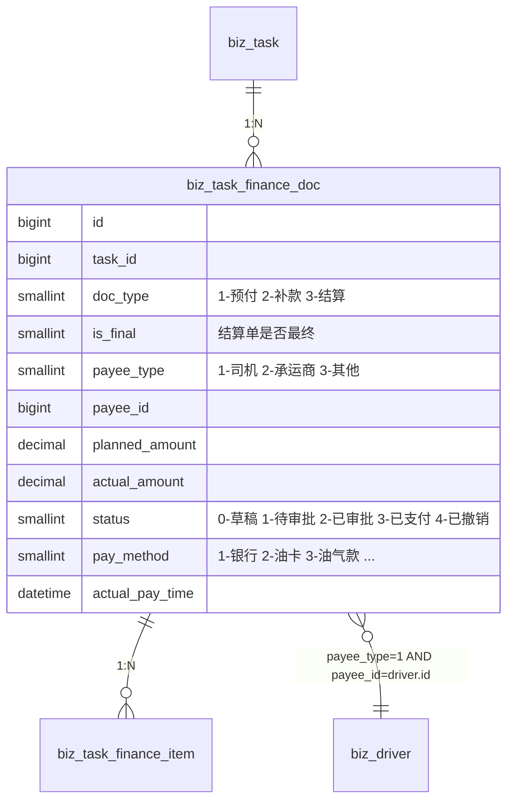

# 财务与收入查询

## 一、司机视角的财务数据

司机在 H5 端能看到的财务数据**只读**，来源于企业端调度员/财务在 PC 端创建的
`biz_task_finance_doc`（费用单）与其子项 `biz_task_finance_item`。



## 二、过滤口径（数据隔离的根基）

所有 finance 接口在后端硬过滤：

```python
WHERE biz_task_finance_doc.is_deleted = 0
  AND biz_task_finance_doc.payee_type = 1            # 必须是"司机"类型
  AND biz_task_finance_doc.payee_id  = DriverContext.driver_id
```

跨企业的隔离由 `TenantMiddleware` 自动切到 `zt_biz_{tenant_code}` 库保障：
**同一手机号在 A 企业的费用单，B 企业的司机端绝对不可见。**

## 三、接口

| 路径 | 用途 | 关键字段 |
|------|------|---------|
| `GET /api/driver/finance/my` | 我的费用单分页 | `docType / status / yearMonth` 过滤 |
| `GET /api/driver/finance/{docId}` | 费用单详情 | items[] + payVoucherUrl |
| `GET /api/driver/finance/summary` | 收入汇总 | totalIncome / 三种类型分项 / byMonth |
| `GET /api/driver/finance/account` | 我的收款账户 | `biz_driver_account` 列表 |

### 3.1 列表过滤

- `docType=1/2/3`：预付/补款/结算
- `status=3`：仅看已支付（默认列表展示全部）
- `yearMonth=YYYY-MM`：按 `created_at` 月份过滤

### 3.2 汇总语义

- **totalIncome**：仅累计 `status=3 已支付` 的 `actual_amount`，按 `doc_type` 分项
  - prepaidAmount = 预付单已支付
  - supplementAmount = 补款单已支付
  - settledAmount = 结算单已支付
- **byMonth**：近 6 个月，按 `actual_pay_time` 的 `YYYY-MM` 分组累加

### 3.3 收款账户

- `biz_driver_account` 中 `driver_id=当前 driver_id AND is_deleted=0`
- 不返回完整账户号（前端 `maskBankAccount` 脱敏展示）
- 账户类型：1-银行卡 / 2-油气款 / 3-积分

## 四、与 PC 端结算流程的边界

| 操作 | 由谁触发 | 司机端的反馈 |
|------|---------|--------------|
| 创建预付单 | 调度员 PC 端 | 司机列表立即可见，status=0 草稿 |
| 审批 | 财务 PC 端 | status=2 已审批 |
| 实际支付 | 财务 PC 端登记 | status=3 已支付；累计入 totalIncome |
| 撤销 | 调度员 PC 端 | status=4 已撤销；累计中扣除 |
| 整票任务取消 | 调度员 PC 端 | `TaskFinanceService.cancel_all_unpaid_docs` 联动撤销未支付单 |

**司机端不参与任何写操作**；H5 只读 finance 数据，避免与 PC 端审批流程冲突。

## 五、UI 关键页面

### 5.1 列表页 `finance-list.vue`

- 顶部蓝色汇总卡：本月总收入 + 三分项
- Tab：全部 / 预付单 / 补款单 / 结算单
- 卡片列表：单号 + 状态 Tag + doc_type Tag + 关联任务编号 + 金额 + 时间

### 5.2 详情页 `finance-detail.vue`

- 头部：单号 + 状态 Tag + 大额金额
- 元信息：关联任务 / 收款人 / 支付方式 / 计划时间 / 实际时间
- 费用项明细：itemName + quantity × unitPrice = amount
- 支付凭证：`payVoucherUrl` 缩略图（点击预览）
- 备注

### 5.3 汇总页 `income-summary.vue`

- 四宫格：累计收入（突出） / 预付 / 补款 / 结算
- 近 6 月时间轴
- 收款账户列表

## 六、安全 / 隐私

- 详情页**不展示 actualAmount 之外的内部金额**（如调度员草稿态金额已被覆盖即按最新）
- 银行账号、凭证 URL 均通过 `/api/driver/finance/account` 受控返回，避免 PC 端 API 泄露
