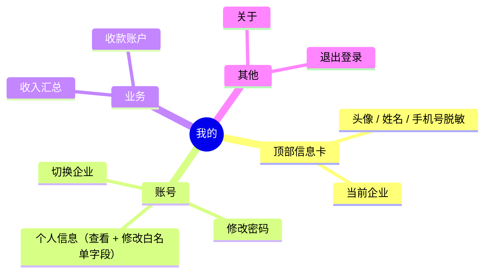
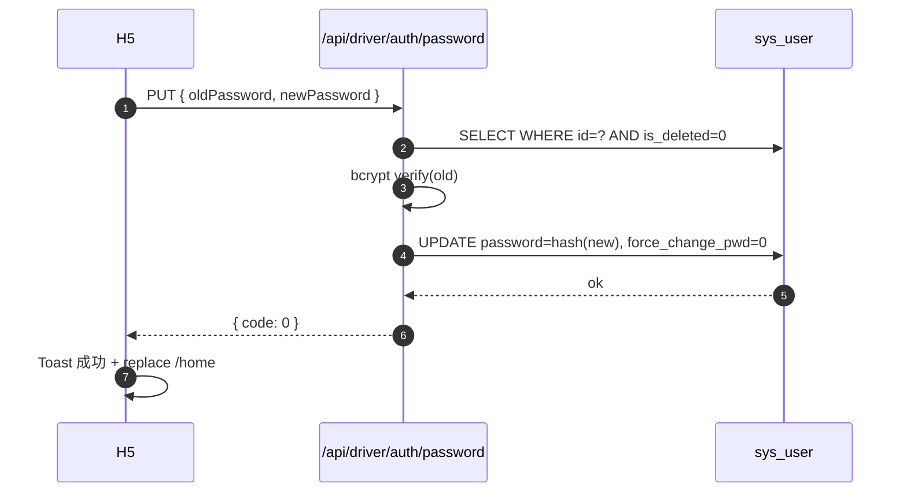

# 个人中心与资质

## 一、个人中心结构

## 二、个人信息接口

### 2.1 查看 `GET /api/driver/profile/me`

返回 `DriverProfileOut`：

| 字段 | 来源 | 说明 |
|------|------|------|
| id | `biz_driver.id` | 当前企业内的司机主键 |
| driverCode | `biz_driver.driver_code` | 司机编号（业务唯一） |
| name | `biz_driver.name` | 姓名（PC 端维护） |
| phone | `biz_driver.phone` | 手机号（与 sys_user 一致） |
| gender | `biz_driver.gender` | 0 未知 / 1 男 / 2 女 |
| avatar | `biz_driver.avatar` | 头像 URL |
| idCard | `biz_driver.id_card` | 身份证（仅展示） |
| emergencyContact | `biz_driver.emergency_contact` | 紧急联系人 ✏️ |
| emergencyPhone | `biz_driver.emergency_phone` | 紧急联系人电话 ✏️ |
| homeAddress | `biz_driver.home_address` | 家庭住址 ✏️ |
| status | `biz_driver.status` | 0 冻结 / 1 在职 / 2 离职 |

✏️ = 司机可自助修改

### 2.2 更新 `PUT /api/driver/profile/me`

后端只接受 `DriverProfileUpdate` 中定义的**白名单字段**：

- `emergencyContact`
- `emergencyPhone`
- `homeAddress`
- `avatar`

**不允许**通过此接口修改：
- 姓名（PC 端维护）
- 手机号（涉及账号体系，须走重置流程）
- 身份证号（涉及合规审计）
- 司机编号（业务标识）
- 状态（PC 端人事流程）

## 三、修改密码

| 项 | 值 |
|----|----|
| 路径 | `PUT /api/driver/auth/password` |
| Service | 复用 `AuthService.change_password` |
| 表 | `sys_user.password`（bcrypt） |
| 副作用 | 清除 `force_change_pwd` 标记 |
| 校验 | 旧密码必填 + 新密码 8-32 位 + 不同于旧密码 |

## 四、切换企业入口

- 列表页：`/profile/switch-tenant`，自动拉远端 `/auth/user-tenants`（强制 `user_type=3`）
- 当前企业带"当前"标签置顶
- 点击非当前 → Vant `showConfirmDialog` 二次确认 → `POST /auth/switch-tenant` → 重签 JWT
- 切换成功：清空 task store，跳 `/home`

## 五、退出登录

- 二次确认（Vant `showConfirmDialog`）
- 调用 `useUserStore.logout()` 清 localStorage
- 跳 `/login`

## 六、资质（远期）

| 模块 | 状态 |
|------|------|
| 驾驶证 `biz_driver_license` | 远期：H5 自助上报 + PC 审核 |
| 从业资格证 | 远期 |
| 健康证 | 远期 |
| 资质到期提醒 | 远期：APP 上线后 + PUSH 推送 |

一期 MVP **不实现资质自助上报**：所有资质数据由企业管理员在 PC 端录入。
H5 暂以"个人信息"页提供查看入口，写操作 v0.3 上线。

## 七、隐私字段展示规则

| 字段 | 列表/卡片 | 详情/编辑 |
|------|----------|----------|
| 手机号 | 138****1234 | 完整明文（仅本人） |
| 身份证 | - | 不可编辑，前端仅展示后 4 位 + 是否已登记 |
| 收款账号 | 4500****8888 | 详情页仅展示脱敏 |
