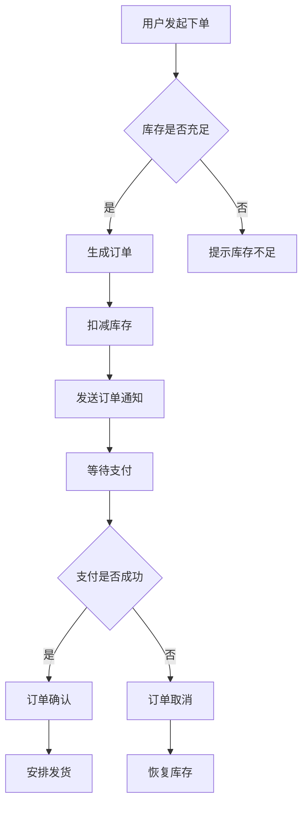
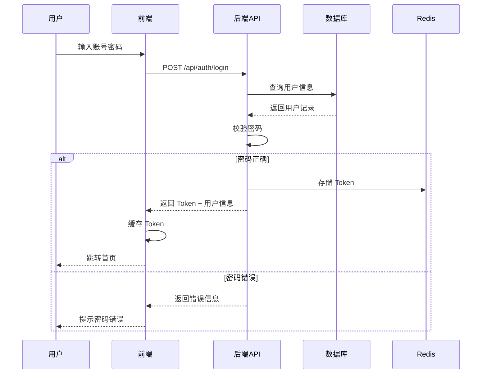
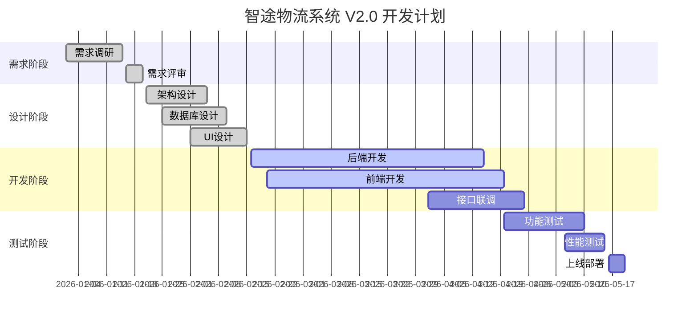
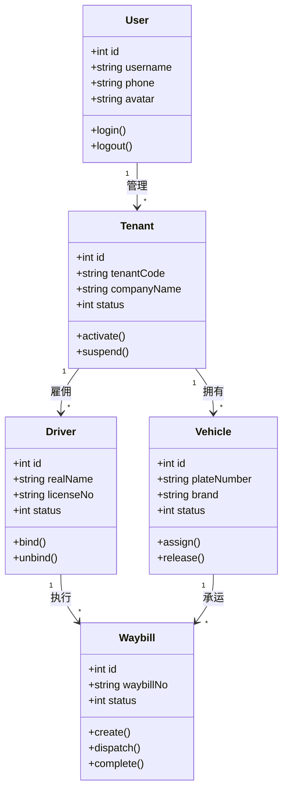
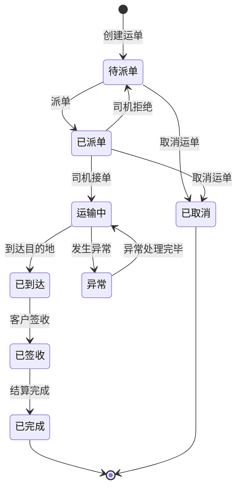
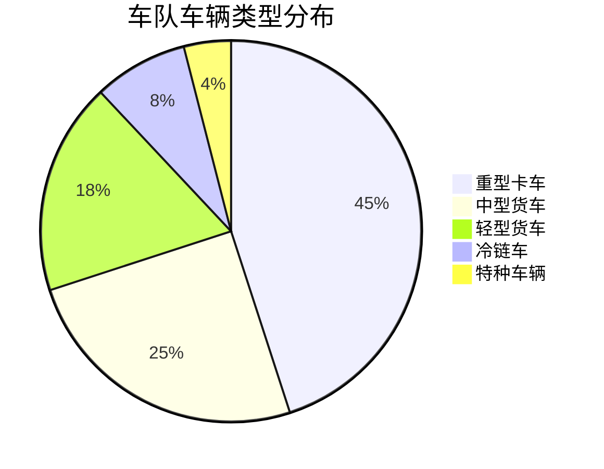

# Mermaid 图表渲染测试

本文档用于验证文档中心对 Mermaid 图表的渲染支持，包含流程图、时序图、甘特图、类图等常用图表类型。

---

## 1. 流程图（Flowchart）

以下是一个用户下单的业务流程图：

## 2. 时序图（Sequence Diagram）

用户登录认证的时序图：

## 3. 甘特图（Gantt Chart）

项目开发排期示例：

## 4. 类图（Class Diagram）

系统核心模型的类图：

## 5. 状态图（State Diagram）

运单状态流转：

## 6. 饼图（Pie Chart）

车辆类型占比：

---

> 如果以上图表均能正常渲染，则说明文档中心已完整支持 Mermaid 语法。
