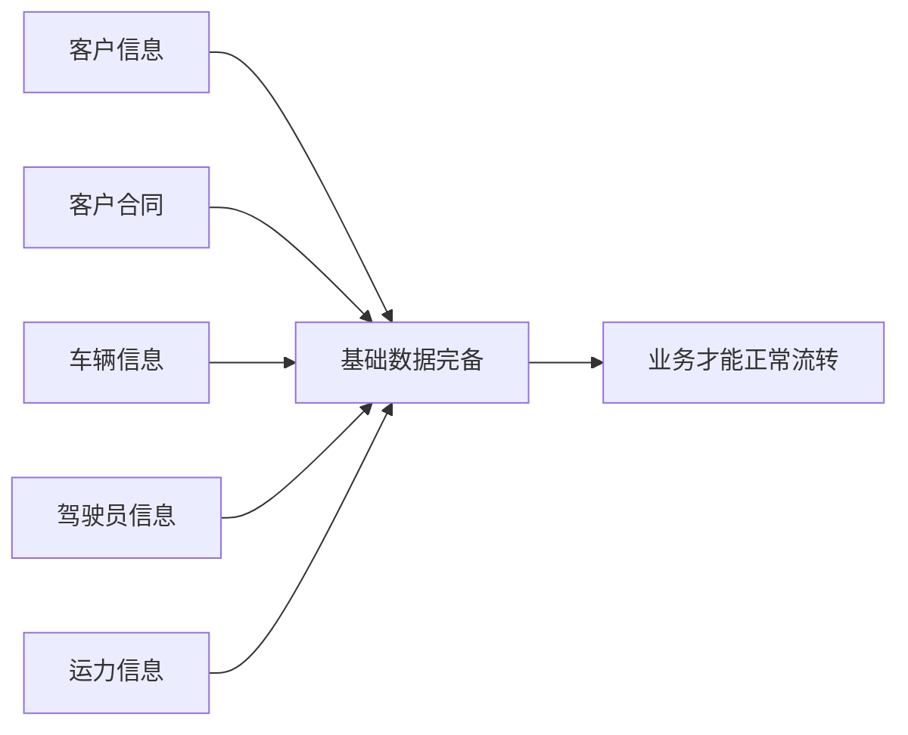
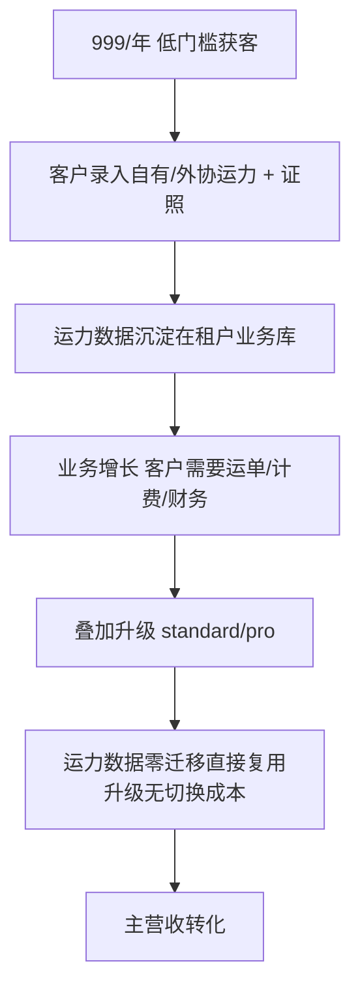

# 运力宝 - 产品方案与商业化设计

> 关联：[00.模块总览](00.模块总览.md) · [04.商业化基建-功能守卫与配额](04.商业化基建-功能守卫与配额.md)

本文阐述运力宝"为什么做、卖给谁、凭什么值这个价、怎么转化升级"，是产品与商业侧的决策依据；技术实现见 02 / 03 / 04。

## 一、为什么需要运力宝

### 1.1 综合系统的实施门槛问题

综合业务系统（standard / pro）定位是"物流车队综合业务管理系统"，但要跑起来必须先备齐基础数据：

这意味着：

- 客户要先投入大量数据维护成本，才能感受到系统价值——**决策周期长、流失率高**。
- 销售难以用"开箱即用"快速打动客户。

### 1.2 运力宝的破局思路

| 维度 | 综合系统 | 运力宝 |
|------|---------|--------|
| 切入点 | 全流程业务管理 | 单点痛点：资质到期 + 外协运力没存档 |
| 上手成本 | 高（需备齐 5 类基础数据） | 低（只录车/司机/运力，当天见效） |
| 客户感知价值 | 慢（数据齐了才显现） | 快（录完即看到到期预警） |
| 商业角色 | 主营收 | 获客入口 + 数据沉淀前哨 |

## 二、目标客户与痛点

### 2.1 目标客户

- 中小物流车队（自有车 + 大量外协运力），尚未上综合管理系统。
- 对"资质合规、安全生产检查"有刚性需求的车队（证照过期=罚款+停运风险）。
- 已是 lite（被上游邀请上报运力）但希望自己也管好车队资质的承运商。

### 2.2 核心痛点

| 痛点 | 现状（无系统时） | 运力宝解法 |
|------|----------------|-----------|
| 司机驾驶证/从业资格证到期没人盯 | Excel 台账靠人记，漏检被罚 | 证照监控引擎自动扫描分级预警 |
| 车辆年检/保险/道路运输证到期 | 同上 | 同上 |
| 外协（社会/承运商）运力没存档 | 微信/纸质合同散落，换人就丢 | 社会运力 + 承运商运力建档 |
| 外协运力的证照同样要合规 | 几乎无人监控 | 监控引擎同样覆盖社会/承运商运力 |

## 三、价值主张与差异化

运力宝的**唯一核心差异化 = 证照监控引擎**（见 `02`）：

- 不是"列表里有个到期日字段"，而是**独立进程周期扫描 + 分级预警 + 看板汇总 + 处理状态闭环**。
- 覆盖 6 类主体 × 5 类证照（自有/社会/承运商 × 司机/车辆），一处建档、全局监控。
- 引擎独立部署，不拖累 API，支撑后续多租户规模化。

## 四、版本对比（销售口径）

| 能力 | lite | **ylb** | standard | pro |
|------|:---:|:---:|:---:|:---:|
| 组织/账号/角色底座 | ✓ | ✓ | ✓ | ✓ |
| 自有运力建档 | ✓ | ✓ | ✓ | ✓ |
| 社会运力池 | ✗ | ✓ | ✓ | ✓ |
| 承运商运力建档 | ✗ | ✓ | ✓ | ✓ |
| **证照到期监控** | ✗ | **✓** | ✓ | ✓ |
| 运单/任务/调度 | ✗ | ✗ | ✓ | ✓ |
| 计费/合同/财务结算 | ✗ | ✗ | ✓ | ✓ |
| BI 数据分析/驾驶舱 | ✗ | ✗ | ✗ | ✓ |
| AI 数字员工 | ✗ | ✗ | ✗ | ✓ |
| 参考配额（人/车） | 5/20 | 10/50 | 20/100 | 100/500 |
| 参考定价 | 免费 | 999/年 | 2999/年 | 9999/年 |

## 五、数据沉淀与升级转化

运力宝的商业模型是**"低价入口 → 数据沉淀 → 升级转化"**：

升级零摩擦的技术保证（详见 `00` §三、`05`）：

- 同一租户业务库，升级只是 feature 叠加授权 + 增量建表。
- 已录运力/证照数据原样保留，综合系统的运单/计费直接引用。

## 六、配额与商业化拦截

为避免低版本无限录入绕过付费档位（见 `04`）：

- 车辆、员工创建前按版本 `max_vehicles` / `max_users` 硬校验，超限提示升级。
- 多版本并存时取上限最大值；`<=0` 视为不限量。
- 功能门控 fail-closed：未开通 feature 的接口直接 403，不依赖前端藏菜单。

## 七、开放问题

| 项 | 说明 | 倾向 |
|---|------|------|
| ylb 是否提供试用期 | 影响获客转化 | 建议 14/30 天全功能试用，到期降级只读 |
| 到期预警提前天数是否客户可配 | 当前全局默认 horizon=60 / critical=7 | v2 考虑租户级可配 |
| 证照监控是否对 lite 开放（增值包） | lite 是承运商基础版 | 暂不，保持 ylb 差异化；远期可作增值 feature 单卖 |
