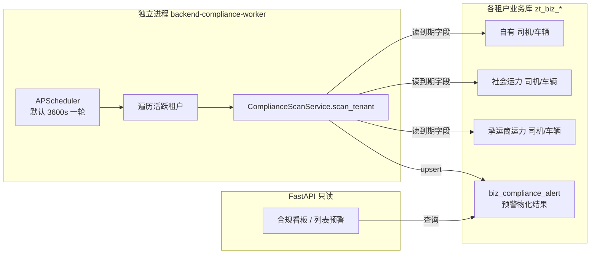
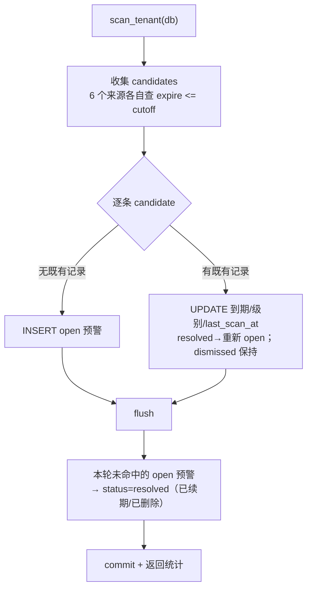

# 运力宝 - 证照监控引擎技术设计

> 关联：[00.模块总览](00.模块总览.md) · [03.承运商运力建档技术设计](03.承运商运力建档技术设计.md) · [05.部署与运维手册](05.部署与运维手册.md)
>
> 设计参照：运费计算引擎（`backend/app/workers/freight_calc_main.py`）的独立 worker 形态

证照监控引擎是运力宝的核心差异化能力：**周期性扫描各租户运力资质的到期字段，物化为预警记录**，供前端合规看板/列表/工作台读取。

## 一、整体架构

**职责切分**：

- worker 只负责"扫描 → 物化预警"，**不参与 HTTP 请求链路**，避免调度任务拖累 API。
- API 只读 `biz_compliance_alert`，不现算到期，**响应快、可分页/汇总**。

为什么独立成进程（与运费引擎一致的理由）：

- **资源隔离**：批量扫描不抢占 API 进程资源。
- **避免重复扫表**：`zhitu-backend` 起 4 个 uvicorn 进程，若进程内嵌 scheduler 会 4 份重复扫描；独立单实例 worker 干净。
- **独立扩缩容**：未来租户量翻倍可独立调整。

## 二、数据模型 `biz_compliance_alert`

> 文件：`backend/app/modules/client/models/compliance/compliance_alert.py`
> 表级：`__table_tier__ = "business"`（按 feature `required_tables` 自动建表）

一条预警 = 某主体（subject）的某类证照（doc_type）的最新到期状态。同一 `(subject_type, subject_id, doc_type)` 在未删除范围内只保留一条，扫描时 upsert。

| 字段 | 类型 | 说明 |
|------|------|------|
| `subject_type` | varchar(32) | 主体类型，见下表 |
| `subject_id` | bigint | 主体业务 ID（司机ID/车辆ID/运力ID） |
| `subject_name` | varchar(100) | 主体名称（司机姓名 / 车牌号） |
| `subject_ref` | varchar(50) | 辅助标识（手机号 / 车牌号） |
| `doc_type` | varchar(32) | 证照类型，见下表 |
| `doc_no` | varchar(64) | 证照号（如有） |
| `expire_date` | date | 到期日 |
| `days_left` | int | 距到期天数（负数=已过期） |
| `level` | varchar(16) | 预警级别 expired/critical/warning |
| `status` | varchar(16) | 处理状态 open/dismissed/resolved |
| `dismissed_user_id` / `dismissed_at` | bigint / datetime | 忽略操作人与时间 |
| `first_alerted_at` / `last_scan_at` | datetime | 首次预警 / 最近命中时间 |

索引：`idx_ca_subject_doc(subject_type,subject_id,doc_type)`、`idx_ca_level_status(level,status)`、`idx_ca_expire(expire_date)`。

### 2.1 主体类型 subject_type（6 类）

| subject_type | 含义 | 来源表 |
|---|---|---|
| `driver` | 自有驾驶员 | `biz_driver` + `biz_driver_license` |
| `vehicle` | 自有车辆 | `biz_vehicle` + `biz_vehicle_ext` |
| `social_driver` | 社会运力-司机 | `biz_social_capacity` + `biz_social_capacity_driver` |
| `social_vehicle` | 社会运力-车辆 | `biz_social_capacity` + `biz_social_capacity_vehicle` |
| `carrier_driver` | 承运商运力-司机 | `biz_carrier_capacity` + `biz_carrier_capacity_driver` |
| `carrier_vehicle` | 承运商运力-车辆 | `biz_carrier_capacity` + `biz_carrier_capacity_vehicle` |

### 2.2 证照类型 doc_type（5 类）

| doc_type | 含义 | 适用主体 |
|---|---|---|
| `driver_license` | 驾驶证 | 各类司机 |
| `qualification` | 从业资格证 | 各类司机 |
| `insurance` | 保险 | 各类车辆 |
| `inspection` | 年检 | 各类车辆 |
| `transport_license` | 道路运输证 | 各类车辆 |

> 自有车辆的道路运输证字段 `transport_license_no` / `transport_license_expire` 是本次为 ylb 新增（迁移 `20260615_001`，见 `05`）。

## 三、扫描服务 `ComplianceScanService.scan_tenant`

> 文件：`backend/app/modules/client/services/compliance/compliance_scan_service.py`

### 3.1 阈值与分级

通过环境变量配置（worker 容器注入）：

| 环境变量 | 默认 | 含义 |
|---|---|---|
| `COMPLIANCE_ALERT_HORIZON_DAYS` | 60 | 进入预警视野的提前天数 |
| `COMPLIANCE_ALERT_CRITICAL_DAYS` | 7 | 临界阈值 |

分级规则（`days_left = expire_date - today`）：

| level | 条件 |
|---|---|
| `expired` | `days_left < 0`（已过期） |
| `critical` | `0 <= days_left <= critical`（默认 ≤7 天） |
| `warning` | `critical < days_left <= horizon`（默认 ≤60 天） |

### 3.2 单租户一轮扫描流程

关键语义：

- **cutoff** = `today + horizon`，只收集到期日在视野内的证照。
- **dismissed 不被覆盖**：人工忽略后扫描不再改其状态。
- **resolved 自愈**：续期或删除后该证照不再命中，原 open 预警自动置 resolved；若极少数情况下又重新进入视野，resolved 会被重新 open。
- 排除非在用主体：自有司机排除离职（`status!=2`）、自有车辆排除报废（`status!=9`）、社会/承运商运力排除黑名单（`status!=3`）。

返回统计：`{candidates, inserted, updated, reopened, resolved}`。

## 四、Worker 调度 `ComplianceAlertWorker`

> 文件：`backend/app/modules/client/workers/compliance_alert_worker.py`
> 独立入口：`backend/app/workers/compliance_alert_main.py`

| 行为 | 说明 |
|------|------|
| 调度 | `AsyncIOScheduler`，间隔 `COMPLIANCE_WORKER_INTERVAL`（默认 3600s）；启动后立即跑一次 |
| 并发保护 | `max_instances=1` + `coalesce=True` + 运行锁，避免 tick 叠加 |
| 租户范围 | `sys_tenant` 中 `is_deleted=0 AND db_initialized=1` |
| 表自愈 | 每租户先 `ensure_tenant_tables(code, ['biz_compliance_alert'])` 幂等补表 |
| 降噪跳过 | 缺前置表 `biz_vehicle`/`biz_driver`（未开通运力域）的租户加入 skip 集，只告警一次后静默 |
| 启停 | 独立进程入口 `start_force()`；API 进程内仅当 `COMPLIANCE_WORKER_ENABLED=1` 才内嵌 `start()` |

> ⚠️ 生产**必须**用独立 `backend-compliance-worker` 容器跑（`COMPLIANCE_WORKER_ENABLED=1`），API 容器保持 `0`，否则多 uvicorn 进程重复扫描。

## 五、API（只读 + 处理状态）

> 路由前缀：`/capacity/compliance/alerts`，守卫：`Depends(require_feature("fleet_compliance"))`
> 文件：`backend/app/modules/client/api/capacity/compliance/alerts.py`

| 方法 | 路径 | 说明 |
|------|------|------|
| GET | `/capacity/compliance/alerts` | 分页查询（筛选 subjectType/docType/level/status/keyword，默认看 open） |
| GET | `/capacity/compliance/alerts/summary` | 合规看板汇总（按级别/主体/证照分组的待处理数量） |
| PUT | `/capacity/compliance/alerts/{id}/dismiss` | 忽略一条预警（人工确认） |

所有接口含 `_ensure_alert_table` 依赖：老租户库首次访问时幂等补建 `biz_compliance_alert`，保证不依赖部署顺序也能用。

## 六、前端合规看板

> 文件：`frontend/client/src/views/capacity/compliance/index.vue`
> API：`frontend/client/src/api/capacity/compliance/`

- 顶部汇总统计卡（已过期/临界/预警计数）。
- 筛选区：级别、主体类型、证照类型、状态、关键字。
- 数据表：主体、证照、到期日、剩余天数、级别标签、状态；行内"忽略"操作。

## 七、运维与排障要点

- 看 worker 日志：`docker logs zhitu-backend-compliance-worker --tail 50`，期望 `[ComplianceWorker] 已启动，扫描间隔 3600s`。
- 命中扫描会打印 `租户 X 扫描: {candidates:.., inserted:.., ...}`。
- 表缺失类报错（1146）属预期降噪，已"每租户告警一次后静默"。
- 详细部署与首次升级步骤见 [05.部署与运维手册](05.部署与运维手册.md)。
