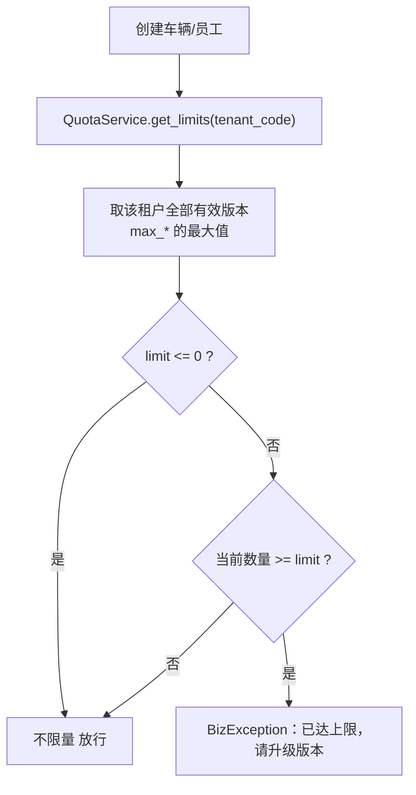

# 运力宝 - 商业化基建：功能守卫与配额

> 关联：[00.模块总览](00.模块总览.md) · [01.产品方案与商业化设计](01.产品方案与商业化设计.md)

要把版本（lite/ylb/standard/pro）做成"买了才能用、买够了才够用"，需要三块横切基建：**API 级功能守卫**、**资源配额校验**、**角色菜单一致性**。这三块对所有版本通用，但因 ylb 的"平行版本 + 叠加升级"模型而变得必不可少。

## 一、功能守卫 `require_feature`（fail-closed）

> 文件：`backend/app/core/permissions.py`

历史上功能边界只靠"前端藏菜单"，接口本身不校验——懂行的用户直接调 API 就能绕过。`require_feature` 把功能门控下沉到 API 层。

### 1.1 行为

```python
# 用法：路由级依赖
router.include_router(
    compliance_alert_router,
    prefix="/capacity/compliance/alerts",
    dependencies=[Depends(require_feature("fleet_compliance"))],
)
```

| 规则 | 说明 |
|------|------|
| 要求 | 当前租户的有效版本**至少包含其中一个** `feature_code`，否则 403 |
| 平台管理员 | `tenant_code` 为 None 直接放行 |
| 失败语义 | fail-closed：查不到/未开通即拒绝，提示"当前版本未开通该功能，请升级版本后使用" |
| 缓存 | 租户 feature 集合内存缓存，TTL 由 `FEATURE_GUARD_CACHE_TTL` 控制（默认 300s） |
| 缓存失效 | 授权变更后调 `invalidate_feature_cache(tenant_code)` 主动失效 |

### 1.2 已挂守卫的接口（运力域 + 证照）

| 前缀 | feature_code |
|------|--------------|
| `/capacity/self_capacity/list` 等 | `capacity_self_*` |
| `/capacity/social_capacity/list` / `/approval` | `capacity_social_*` |
| `/capacity/carrier_capacity/list` / `/approval` | `capacity_carrier_*` |
| `/capacity/compliance/alerts` | `fleet_compliance` |

> 事实源：`backend/app/modules/client/api/__init__.py`

## 二、配额校验 `QuotaService`

> 文件：`backend/app/modules/client/services/quota_service.py`

产品版本有 `max_users` / `max_vehicles`，但历史上只展示、不拦截。`QuotaService` 在创建车辆/员工前做硬校验。

### 2.1 口径



| 规则 | 说明 |
|------|------|
| 多版本并存 | 同租户可并行持有多个有效版本，取各版本上限的**最大值**作为有效上限 |
| 不限量 | 上限 `<= 0` 视为不限量（放行） |
| 有效版本判定 | `sys_tenant_product`：`is_deleted=0 AND status=1 AND (end_time IS NULL OR end_time > now)` |
| 接入点 | `create_vehicle`（`ensure_vehicle_quota`）、`create_user`（`ensure_user_quota`） |

> 与 ylb 叠加升级的关系：客户加购 standard 后，配额自动取 ylb(50) 与 standard(100) 的最大值=100，无需手工调整。

## 三、角色菜单一致性（双写同步）

> 文件：`backend/app/modules/client/services/user/platform_user_sync.py`、`backend/app/modules/client/api/role/role.py`

### 3.1 背景问题

系统采用"租户角色 `biz_role` + 平台镜像角色 `sys_role`"双轨。历史上给租户角色分配菜单只写了 `biz_role_menu`，没有同步到平台镜像角色的 `sys_role_menu`，导致登录鉴权按平台镜像取菜单时**菜单缺失/不一致**。

### 3.2 解法

`assign_role_menus` 在写完 `biz_role_menu` 后，调用 `BizPlatformUserSync.sync_role_menus`：


| 步骤 | 作用 |
|------|------|
| 镜像角色 ensure | 找到/创建对应的平台镜像角色 |
| 整体替换 `sys_role_menu` | 用最新 `menu_ids` 全量覆盖，避免增量遗漏 |
| bump `menu_version` | 触发在线客户端重新拉菜单 |

> 同理，运力宝新菜单（如证照监控）若涉及可见性变更，也需配合 `menu_version` bump 让客户端刷新（见 [05](05.部署与运维手册.md) 菜单可见性修正）。

## 四、与 ylb 的整体关系

| 基建 | 对 ylb 的意义 |
|------|--------------|
| `require_feature` | ylb 客户只买了运力域，调不到运单/财务接口（即便构造请求也 403） |
| `QuotaService` | ylb 的 10 人/50 车上限真正生效，超限引导升级 |
| 角色菜单同步 | ylb 客户自定义角色后，菜单按所购 feature 正确呈现 |
