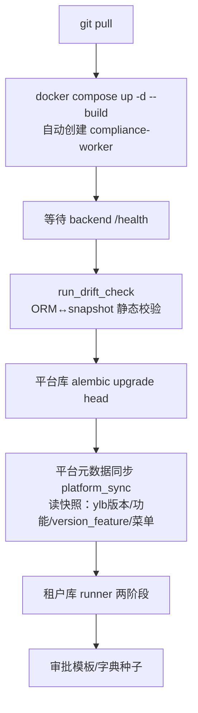

# 运力宝 - 部署与运维手册

> 关联：[00.模块总览](00.模块总览.md) · [02.证照监控引擎技术设计](02.证照监控引擎技术设计.md) · [计费引擎部署与运维](../../04.开发手册/13.计费引擎部署与运维.md)
>
> 最近更新：2026-06-15

本手册记录 ylb 上线涉及的新增运行时组件、生产发版流程、本地开发执行步骤与排障。**`bash deploy/deploy.sh update` 已覆盖日常更新流程**，本文只补充其外需人工关注的事项。

## 一、新增运行时组件

ylb 上线后线上多一个 docker 容器：

| 容器名 | 镜像 | 角色 | 是否新增 |
|---|---|---|---|
| `zhitu-redis` | redis:7-alpine | 缓存 | 否 |
| `zhitu-backend` | Dockerfile.backend | FastAPI HTTP（4 uvicorn） | 否 |
| `zhitu-backend-worker` | 同上 | 计费引擎 worker | 否 |
| **`zhitu-backend-compliance-worker`** | 同上 | **证照监控 worker（单实例）** | **是** |
| `zhitu-nginx` | Dockerfile.nginx | 反代 + 前端静态 | 否 |

> 该 worker 的 env 与 `backend-worker` 完全一致（`PLATFORM/TENANT_DB`、`host.docker.internal`、Redis），只是启动命令换成 `python -m app.workers.compliance_alert_main`。

### 1.1 关键环境变量

由 `deploy/docker/docker-compose.yml` 定义，按需在 `.env` 覆盖：

| 变量 | 默认值 | 说明 |
|---|---|---|
| `COMPLIANCE_WORKER_ENABLED` | backend=`0`，compliance-worker=`1` | API 进程是否内嵌 scheduler；生产 backend **必须 0** |
| `COMPLIANCE_WORKER_INTERVAL` | `3600`（秒） | 扫描轮询间隔 |
| `COMPLIANCE_ALERT_HORIZON_DAYS` | `60` | 进入预警视野的提前天数 |
| `COMPLIANCE_ALERT_CRITICAL_DAYS` | `7` | 临界阈值 |
| `FEATURE_GUARD_CACHE_TTL` | `300` | `require_feature` 租户功能缓存 TTL |

## 二、生产发版流程（为什么 `deploy.sh update` 能正确迁移 ylb）

ylb 的所有变更都是"快照/元数据驱动"，被 `deploy.sh update` 的通用阶段自动覆盖，**无需改 deploy.sh**：



| 阶段 | 对 ylb 的作用 |
|------|--------------|
| compose up | 创建并启动 `backend-compliance-worker` |
| drift-check | 校验 ORM 与 `scripts/migration/snapshots/*.json` 一致（不一致即中止发版） |
| 平台元数据同步 | 写入 ylb 版本、`fleet_compliance` 等功能、version_feature（含 standard 新增 fleet_compliance）、菜单结构 |
| 租户 runner Phase1 | 按 feature `required_tables` 给已开通租户补建 `biz_compliance_alert` + 3 张 `biz_carrier_capacity*` |
| 租户 runner Phase2 | 跑 `20260615_001`：给 `biz_vehicle_ext` 加 `transport_license_no` / `transport_license_expire` |

### 2.1 生产发版命令

```bash
cd /opt/zhitu
sudo bash deploy/deploy.sh update --auto
```

### 2.2 唯一需要人工补的一步：菜单可见性

证照监控菜单（`sys_menu` 中 `feature_code=fleet_compliance`）历史上是 `visible=0` 占位，而 `seed_client_menus` 为 **preserve-ui 模式**（不覆盖存量库的 `visible`），所以发版不会自动翻转。发版后执行一次（幂等，会 bump 各租户 `menu_version` 触发客户端刷新）：

```bash
sudo docker compose exec backend python -m scripts.fix.show_ylb_menus
# 预览：python -m scripts.fix.show_ylb_menus --dry-run
```

> 文件：`backend/scripts/fix/show_ylb_menus.py`

### 2.3 验证

```bash
sudo docker ps | grep zhitu     # 应看到 5 个容器，含 zhitu-backend-compliance-worker
sudo docker logs zhitu-backend-compliance-worker --tail 30
# 期望：[ComplianceWorker] 已启动，扫描间隔 3600s
```

## 三、本地开发环境执行步骤

本地用 `backend/.env`（`DB_SUFFIX=_ci`，平台库 `zt_platform_ci`，租户 `zt_biz_{code}_ci`）。在 `backend/` 目录、虚拟环境激活后按序执行：

```bash
# 1) 产品版本（插入 ylb）
python -m scripts.seed.seed_product_versions

# 2) 功能清单 + 版本-功能映射（ylb 全量、standard 加 fleet_compliance、carrier required_tables）
python -m scripts.seed.seed_product_features

# 3) 客户端菜单结构（含前端组件路径校验）
python -m scripts.seed.seed_client_menus

# 4) 租户业务库迁移（建 biz_compliance_alert + carrier 三表 + 跑 20260615_001）
python -m scripts.migration.runner --tenant 1001        # 或全部租户：去掉 --tenant
#   预览：python -m scripts.migration.runner --tenant 1001 --dry-run

# 5) 菜单可见性修正（证照监控置为可见）
python -m scripts.fix.show_ylb_menus

# 6) drift 校验（应为 0 diff）
python -m scripts.migration.check
```

> 也可用一键脚本 `python -m scripts.dev.dev_migrate`（含平台 alembic + seed_product_features + runner），但它**不含** seed_product_versions / seed_client_menus / show_ylb_menus，ylb 首次落地建议按上面分步执行。

### 3.1 落库校验口径

| 检查项 | 期望 |
|--------|------|
| `sys_product_version` | 存在 `ylb` |
| `fleet_compliance` 归属版本 | `pro` / `standard` / `ylb` |
| `capacity_carrier_list` 归属版本 | `pro` / `standard` / `ylb` |
| 租户库 `biz_compliance_alert` | 存在 |
| 租户库 `biz_vehicle_ext` | 含 `transport_license_no` / `transport_license_expire` |
| 租户库 `biz_carrier_capacity*` | 3 张表存在 |
| 证照监控菜单 `visible` | 1 |
| drift 检查 | platform / tenant 均 0 diff |

## 四、首次升级到 ylb 的执行顺序（存量环境）

老库升级须按序，之后常规发版直接 `update --auto` 即可：

1. `sudo bash deploy/deploy.sh update --auto`（拉代码 + 建 compliance-worker 容器 + 平台元数据 + 租户 runner）。
2. `docker logs zhitu-backend-compliance-worker --tail 30` 确认 worker 健康。
3. `docker compose exec backend python -m scripts.fix.show_ylb_menus` 置证照监控菜单可见。
4. 给目标客户在 console 开通 `ylb` 版本（`sys_tenant_product`），runner 会在下次发版/或开通流程中按其 feature 补齐业务表。

> ⚠️ worker 启动后即开始轮询，老租户库若暂缺 `biz_compliance_alert`，worker 会幂等补表；缺运力域前置表（`biz_vehicle`/`biz_driver`）的租户会被降噪跳过，不刷屏。

## 五、排障速查

| 现象 | 排查 |
|------|------|
| 客户端看不到"证照监控"菜单 | ①该租户版本是否含 `fleet_compliance`；②`sys_menu.visible` 是否为 1（跑 `show_ylb_menus`）；③`menu_version` 是否已 bump |
| 调用证照接口 403 | 该租户版本未开通 `fleet_compliance`（`require_feature` 拦截），或缓存未失效（等 TTL 或重启） |
| worker 日志报 1146 表不存在 | 预期降噪，未开通运力域租户；已"每租户告警一次后静默" |
| 预警一直为空 | ①worker 是否在跑；②是否有到期日 ≤ 60 天的证照；③`biz_compliance_alert` 是否建成 |
| 升级后业务表没补齐 | 手动 `bash deploy/deploy.sh db-migrate`（或 `runner`）重跑 Phase1 |
| 发版被 drift 中止 | 开发侧改 ORM 后须 `python -m scripts.migration.autogen tenant\|platform --name '...'` 生成迁移并刷新 snapshot |
