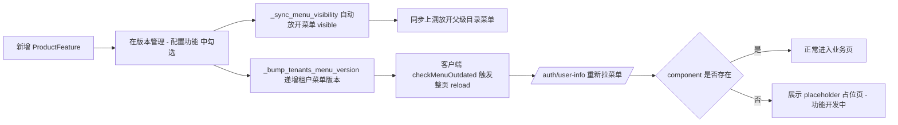

# 新模块开发上线指南

> **适用范围**：在客户端（Client）新增一个完整的业务功能模块，从需求到上线的完整流程。

---

## 目录

- [1. 整体流程概览](#1-整体流程概览)
- [2. 核心概念速查](#2-核心概念速查)
- [3. 第一步：需求与设计](#3-第一步需求与设计)
- [4. 第二步：后端开发](#4-第二步后端开发)
- [5. 第三步：前端开发](#5-第三步前端开发)
  - [5.4 图片/文件上传（可选）](#54-图片文件上传可选)
  - [5.5 列表筛选区布局](#55-列表筛选区布局)
- [6. 第四步：菜单与产品版本注册](#6-第四步菜单与产品版本注册)
- [7. 第五步：本地验证](#7-第五步本地验证)
- [8. 第六步：提交与部署](#8-第六步提交与部署)
- [9. 完整示例：开发「油卡管理」模块](#9-完整示例开发油卡管理模块)
- [10. 新功能上线配置流程（运营标准 SOP）](#10-新功能上线配置流程运营标准-sop)
- [附录 A：脚本速查表](#附录-a脚本速查表)
- [附录 B：feature_code 命名规范](#附录-bfeature_code-命名规范)
- [附录 C：常见问题](#附录-c常见问题)

---

## 1. 整体流程概览

```
需求文档 → 数据库表设计 → 后端开发 → 前端开发 → 菜单注册 → 产品版本注册 → 本地验证 → 提交部署
```

详细步骤：

| 阶段 | 产出物 | 涉及目录 |
|------|--------|----------|
| 需求设计 | 需求文档、表结构设计 | `项目文档/02.需求文档/`、`项目文档/03.数据库设计/` |
| 后端开发 | Model → Schema → Service → API | `backend/app/modules/client/` |
| 前端开发 | API 模型 → API 服务 → 页面视图 | `frontend/client/src/` |
| 菜单注册 | 更新种子脚本 | `backend/scripts/seed_client_menus.py` |
| 版本注册 | 更新功能清单脚本 | `backend/scripts/seed_product_features.py` |
| 本地验证 | 重跑种子脚本，登录测试 | `backend/scripts/` |
| 提交部署 | Git 提交、Docker 构建 | `deploy/` |

---

## 2. 核心概念速查

### 2.1 菜单系统

客户端菜单统一存储在**平台库** `sys_menu` 表中（`app_type = 'client'`）。

| 字段 | 说明 | 示例 |
|------|------|------|
| `parent_id` | 父菜单 ID，0 为顶级 | `0` |
| `menu_name` | 菜单显示名称 | `车辆管理` |
| `menu_code` | 权限标识（按钮级权限使用） | `resource:vehicle` |
| `menu_type` | 0=目录/菜单, 1=按钮 | `0` |
| `path` | 前端路由路径 | `/resource/vehicle` |
| `component` | 前端组件路径（相对 views 目录） | `/resource/vehicle/index` |
| `icon` | 图标名称（Ant Design 图标） | `CarOutlined` |
| `sort_order` | 排序号，越小越靠前 | `0` |
| `feature_code` | **关键字段**：关联产品功能编码 | `resource_vehicle` |

**菜单的数据流**：

```
seed_client_menus.py 写入 → sys_menu 表 → 用户登录时 AuthService._get_user_menus() 查询
→ 按企业产品版本的 feature_code 过滤 → 返回前端动态渲染侧边栏
```

> **重要**：菜单同时也可以通过 Console 端的「系统管理 > 菜单管理」页面进行可视化增删改。种子脚本用于初始化环境和保持代码即配置。

### 2.2 产品版本控制

系统通过三张表实现「不同版本看到不同菜单」：

```
sys_product_version  (版本: basic/standard/pro/enterprise)
        ↕ 多对多
sys_version_feature  (关联表)
        ↕
sys_product_feature  (功能: feature_code + required_tables)
        ↕
sys_menu             (菜单: feature_code 字段)
```

企业开通某个版本后，登录时只显示该版本包含的 `feature_code` 对应的菜单。`feature_code = NULL` 的菜单对所有版本可见。

### 2.3 数据库表分层（table_tier）

租户库的表分为三层，决定了表的创建时机：

| tier | 创建时机 | 示例 |
|------|----------|------|
| `core` | 企业注册时自动创建 | `biz_user`、`biz_role`、`biz_department` |
| `business` | 开通产品版本时按需创建 | `biz_vehicle`、`biz_order` |
| `premium` | 开通高级版本时按需创建 | 预留 |

创建逻辑：`ProductFeature.required_tables` 声明了某功能需要哪些表，开通版本时 `TenantService.assign_product()` 会自动创建这些表。

---

## 3. 第一步：需求与设计

### 3.1 撰写需求文档

在 `项目文档/02.需求文档/` 下创建模块需求文档：

```
项目文档/02.需求文档/
  └── 资源管理-油卡管理需求说明.md    ← 示例
```

需求文档建议包含：
- 功能概述与业务场景
- 用户角色与权限要求
- 页面原型（列表页、表单页、详情页）
- 数据字段定义
- 业务规则与校验逻辑
- 与其他模块的关联关系

### 3.2 设计数据表

在 `项目文档/03.数据库设计/02.租户库数据表/` 下创建表结构 SQL：

```sql
-- 文件：项目文档/03.数据库设计/02.租户库数据表/biz_fuel_card.sql

CREATE TABLE biz_fuel_card (
    id          BIGINT       NOT NULL AUTO_INCREMENT,
    card_no     VARCHAR(50)  NOT NULL COMMENT '油卡编号',
    card_type   VARCHAR(20)  DEFAULT NULL COMMENT '卡类型（主卡/副卡）',
    bindVehicle BIGINT       DEFAULT NULL COMMENT '绑定车辆ID',
    balance     DECIMAL(12,2) DEFAULT 0 COMMENT '余额',
    status      SMALLINT     DEFAULT 1 COMMENT '状态 0-停用 1-正常 2-挂失',
    remark      TEXT         DEFAULT NULL COMMENT '备注',
    created_at  DATETIME     DEFAULT CURRENT_TIMESTAMP,
    updated_at  DATETIME     DEFAULT CURRENT_TIMESTAMP ON UPDATE CURRENT_TIMESTAMP,
    is_deleted  SMALLINT     DEFAULT 0,
    PRIMARY KEY (id),
    UNIQUE KEY uk_card_no (card_no)
) ENGINE=InnoDB DEFAULT CHARSET=utf8mb4 COMMENT='油卡管理表';
```

---

## 4. 第二步：后端开发

所有文件位于 `backend/app/modules/client/` 下。按以下顺序开发：

### 4.1 创建 Model（数据模型）

**文件**：`models/fuel_card.py`

```python
from typing import Optional
from sqlalchemy import String, SmallInteger, Text, Numeric, BigInteger
from sqlalchemy.orm import Mapped, mapped_column

from app.modules.client.models.base import TenantModelBase


class FuelCard(TenantModelBase):
    """油卡信息"""
    __tablename__ = "biz_fuel_card"
    __table_args__ = {"comment": "油卡管理表"}
    __table_tier__ = "business"  # 开通版本时创建

    card_no: Mapped[str] = mapped_column(
        String(50), unique=True, nullable=False, comment="油卡编号"
    )
    card_type: Mapped[Optional[str]] = mapped_column(
        String(20), nullable=True, comment="卡类型"
    )
    bind_vehicle_id: Mapped[Optional[int]] = mapped_column(
        BigInteger, nullable=True, comment="绑定车辆ID"
    )
    balance: Mapped[Optional[str]] = mapped_column(
        Numeric(12, 2), default=0, comment="余额"
    )
    status: Mapped[int] = mapped_column(
        SmallInteger, default=1, comment="状态 0-停用 1-正常 2-挂失"
    )
    remark: Mapped[Optional[str]] = mapped_column(
        Text, nullable=True, comment="备注"
    )
```

**关键点**：
- 继承 `TenantModelBase`（租户库基类，自动包含 `id`、`created_at`、`updated_at`、`is_deleted`）
- `__table_tier__ = "business"` 表示该表在开通版本时创建
- 表名使用 `biz_` 前缀

**注册模型**：在 `models/__init__.py` 中添加导入：

```python
from app.modules.client.models.fuel_card import FuelCard  # noqa
```

### 4.2 创建 Schema（请求/响应模型）

**文件**：`schemas/fuel_card.py`

```python
from typing import Optional
from pydantic import BaseModel, Field


class FuelCardCreate(BaseModel):
    cardNo: str = Field(..., description="油卡编号")
    cardType: Optional[str] = Field(None, description="卡类型")
    bindVehicleId: Optional[int] = Field(None, description="绑定车辆ID")
    balance: Optional[float] = Field(0, description="余额")
    remark: Optional[str] = None


class FuelCardUpdate(FuelCardCreate):
    id: int


class FuelCardOut(BaseModel):
    id: int
    cardNo: str
    cardType: Optional[str] = None
    bindVehicleId: Optional[int] = None
    balance: Optional[float] = None
    status: int = 1
    remark: Optional[str] = None
    createdAt: Optional[str] = None

    @classmethod
    def from_model(cls, m) -> "FuelCardOut":
        return cls(
            id=m.id,
            cardNo=m.card_no,
            cardType=m.card_type,
            bindVehicleId=m.bind_vehicle_id,
            balance=float(m.balance) if m.balance else None,
            status=m.status,
            remark=m.remark,
            createdAt=m.created_at.strftime("%Y-%m-%d %H:%M:%S") if m.created_at else None,
        )
```

**关键点**：
- Schema 字段使用**小驼峰**（前端风格），Model 字段使用**下划线**（Python 风格）
- `from_model()` 负责 ORM 模型 → 响应 DTO 的转换

### 4.3 创建 Service（业务逻辑）

**文件**：`services/fuel_card_service.py`

```python
from typing import Optional
from sqlalchemy import select, func
from sqlalchemy.ext.asyncio import AsyncSession

from app.common.exceptions import BizException
from app.modules.client.models.fuel_card import FuelCard
from app.modules.client.schemas.fuel_card import FuelCardCreate, FuelCardUpdate, FuelCardOut


class FuelCardService:

    @staticmethod
    async def page_fuel_cards(
        db: AsyncSession,
        page: int = 1,
        page_size: int = 20,
        keyword: Optional[str] = None,
        status: Optional[int] = None,
    ) -> dict:
        base = select(FuelCard).where(FuelCard.is_deleted == 0)
        if keyword:
            base = base.where(FuelCard.card_no.contains(keyword))
        if status is not None:
            base = base.where(FuelCard.status == status)

        count_q = select(func.count()).select_from(base.subquery())
        total = (await db.execute(count_q)).scalar() or 0

        result = await db.execute(
            base.order_by(FuelCard.id.desc())
            .offset((page - 1) * page_size)
            .limit(page_size)
        )
        items = result.scalars().all()
        return {
            "list": [FuelCardOut.from_model(item).model_dump() for item in items],
            "total": total,
            "page": page,
            "page_size": page_size,
        }

    @staticmethod
    async def create_fuel_card(db: AsyncSession, data: FuelCardCreate) -> FuelCard:
        existing = await db.execute(
            select(FuelCard).where(
                FuelCard.card_no == data.cardNo,
                FuelCard.is_deleted == 0,
            )
        )
        if existing.scalar_one_or_none():
            raise BizException(f"油卡编号 {data.cardNo} 已存在")

        card = FuelCard(
            card_no=data.cardNo,
            card_type=data.cardType,
            bind_vehicle_id=data.bindVehicleId,
            balance=data.balance,
            remark=data.remark,
        )
        db.add(card)
        await db.flush()
        return card

    # update_fuel_card, delete_fuel_card ... 参照已有模块实现
```

**关键点**：
- Service 使用 `@staticmethod`，不持有状态
- `AsyncSession` 作为第一个参数传入
- 业务异常使用 `BizException`

### 4.4 创建 API（路由接口）

**文件**：`api/fuel_card.py`

```python
from typing import Optional
from fastapi import APIRouter, Depends, Query
from sqlalchemy.ext.asyncio import AsyncSession

from app.core.dependencies import get_tenant_db, get_current_user
from app.core.security import TokenData
from app.common.response import success
from app.modules.client.schemas.fuel_card import FuelCardCreate, FuelCardUpdate
from app.modules.client.services.fuel_card_service import FuelCardService

router = APIRouter()


@router.get("")
async def page_fuel_cards(
    page: int = Query(1),
    limit: int = Query(20),
    keyword: Optional[str] = Query(None),
    status: Optional[int] = Query(None),
    db: AsyncSession = Depends(get_tenant_db),
    _: TokenData = Depends(get_current_user),
):
    result = await FuelCardService.page_fuel_cards(db, page, limit, keyword, status)
    return success(data=result)


@router.post("")
async def add_fuel_card(
    data: FuelCardCreate,
    db: AsyncSession = Depends(get_tenant_db),
    _: TokenData = Depends(get_current_user),
):
    await FuelCardService.create_fuel_card(db, data)
    await db.commit()
    return success(message="添加成功")


# PUT /{id}, DELETE /{id} ... 参照已有模块
```

**关键点**：
- Client 端 API 使用 `get_tenant_db` 获取租户库连接
- 统一使用 `success()` 包装响应

### 4.5 注册路由

**文件**：`api/__init__.py`

添加两行：

```python
from app.modules.client.api.fuel_card import router as fuel_card_router
# ...
router.include_router(fuel_card_router, prefix="/resource/fuel-card", tags=["客户端-油卡管理"])
```

> **路由前缀规范**：按模块分组，如 `/resource/*`、`/business/*`、`/finance/*`。最终完整路径为 `/api/client/resource/fuel-card`。

---

## 5. 第三步：前端开发

所有文件位于 `frontend/client/src/` 下。

若模块需要 **租户可维护的选项**（下拉、筛选等），请对接数据字典，详见 [11.数据字典对接指南](./11.数据字典对接指南.md)。

### 5.1 创建 API 模型

**文件**：`api/resource/fuel-card/model/index.ts`

```typescript
export interface FuelCard {
  id?: number;
  cardNo?: string;
  cardType?: string;
  bindVehicleId?: number;
  balance?: number;
  status?: number;
  remark?: string;
  createdAt?: string;
}

export interface FuelCardParam {
  keyword?: string;
  status?: number;
  page?: number;
  limit?: number;
}
```

### 5.2 创建 API 服务

**文件**：`api/resource/fuel-card/index.ts`

```typescript
import request from '@/utils/request';
import type { FuelCard, FuelCardParam } from './model';

export async function pageFuelCards(params: FuelCardParam) {
  const res = await request.get('/resource/fuel-card', { params });
  if (res.data.code === 0) return res.data.data;
  return Promise.reject(new Error(res.data.message));
}

export async function addFuelCard(data: FuelCard) {
  const res = await request.post('/resource/fuel-card', data);
  if (res.data.code === 0) return res.data.message;
  return Promise.reject(new Error(res.data.message));
}

export async function updateFuelCard(data: FuelCard) {
  const res = await request.put(`/resource/fuel-card/${data.id}`, data);
  if (res.data.code === 0) return res.data.message;
  return Promise.reject(new Error(res.data.message));
}

export async function removeFuelCard(id: number) {
  const res = await request.delete(`/resource/fuel-card/${id}`);
  if (res.data.code === 0) return res.data.message;
  return Promise.reject(new Error(res.data.message));
}
```

### 5.3 创建页面视图

**文件结构**：

```
views/resource/fuel-card/
  ├── index.vue                   ← 列表页
  └── components/
      └── fuel-card-edit.vue      ← 新增/编辑弹窗
```

参照已有模块（如 `views/resource/vehicle/index.vue`）的代码结构，使用 EleAdmin Plus 的 `ele-pro-table` 组件。

**关键点**：
- 组件路径必须与 `seed_client_menus.py` 中的 `component` 字段匹配
- 例如 `component: "/resource/fuel-card/index"` 对应 `views/resource/fuel-card/index.vue`

### 5.4 图片/文件上传（可选）

若模块需要上传图片并在列表或详情中展示，请统一按「场景目录 + 库存相对路径」接入，详见 **[《04.文件上传与静态资源服务》](./04.文件上传与静态资源服务.md)**（含后端 `scene` 注册、前端 `uploadFile` / `resolveUploadUrl`、Nginx 与本地代理说明）。

### 5.5 列表筛选区布局

列表页须拆出独立 `*-search.vue`（或等价组件），筛选条使用 **浮动标签 + `el-row`/`el-col` 栅格**，单行 / 多行分别对照标准范例，详见 **[《06.列表筛选区布局规范》](./06.列表筛选区布局规范.md)**。

---

## 6. 第四步：菜单与产品版本注册

这是将新模块接入系统的关键步骤，需要修改 **3 个文件**。

### 6.1 注册菜单（seed_client_menus.py）

在 `backend/scripts/seed_client_menus.py` 的 `CLIENT_MENUS` 数组中，找到对应的父菜单（如资源管理），添加子菜单：

```python
# 在「资源管理」的 children 中追加：
{
    "menu_name": "油卡管理",
    "menu_code": "resource:fuel-card",
    "menu_type": 0,
    "path": "/resource/fuel-card",
    "component": "/resource/fuel-card/index",
    "icon": "CreditCardOutlined",
    "sort_order": 40,           # 排在路线管理(30)之后
    "feature_code": "resource_fuel_card",  # 关联功能编码
},
```

如果需要按钮级权限控制，添加 `children`：

```python
{
    "menu_name": "油卡管理",
    "menu_code": "resource:fuel-card",
    "menu_type": 0,
    "path": "/resource/fuel-card",
    "component": "/resource/fuel-card/index",
    "icon": "CreditCardOutlined",
    "sort_order": 40,
    "feature_code": "resource_fuel_card",
    "children": [
        {"menu_name": "查询", "menu_code": "resource:fuel-card:list", "menu_type": 1, "sort_order": 0, "feature_code": "resource_fuel_card"},
        {"menu_name": "新增", "menu_code": "resource:fuel-card:add", "menu_type": 1, "sort_order": 1, "feature_code": "resource_fuel_card"},
        {"menu_name": "编辑", "menu_code": "resource:fuel-card:edit", "menu_type": 1, "sort_order": 2, "feature_code": "resource_fuel_card"},
        {"menu_name": "删除", "menu_code": "resource:fuel-card:delete", "menu_type": 1, "sort_order": 3, "feature_code": "resource_fuel_card"},
    ],
},
```

### 6.2 注册产品功能（seed_product_features.py）

在 `backend/scripts/seed_product_features.py` 中做两处修改：

**第一处**：在 `FEATURES` 列表中添加新功能：

```python
FEATURES = [
    # ... 已有功能 ...

    # 资源模块 - 新增
    {"feature_code": "resource_fuel_card", "feature_name": "油卡管理", "module": "resource", "sort_order": 15, "required_tables": '["biz_fuel_card"]'},
]
```

> `required_tables` 声明了该功能需要哪些租户库表。开通版本时系统会自动创建这些表。如果不需要新表（例如纯展示功能），设为 `None`。

**第二处**：在 `VERSION_FEATURES` 字典中，将新功能添加到对应的版本：

```python
VERSION_FEATURES = {
    "basic": [
        # 基础版不含资源模块，不添加
    ],
    "standard": [
        # ... 已有 ...
        "resource_fuel_card",    # ← 新增
    ],
    "pro": [
        # ... 已有 ...
        "resource_fuel_card",    # ← 新增
    ],
    "enterprise": [
        # ... 已有 ...
        "resource_fuel_card",    # ← 新增
    ],
}
```

### 6.3 三个文件修改清单

| 序号 | 文件 | 修改内容 |
|------|------|----------|
| 1 | `scripts/seed_client_menus.py` | `CLIENT_MENUS` 中添加菜单定义 |
| 2 | `scripts/seed_product_features.py` | `FEATURES` 中添加功能条目 |
| 3 | `scripts/seed_product_features.py` | `VERSION_FEATURES` 中添加到对应版本 |

---

## 7. 第五步：本地验证

### 7.1 重新执行种子脚本

在 `backend/` 目录下，依次执行以下脚本：

```bash
# 1. 重新灌入产品功能清单（会自动跳过已存在的，只插入新增的）
python scripts/seed_product_features.py

# 2. 重新灌入客户端菜单（会清除旧菜单后全量重建）
python scripts/seed_client_menus.py
```

> **如果是全新环境**，直接运行一键初始化脚本即可（包含上述所有步骤）：
> ```bash
> python scripts/init_dev_env.py
> # 或重置后重建：
> python scripts/init_dev_env.py --reset
> ```

### 7.2 确保租户库已创建对应表

如果新功能的 `required_tables` 中声明了新表，需要确保开发企业已开通对应版本。`init_dev_env.py` 默认为开发企业开通 `enterprise`（旗舰版），会自动创建所有 `business` 层的表。

如果你的 Model 是新增的，需要重跑一键初始化（或使用 `--reset` 参数重建开发企业库）：

```bash
python scripts/init_dev_env.py --reset
```

### 7.3 启动服务验证

```bash
# 启动后端（在 backend/ 目录）
uvicorn app.main:app --reload --port 9100

# 启动前端（在 frontend/client/ 目录）
npm run dev
```

验证清单：
- [ ] 后端 API 文档中能看到新路由（访问 `http://localhost:9100/docs`）
- [ ] 登录客户端后侧边栏能看到新菜单
- [ ] 点击菜单能正确加载页面
- [ ] CRUD 操作正常工作
- [ ] 切换不同产品版本，菜单可见性符合预期

---

## 8. 第六步：提交与部署

### 8.1 Git 提交

遵循提交规范：

```bash
git add .
git commit -m "feat(fuel-card): 新增油卡管理模块

- 后端：Model/Schema/Service/API
- 前端：API 服务、列表页、编辑弹窗
- 注册菜单和产品功能清单"
```

### 8.2 生产环境部署

1. **合并到 `develop` 分支**
2. **构建 Docker 镜像**：
   ```bash
   # 后端
   docker build -f deploy/docker/Dockerfile.backend -t zhitu-backend .
   # 前端
   docker build -f deploy/docker/Dockerfile.frontend -t zhitu-frontend .
   ```
3. **执行数据库迁移脚本**（在生产环境容器中）：
   ```bash
   python scripts/seed_product_features.py
   python scripts/seed_client_menus.py
   ```
4. **为已有租户创建新表**（如果有 `required_tables`）：
   - 通过 Console 端为租户重新「开通版本」
   - 或编写一次性迁移脚本遍历所有已开通对应版本的租户，执行 `ensure_tenant_tables`

---

## 9. 完整示例：开发「油卡管理」模块

以下用一个完整示例串联所有步骤。

### 文件创建/修改清单

| 操作 | 文件路径 |
|------|----------|
| 新建 | `项目文档/02.需求文档/资源管理-油卡管理.md` |
| 新建 | `项目文档/03.数据库设计/02.租户库数据表/biz_fuel_card.sql` |
| 新建 | `backend/app/modules/client/models/fuel_card.py` |
| 修改 | `backend/app/modules/client/models/__init__.py`（添加 import） |
| 新建 | `backend/app/modules/client/schemas/fuel_card.py` |
| 新建 | `backend/app/modules/client/services/fuel_card_service.py` |
| 新建 | `backend/app/modules/client/api/fuel_card.py` |
| 修改 | `backend/app/modules/client/api/__init__.py`（注册路由） |
| 新建 | `frontend/client/src/api/resource/fuel-card/model/index.ts` |
| 新建 | `frontend/client/src/api/resource/fuel-card/index.ts` |
| 新建 | `frontend/client/src/views/resource/fuel-card/index.vue` |
| 新建 | `frontend/client/src/views/resource/fuel-card/components/fuel-card-edit.vue` |
| 修改 | `backend/scripts/seed_client_menus.py`（添加菜单） |
| 修改 | `backend/scripts/seed_product_features.py`（添加功能 + 版本关联） |

### 执行脚本

```bash
cd backend

# 更新产品功能清单
python scripts/seed_product_features.py

# 更新客户端菜单
python scripts/seed_client_menus.py

# 如需重建开发企业库（创建新表）
python scripts/init_dev_env.py --reset
```

---

## 10. 新功能上线配置流程（运营标准 SOP）

> 本章面向 **运营 / 产品 / 实施** 角色，介绍把一个已有 `feature_code` 的功能挂到产品版本、推到客户端的标准动作。前置条件：开发已经按 §6 完成菜单 / FEATURES 注册并合入主干。

### 10.1 全链路示意



### 10.2 标准操作步骤

1. **运营端 → 产品管理 → 产品功能清单** 新增功能
   - `功能编码（feature_code）`：必须与开发同学约定一致，命名规范见 [附录 B](#附录-bfeature_code-命名规范)
   - `所属模块`：选择对应业务模块（用于列表分类 tabs 与版本配置弹窗分组）
   - `关联数据表`：若该功能依赖租户库新表，按数组形式登记，例如 `["biz_fuel_card"]`，开通版本时会自动建表
2. **运营端 → 产品管理 → 版本管理 → 配置功能** 中勾选刚刚新增的功能，保存
   - 后端会自动：
     - 把对应 `client` 菜单 `visible=1`（覆盖菜单 seed 时打的"远期预留 visible=0"标记）
     - 沿 `parent_id` 链路上溯把祖先目录菜单 `visible=1`，避免子菜单孤儿化
     - 给所有持有该版本（且授权未过期）的租户 `menu_version + 1`
3. **客户端**：用户在 5 秒节流内做下一次路由切换 / 标签页激活时（参见 [`use-menu-version-watcher.ts`](../../frontend/client/src/utils/use-menu-version-watcher.ts) 与路由守卫 `checkMenuOutdated`），会自动整页 reload，重建动态路由
4. 若客户端路由 `component` 对应的 `.vue` 文件还没上线，会进入新增的「功能开发中」占位页 [`views/exception/placeholder/index.vue`](../../frontend/client/src/views/exception/placeholder/index.vue)，避免 404 体验

### 10.3 上线前自检清单

| 检查项 | 检查方式 | 期望结果 |
|--------|----------|----------|
| 功能编码与菜单一致 | 运营端「产品功能清单」页右上角 **全链路体检** 按钮，或调用 `GET /api/console/product-feature/health-check` | `orphanFeatureCodes = []` |
| 所有功能至少绑定到一个版本 | 同上 | `unboundFeatureCodes = []` |
| 客户端有对应页面 | 运行 `python backend/scripts/seed/seed_client_menus.py`，查看末尾「前端页面校验」输出 | 无缺失项；缺失项会自动渲染占位页 |
| 后端启动日志无异常 | 启动后查看 `loguru` 输出 `[菜单一致性] 自检通过` | 没有 `[菜单一致性]` 警告 |
| 租户菜单已自动刷新 | 客户端登录或操作下一次路由切换 | 侧边栏出现新菜单 |

### 10.4 常见异常与定位

| 现象 | 可能原因 | 排查 / 处理 |
|------|----------|-------------|
| 菜单未显示 | `feature_code` 拼写不一致 | 运营端「全链路体检」查 `orphanFeatureCodes`；用 `python backend/scripts/fix/fix_stale_feature_codes.py --dry-run` 预览，再不带参数执行 |
| 菜单未显示 | 租户未开通包含该功能的版本，或 `sys_tenant_product.end_time` 已过 | 在「企业租户 → 产品授权」检查 |
| 菜单未显示 | 父级目录菜单 `visible=0` 拖累整棵子树 | 重新执行一次「版本管理 → 配置功能」保存即可（会自动上溯放开），或运营端「菜单管理」手动置 `visible=1` |
| 菜单显示但点击进入「功能开发中」 | 前端工程未提交对应 `.vue` 文件 | 提示前端补 `views/<path>/index.vue`，CI 通过后客户端会自动渲染真实页面（占位页是兜底，不会再触发 404） |
| 菜单显示但客户端没自动刷新 | `menu_version` 节流未到时间，或租户已退出登录 | 引导用户下一次路由切换/F5 即可；后端日志会显示 `已递增 N 个租户的 menu_version` |
| 远期菜单想保持隐藏 | 在 `sys_menu.json` 设 `visible=0` 即可，运营首次配置功能时才会自动放开 | 不需要额外操作 |

### 10.5 涉及到的接口与脚本

- 接口
  - `GET /api/console/product-feature` 支持分页 `page` / `pageSize` / `keyword` / `module`，并返回每条 `assignedVersions`
  - `GET /api/console/product-feature/health-check` 全链路一致性体检
  - `POST /api/console/product-feature/version/assign` 版本-功能批量勾选（运营端「配置功能」按钮使用）
  - `GET /api/client/auth/menu-version` 客户端轮询 / 节流比对
- 脚本
  - `backend/scripts/seed/seed_product_features.py` 新增 / 修改 FEATURES 与 VERSION_FEATURES 后执行；末尾会打印一致性自检
  - `backend/scripts/seed/seed_client_menus.py` 新增 / 修改菜单后执行；末尾会扫描客户端 views 目录给出缺页清单
  - `backend/scripts/fix/fix_stale_feature_codes.py` 一次性修复线上库残留的旧 `feature_code`，并自动 `menu_version + 1`

---

## 附录 A：脚本速查表

| 脚本 | 功能 | 使用场景 |
|------|------|----------|
| `init_platform_db.py` | 创建平台库和表结构 | 全新环境搭建 |
| `seed_data.py` | 灌入平台种子数据 | 全新环境搭建 |
| `seed_product_features.py` | 灌入产品功能清单和版本关联 | 新增模块后 |
| `seed_client_menus.py` | 灌入客户端菜单（全量重建） | 新增/修改菜单后 |
| `init_tenant_db.py` | 为指定租户创建库和 core 层表 | 手动创建租户 |
| `init_dev_env.py` | **一键初始化**（串联以上所有步骤） | 开发环境搭建/重置 |
| `init_dev_env.py --reset` | 删除开发企业库后重建 | 新增 Model 后 |
| `fix/fix_stale_feature_codes.py` | 修复线上 `sys_menu` 中已废弃的 `feature_code`，并触发客户端菜单刷新 | 升级 / 数据迁移后 |

---

## 附录 B：feature_code 命名规范

```
{模块前缀}_{功能名}
```

| 模块前缀 | 适用范围 | 示例 |
|----------|----------|------|
| `base_` | 基础模块，所有版本可用 | `base_dashboard`、`base_system` |
| `resource_` | 资源管理模块，standard 及以上 | `resource_vehicle`、`resource_driver` |
| `biz_` | 业务运营模块，standard 及以上 | `biz_order`、`biz_dispatch` |
| `finance_` | 财务结算模块，pro 及以上 | `finance_receivable` |
| `bi_` | 数据分析模块，pro 及以上 | `bi_overview`、`bi_report` |

> 目录级菜单的 `feature_code` 通常使用 `xxx_manage`（如 `resource_manage`、`biz_manage`），子菜单使用具体功能名。

---

## 附录 C：常见问题

### Q1：新增菜单后登录看不到？

**排查步骤**：
1. 确认已执行 `python scripts/seed_client_menus.py`
2. 检查 `sys_menu` 表中是否有对应记录且 `app_type = 'client'`
3. 检查菜单的 `feature_code` 是否已添加到 `sys_product_feature` 表
4. 检查企业的产品版本是否包含该 `feature_code`（查 `sys_version_feature` 表）
5. 重新登录（菜单在登录时获取，需刷新 Token）

### Q2：新表没有自动创建？

确认以下几点：
1. Model 的 `__table_tier__ = "business"`
2. `seed_product_features.py` 中的 `required_tables` 包含了表名（如 `'["biz_fuel_card"]'`）
3. 开发企业已开通包含该功能的产品版本
4. 如果是修改了已有 Model，需要 `init_dev_env.py --reset` 重建

### Q3：如何新建一个全新的顶级菜单分组？

在 `CLIENT_MENUS` 列表中添加一个新的顶级字典（`parent_id` 默认为 0）：

```python
{
    "menu_name": "设备管理",
    "menu_code": None,
    "menu_type": 0,
    "path": "/device",
    "component": None,        # 目录不需要组件
    "icon": "ToolOutlined",
    "sort_order": 25,          # 控制在侧边栏中的位置
    "feature_code": "device_manage",
    "children": [
        # ... 子菜单
    ],
},
```

同时需要在 `FEATURES` 中注册 `device_manage` 功能，并关联到对应版本。

### Q4：前端 component 路径怎么对应？

`seed_client_menus.py` 中的 `component` 字段值（如 `/resource/fuel-card/index`）会被前端路由动态解析为 `views/resource/fuel-card/index.vue`。确保前端文件路径与此一致。

### Q5：如何为已上线的生产租户应用新模块？

1. 执行 `seed_product_features.py` 更新功能清单和版本关联
2. 执行 `seed_client_menus.py` 更新菜单
3. 对于需要新建表的功能，需要通过 Console 为租户重新开通版本（触发 `assign_product` → `ensure_tenant_tables`），或者编写独立迁移脚本
