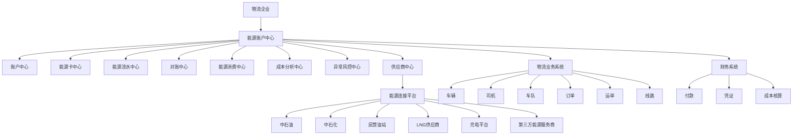
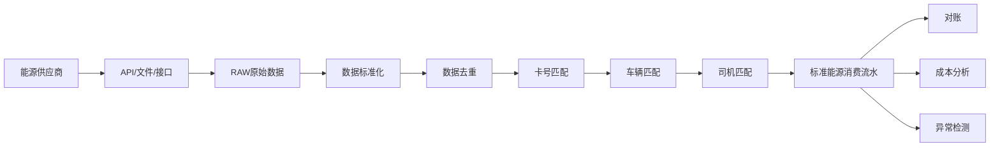
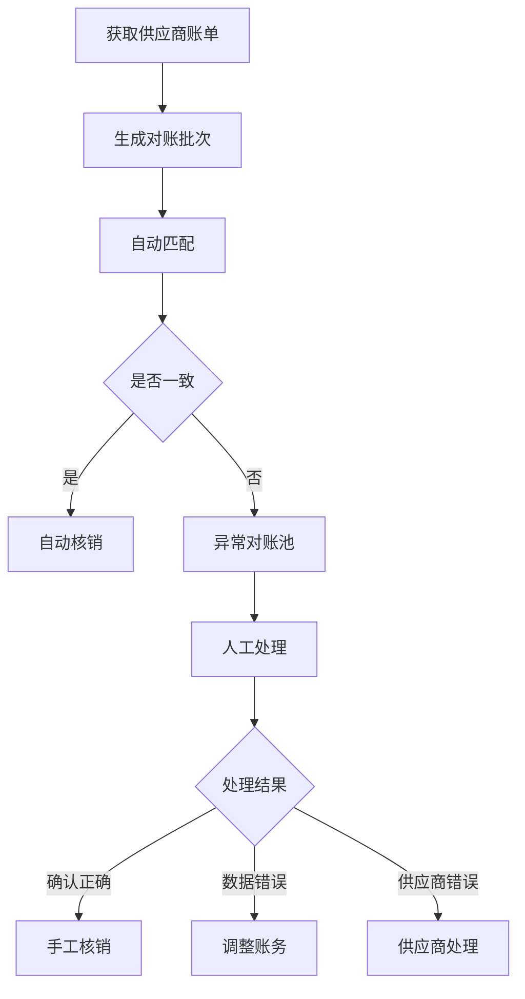
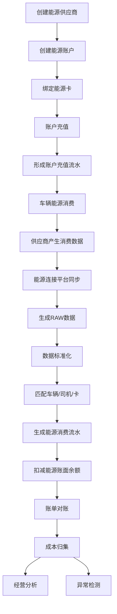
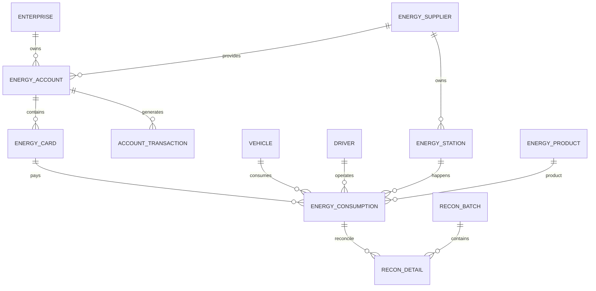

# 物流企业能源账户中心产品与系统设计方案

> 版本：V1.0  
> 定位：物流企业内部能源管理中心  
> 覆盖能源：油品 / LNG、CNG 等气品 / 新能源充电  
> 核心能力：账户记账、能源消费归集、外部服务商对接、自动对账、成本分析与管控

---

# 1. 项目背景

对于物流企业而言，车辆能源消耗通常属于企业最大的运营成本之一。

能源主要包括：

- 柴油、汽油等油品；
- LNG、CNG 等燃气；
- 新能源车辆充电。

传统物流企业的能源管理通常存在以下问题：

1. **能源资金分散**

企业可能同时在中石油、中石化、民营油站、能源平台、充电平台等多个渠道预存资金。

因此企业难以准确了解：

- 当前到底有多少能源资金；
- 分别沉淀在哪些供应商；
- 哪些账户资金利用率低；
- 哪些账户需要充值；
- 哪些账户存在大量长期沉淀资金。

2. **能源消费数据分散**

能源消费可能来源于：

- 中石油实体卡；
- 中石化实体卡；
- 第三方能源平台；
- 企业内部油卡；
- 司机垫付；
- 油站月结；
- 充电平台；
- LNG 加气平台。

企业很难形成统一能源消费台账。

3. **对账高度依赖人工**

财务或者车队管理员需要：

- 下载供应商账单；
- 整理 Excel；
- 对照车辆；
- 对照司机；
- 对照油卡；
- 对照充值记录；
- 检查异常流水。

大量依赖人工。

4. **成本缺乏透明度**

企业通常只能知道：

> “本月用了多少钱油。”

但无法快速回答：

- 哪辆车油耗最高？
- 哪条线路能源成本最高？
- 哪个供应商价格最低？
- 同车型为什么油耗差异这么大？
- 某辆车是否存在异常加油？
- 哪些能源账户资金沉淀严重？

因此需要建设独立的 **企业能源账户中心**。

---

# 2. 产品定位

## 2.1 产品定义

能源账户中心不是单纯的“油卡管理系统”。

其定位为：

> **物流企业内部统一的能源账户、能源消费和能源资金管理中心。**

系统本身原则上：

**不承担银行级支付和资金清算职责。**

核心职责是：

> **记账 + 数据连接 + 对账 + 管控 + 分析。**

即：

```text
企业真实资金
        │
        ▼
外部能源供应商
        │
        ▼
能源账户中心
        │
 ┌──────┼──────┐
 │      │      │
账户    消费    对账
 │      │      │
 └──────┼──────┘
        │
        ▼
成本分析 / 风控 / 决策
```

---

# 3. 产品目标

能源账户中心重点解决三个问题。

## 3.1 提高能源资金周转效率

帮助企业回答：

```text
钱在哪里？
有多少钱？
用了多少钱？
还有多少钱？
哪些钱长期没有使用？
哪些账户应该充值？
哪些账户应该减少预存？
```

最终降低能源预存资金规模，提高资金利用率。

---

## 3.2 提升能源成本透明度

建立：

```text
企业
 ↓
车队
 ↓
车辆
 ↓
司机
 ↓
订单 / 运单 / 线路
 ↓
能源消费
```

之间的数据关联。

最终实现：

> 每一笔能源费用都可以追溯到车辆、司机、能源账户和供应商。

---

## 3.3 提升管理效率

通过自动化能力减少：

- Excel 导入；
- 人工对账；
- 人工统计；
- 人工核销；
- 人工异常排查。

---

# 4. 产品设计原则

整个系统遵循以下原则。

## 4.1 能源统一抽象

系统不分别设计：

- 油账户；
- 气账户；
- 电账户。

而统一抽象为：

> **能源账户 Energy Account**

能源类型作为账户及消费记录的属性存在。

---

## 4.2 账户与支付方式分离

必须区分两个概念：

### 能源账户

代表企业与供应商之间的资金关系。

例如：

```text
XX物流 - 中石油企业账户
余额：320,000 元
```

### 能源卡 / 支付介质

代表使用该账户消费的工具。

例如：

```text
中石油卡 001
中石油卡 002
中石化卡 003
```

关系：

```text
企业能源账户
     │
     ├── 能源卡01
     ├── 能源卡02
     ├── 能源卡03
     └── 虚拟支付账户
```

---

## 4.3 真实账户与系统账本分离

能源账户中心维护的是：

> **企业能源管理账本**

并不是银行账户本身。

因此系统余额需要区分：

```text
账面余额
供应商余额
可用余额
冻结金额
差异金额
```

---

## 4.4 原始数据不可直接覆盖

所有外部消费数据必须保留：

```text
原始数据 Raw Data
```

之后经过：

```text
标准化
去重
匹配
校验
归属
```

生成标准能源流水。

避免由于接口变化或人工修改导致无法追溯。

---

# 5. 系统总体架构



---

# 6. 系统逻辑分层

推荐采用六层架构。

```text
┌──────────────────────────────┐
│            应用层             │
│ 账户 / 流水 / 对账 / 分析 / 风控 │
├──────────────────────────────┤
│            业务层             │
│ 账户引擎 / 对账引擎 / 规则引擎   │
├──────────────────────────────┤
│            数据层             │
│ 能源账户 / 卡 / 交易 / 消费模型   │
├──────────────────────────────┤
│           集成平台层           │
│ API / 文件 / 爬取 / 消息 / ETL   │
├──────────────────────────────┤
│           外部能源层           │
│ 中石油 / 中石化 / LNG / 充电平台 │
├──────────────────────────────┤
│           企业业务层           │
│ 车辆 / 司机 / 运单 / 财务 / 组织 │
└──────────────────────────────┘
```

---

# 7. 核心产品模块

一级导航建议：

```text
能源中心

├── 能源首页
├── 能源账户
├── 能源卡
├── 能源流水
├── 能源消费
├── 能源充值
├── 能源对账
├── 异常中心
├── 成本分析
├── 能源供应商
└── 能源设置
```

---

# 8. 能源首页

首页主要解决管理层三个问题：

> 有多少钱？

> 花了多少钱？

> 有没有异常？

## 8.1 核心指标

展示：

### 账户指标

- 能源账户总余额；
- 可用余额；
- 本月充值金额；
- 本月消费金额；
- 沉淀资金；
- 预计可使用天数。

### 消费指标

- 今日能源消费；
- 本月能源消费；
- 油品消费金额；
- LNG 消费金额；
- 充电消费金额。

### 运营指标

- 百公里油耗；
- 百公里电耗；
- 百公里能源成本；
- 单车平均能源成本。

### 风险指标

- 异常消费数量；
- 未匹配车辆流水；
- 未匹配司机流水；
- 对账差异数量；
- 疑似重复消费。

---

# 9. 能源账户中心

## 9.1 账户模型

一个能源账户代表：

> 企业与某个能源服务商之间的资金账户。

例如：

```text
账户名称：
华东车队-中石油账户

能源供应商：
中国石油

能源类型：
柴油

账户类型：
预付

账面余额：
¥328,000

供应商余额：
¥326,800

差异：
¥1,200
```

---

## 9.2 账户类型

支持：

```text
PREPAID     预付账户
POSTPAID    后付/月结账户
CREDIT      授信账户
CARD_POOL   卡资金池
VIRTUAL     虚拟能源账户
```

未来可扩展。

---

## 9.3 账户状态

```text
NORMAL      正常
FROZEN      冻结
DISABLED    停用
CLOSED      已关闭
```

---

# 10. 能源账户余额模型

推荐采用：

```text
期初余额
+
充值
+
退款
-
消费
-
手续费
+
调整
=
期末余额
```

公式：

```text
Balance(t)

= Balance(t-1)
+ Recharge
+ Refund
- Consumption
- Fee
± Adjustment
```

---

# 11. 能源流水模型

这是整个系统最核心的数据结构之一。

所有金额变化必须形成：

> Account Transaction

统一流水类型：

```text
RECHARGE       充值
CONSUMPTION    消费
REFUND         退款
TRANSFER_IN    转入
TRANSFER_OUT   转出
ADJUSTMENT     调账
REVERSAL       冲正
FREEZE         冻结
UNFREEZE       解冻
```

---

# 12. 能源充值

记录企业向能源供应商进行资金充值。

例如：

```text
2026-08-01

企业：
XX物流

能源账户：
中石化上海账户

充值金额：
500,000 元

付款方式：
银行转账

财务付款单：
FK202608010001
```

充值后：

```text
账户余额

1,200,000
+
500,000
=
1,700,000
```

---

# 13. 能源卡中心

能源卡是能源账户下的消费介质。

例如：

```text
中石油账户
    │
    ├── 油卡A
    ├── 油卡B
    ├── 油卡C
    └── 油卡D
```

每张卡可以绑定：

- 车辆；
- 司机；
- 车队；
- 组织；
- 能源账户。

---

# 14. 能源卡生命周期

状态：

```text
UNACTIVATED   未激活
NORMAL        正常
FROZEN        冻结
LOST          挂失
DISABLED      停用
EXPIRED       过期
```

操作：

```text
建卡
 ↓
绑车
 ↓
启用
 ↓
消费
 ↓
解绑
 ↓
冻结 / 挂失
 ↓
注销
```

---

# 15. 能源消费中心

这是系统第二个核心模块。

系统需要把不同供应商的数据统一成：

> Energy Consumption Record

---

# 16. 统一能源消费模型

无论：

- 加油；
- 加气；
- 充电；

统一抽象为：

```text
消费主体
+
能源商品
+
消费数量
+
单价
+
金额
+
时间
+
地点
+
供应商
```

统一模型：

```text
EnergyConsumption

企业
组织
车队
车辆
司机

能源账户
能源卡

供应商
能源站点

能源类型
能源品种

数量
单位
单价
金额

消费时间
消费地点

订单
运单
线路
```

---

# 17. 能源单位体系

因为油、气、电单位不同，因此设计：

## 油品

```text
单位：L
```

例如：

```text
柴油
320 L
7.20 元/L
2304 元
```

---

## LNG / CNG

可以使用：

```text
kg
m³
```

例如：

```text
LNG
210 kg
6.1 元/kg
1281 元
```

---

## 充电

```text
kWh
```

例如：

```text
电量
350 kWh
1.25 元/kWh
437.5 元
```

---

# 18. 能源商品模型

建议单独建立：

```text
energy_product
```

例如：

|能源类型|能源商品|
|---|---|
|OIL|0#柴油|
|OIL|-10#柴油|
|OIL|92#汽油|
|OIL|95#汽油|
|GAS|LNG|
|GAS|CNG|
|ELECTRICITY|充电|

---

# 19. 外部能源数据接入

数据接入是整个系统最重要也是最复杂的一层。

需要建设独立：

> Energy Connector

即能源连接平台。

支持四类接入方式：

```text
API
文件
自动抓取
人工导入
```

优先级建议：

```text
API > 文件自动同步 > Excel导入 > 人工录入
```

---

# 20. 原始数据层

外部数据进入系统后不能直接成为业务数据。

建议流程：

```text
供应商数据
     ↓
RAW原始数据
     ↓
格式转换
     ↓
字段映射
     ↓
数据清洗
     ↓
去重
     ↓
主数据匹配
     ↓
标准能源流水
```

架构：



---

# 21. 数据匹配逻辑

外部消费记录通常只能获得：

```text
卡号
车牌号
时间
油站
金额
```

因此系统需要建立匹配机制。

优先级：

```text
能源卡
 ↓
车辆
 ↓
司机
 ↓
车队
 ↓
组织
```

---

# 22. 数据匹配状态

每笔流水维护：

```text
MATCHED            已匹配
PARTIAL_MATCHED    部分匹配
UNMATCHED          未匹配
CONFLICT           匹配冲突
```

例如：

```text
能源卡：匹配成功
车辆：匹配成功
司机：未匹配
```

则：

```text
PARTIAL_MATCHED
```

---

# 23. 去重机制

外部供应商可能重复推送数据。

必须建立：

```text
external_transaction_id
```

如果供应商没有唯一 ID，则生成业务指纹：

```text
hash(
supplier
+ card_no
+ transaction_time
+ amount
+ quantity
+ station
)
```

防止重复入账。

---

# 24. 对账中心

建议建立三层对账。

```text
账户对账
消费对账
财务对账
```

---

# 25. 账户余额对账

系统计算：

```text
系统账面余额
```

与：

```text
供应商余额
```

比较。

例如：

```text
系统余额：328000
供应商余额：326800

差异：1200
```

生成：

```text
账户余额差异
```

---

# 26. 消费流水对账

比较：

```text
供应商账单
VS
系统能源消费流水
```

状态：

```text
MATCHED
MISSING_INTERNAL
MISSING_EXTERNAL
AMOUNT_DIFFERENCE
QUANTITY_DIFFERENCE
DUPLICATED
```

---

# 27. 对账流程



---

# 28. 异常中心

异常中心不是第一期必须做得非常复杂，但数据模型必须预留。

异常类型：

```text
异常地点加油
异常时间加油
超油箱容量
短时间重复加油
异常油耗
异常单价
非绑定车辆消费
非绑定司机消费
重复流水
账户余额异常
长期未使用账户
```

---

# 29. 风控示例

例如某车辆：

```text
油箱容量：
600L

本次加油：
580L

上次加油：
2小时前

上次加油：
500L
```

系统可以标记：

```text
HIGH_RISK
疑似异常加油
```

---

# 30. 能源成本分析

成本分析需要建立多个维度。

### 企业维度

```text
企业能源总成本
```

### 组织维度

```text
分公司
事业部
车队
```

### 车辆维度

```text
单车能源成本
百公里能源成本
```

### 司机维度

```text
司机油耗表现
```

### 线路维度

```text
线路能源成本
```

### 供应商维度

```text
供应商平均价格
```

---

# 31. 核心成本指标

建议第一期重点建设以下指标。

## 单车能源成本

```text
车辆能源成本
=
车辆所有能源消费金额
```

---

## 百公里能源成本

```text
百公里能源成本
=
能源费用
÷
行驶公里
×
100
```

---

## 百公里油耗

```text
百公里油耗
=
油品使用量
÷
行驶公里
×
100
```

---

## 百公里电耗

```text
百公里电耗
=
充电量
÷
行驶公里
×
100
```

---

# 32. 能源资金效率指标

这是能源账户中心非常重要的经营指标。

## 资金周转率

可以设计：

```text
能源资金周转率
=
周期能源消费
÷
平均能源账户余额
```

---

## 资金可使用天数

```text
可使用天数
=
当前余额
÷
最近30天日均能源消费
```

例如：

```text
余额：
1,000,000

日均消费：
100,000

可使用：
10天
```

---

# 33. 沉淀资金

定义：

> 长时间没有产生消费，但账户仍保持较高余额的资金。

例如：

```text
账户余额：
50万元

过去30天消费：
1万元
```

则可以判定：

```text
资金利用率低
```

提示企业：

> 减少该供应商预存资金。

---

# 34. 供应商分析

对供应商可以形成：

```text
价格
资金效率
站点覆盖
消费规模
数据质量
对账质量
```

综合评价。

例如：

|供应商|平均柴油价|账户余额|月消费|资金可用天数|
|---|---:|---:|---:|---:|
|供应商A|7.20|300万|600万|15|
|供应商B|7.05|500万|100万|150|
|供应商C|7.15|100万|500万|6|

则系统可以提示：

> B 账户存在明显资金沉淀。

---

# 35. 系统核心业务流程

完整流程：



---

# 36. 产品页面设计

## 36.1 能源账户列表

字段：

```text
账户名称
供应商
能源类型
账户类型
账面余额
供应商余额
可用余额
本月充值
本月消费
预计可用天数
状态
最近同步时间
```

---

# 37. 能源账户详情页

建议采用：

```text
账户概览
|
├── 账户余额
├── 资金趋势
├── 充值记录
├── 消费记录
├── 能源卡
├── 对账记录
└── 操作日志
```

---

# 38. 能源消费列表

核心字段：

```text
消费时间
供应商
站点
能源账户
能源卡
车牌号
司机
能源类型
能源商品
数量
单位
单价
金额
里程
匹配状态
对账状态
异常状态
```

---

# 39. 数据库总体模型

核心实体关系：



---

# 40. 数据库表设计

第一期建议核心表约 15～20 张。

主要包括：

```text
energy_supplier
energy_station

energy_account
energy_account_balance

energy_card
energy_card_binding

energy_product

energy_account_transaction

energy_consumption
energy_consumption_raw

energy_recharge

energy_recon_batch
energy_recon_detail

energy_exception

energy_connector
energy_connector_task

energy_account_daily_snapshot
```

---

# 41. energy_supplier

能源供应商表。

```sql
CREATE TABLE energy_supplier (
    id BIGINT PRIMARY KEY,
    tenant_id BIGINT NOT NULL,

    supplier_code VARCHAR(64) NOT NULL,
    supplier_name VARCHAR(128) NOT NULL,

    supplier_type VARCHAR(32),

    status VARCHAR(32),

    contact_name VARCHAR(64),
    contact_phone VARCHAR(32),

    created_at DATETIME,
    updated_at DATETIME
);
```

supplier_type：

```text
PETROLEUM
GAS
CHARGING
ENERGY_PLATFORM
OTHER
```

---

# 42. energy_account

能源账户。

```sql
CREATE TABLE energy_account (
    id BIGINT PRIMARY KEY,

    tenant_id BIGINT NOT NULL,

    account_code VARCHAR(64) NOT NULL,
    account_name VARCHAR(128) NOT NULL,

    supplier_id BIGINT NOT NULL,

    energy_type VARCHAR(32),

    account_type VARCHAR(32),

    external_account_no VARCHAR(128),

    currency VARCHAR(16) DEFAULT 'CNY',

    ledger_balance DECIMAL(18,2) DEFAULT 0,

    supplier_balance DECIMAL(18,2),

    available_balance DECIMAL(18,2),

    frozen_balance DECIMAL(18,2) DEFAULT 0,

    status VARCHAR(32),

    last_sync_time DATETIME,

    created_at DATETIME,
    updated_at DATETIME
);
```

---

# 43. energy_card

能源卡。

```sql
CREATE TABLE energy_card (
    id BIGINT PRIMARY KEY,

    tenant_id BIGINT NOT NULL,

    account_id BIGINT NOT NULL,

    card_no VARCHAR(128) NOT NULL,

    external_card_id VARCHAR(128),

    card_type VARCHAR(32),

    energy_type VARCHAR(32),

    status VARCHAR(32),

    valid_from DATETIME,
    valid_to DATETIME,

    created_at DATETIME,
    updated_at DATETIME
);
```

---

# 44. energy_card_binding

卡与车辆/司机绑定关系。

```sql
CREATE TABLE energy_card_binding (
    id BIGINT PRIMARY KEY,

    tenant_id BIGINT NOT NULL,

    card_id BIGINT NOT NULL,

    vehicle_id BIGINT,
    driver_id BIGINT,

    start_time DATETIME NOT NULL,
    end_time DATETIME,

    status VARCHAR(32),

    created_at DATETIME
);
```

这里必须使用：

```text
start_time
end_time
```

而不能直接覆盖车辆。

原因是：

> 需要知道历史某笔消费发生时，这张卡到底绑定的是哪辆车。

---

# 45. energy_product

能源产品。

```sql
CREATE TABLE energy_product (
    id BIGINT PRIMARY KEY,

    energy_type VARCHAR(32) NOT NULL,

    product_code VARCHAR(64),

    product_name VARCHAR(128),

    standard_unit VARCHAR(16),

    status VARCHAR(32),

    created_at DATETIME
);
```

例如：

```text
DIESEL_0
0#柴油
L
```

---

# 46. energy_account_transaction

能源账户资金流水。

```sql
CREATE TABLE energy_account_transaction (
    id BIGINT PRIMARY KEY,

    tenant_id BIGINT NOT NULL,

    account_id BIGINT NOT NULL,

    transaction_no VARCHAR(64) NOT NULL,

    transaction_type VARCHAR(32) NOT NULL,

    amount DECIMAL(18,2) NOT NULL,

    balance_before DECIMAL(18,2),

    balance_after DECIMAL(18,2),

    external_transaction_id VARCHAR(128),

    transaction_time DATETIME NOT NULL,

    business_type VARCHAR(32),

    business_id BIGINT,

    remark VARCHAR(512),

    created_at DATETIME
);
```

---

# 47. energy_consumption

整个能源系统最重要的业务表。

```sql
CREATE TABLE energy_consumption (
    id BIGINT PRIMARY KEY,

    tenant_id BIGINT NOT NULL,

    consumption_no VARCHAR(64) NOT NULL,

    supplier_id BIGINT,
    station_id BIGINT,

    account_id BIGINT,
    card_id BIGINT,

    vehicle_id BIGINT,
    driver_id BIGINT,

    fleet_id BIGINT,
    org_id BIGINT,

    order_id BIGINT,
    waybill_id BIGINT,
    route_id BIGINT,

    energy_type VARCHAR(32) NOT NULL,
    energy_product_id BIGINT,

    quantity DECIMAL(18,4),
    unit VARCHAR(16),

    unit_price DECIMAL(18,6),

    amount DECIMAL(18,2),

    mileage DECIMAL(18,2),

    consumption_time DATETIME NOT NULL,

    external_transaction_id VARCHAR(128),

    match_status VARCHAR(32),

    recon_status VARCHAR(32),

    exception_status VARCHAR(32),

    raw_id BIGINT,

    created_at DATETIME,
    updated_at DATETIME
);
```

---

# 48. energy_consumption_raw

保存供应商原始数据。

```sql
CREATE TABLE energy_consumption_raw (
    id BIGINT PRIMARY KEY,

    tenant_id BIGINT NOT NULL,

    supplier_id BIGINT,

    connector_id BIGINT,

    external_transaction_id VARCHAR(128),

    raw_data JSON NOT NULL,

    data_hash VARCHAR(128),

    process_status VARCHAR(32),

    error_message VARCHAR(1024),

    received_at DATETIME,

    processed_at DATETIME
);
```

这个表非常重要。

原则：

> RAW 数据只能新增，不轻易修改。

---

# 49. energy_recharge

能源充值单。

```sql
CREATE TABLE energy_recharge (
    id BIGINT PRIMARY KEY,

    tenant_id BIGINT NOT NULL,

    recharge_no VARCHAR(64),

    account_id BIGINT NOT NULL,

    amount DECIMAL(18,2) NOT NULL,

    recharge_time DATETIME,

    payment_method VARCHAR(32),

    payment_reference VARCHAR(128),

    status VARCHAR(32),

    created_by BIGINT,

    created_at DATETIME
);
```

---

# 50. energy_recon_batch

对账批次。

```sql
CREATE TABLE energy_recon_batch (
    id BIGINT PRIMARY KEY,

    tenant_id BIGINT NOT NULL,

    batch_no VARCHAR(64),

    account_id BIGINT,

    supplier_id BIGINT,

    start_date DATE,
    end_date DATE,

    external_amount DECIMAL(18,2),

    internal_amount DECIMAL(18,2),

    difference_amount DECIMAL(18,2),

    status VARCHAR(32),

    created_at DATETIME
);
```

---

# 51. energy_recon_detail

对账明细。

```sql
CREATE TABLE energy_recon_detail (
    id BIGINT PRIMARY KEY,

    tenant_id BIGINT NOT NULL,

    batch_id BIGINT NOT NULL,

    consumption_id BIGINT,

    external_transaction_id VARCHAR(128),

    external_amount DECIMAL(18,2),

    internal_amount DECIMAL(18,2),

    difference_amount DECIMAL(18,2),

    recon_result VARCHAR(32),

    process_status VARCHAR(32),

    created_at DATETIME
);
```

---

# 52. energy_exception

异常记录。

```sql
CREATE TABLE energy_exception (
    id BIGINT PRIMARY KEY,

    tenant_id BIGINT NOT NULL,

    consumption_id BIGINT,

    exception_type VARCHAR(64),

    risk_level VARCHAR(16),

    exception_message VARCHAR(512),

    process_status VARCHAR(32),

    processor_id BIGINT,

    processed_at DATETIME,

    created_at DATETIME
);
```

---

# 53. energy_account_daily_snapshot

建议从第一期就建立每日余额快照。

```sql
CREATE TABLE energy_account_daily_snapshot (
    id BIGINT PRIMARY KEY,

    tenant_id BIGINT NOT NULL,

    account_id BIGINT NOT NULL,

    snapshot_date DATE NOT NULL,

    opening_balance DECIMAL(18,2),

    recharge_amount DECIMAL(18,2),

    consumption_amount DECIMAL(18,2),

    refund_amount DECIMAL(18,2),

    adjustment_amount DECIMAL(18,2),

    closing_balance DECIMAL(18,2),

    supplier_balance DECIMAL(18,2),

    created_at DATETIME
);
```

这样未来进行：

- 资金趋势；
- 平均余额；
- 周转率；
- 沉淀资金分析；

都会简单很多。

---

# 54. 数据字典——能源类型

```text
OIL             油品
GAS             燃气
ELECTRICITY     电力
OTHER           其他
```

---

# 55. API 设计

建议统一：

```text
/api/energy/v1/
```

---

## 账户 API

```http
GET /energy/accounts
GET /energy/accounts/{id}

POST /energy/accounts

PUT /energy/accounts/{id}

GET /energy/accounts/{id}/balance
```

---

## 能源卡 API

```http
GET /energy/cards

POST /energy/cards

POST /energy/cards/{id}/bind

POST /energy/cards/{id}/unbind

POST /energy/cards/{id}/freeze
```

---

## 消费 API

```http
GET /energy/consumptions

GET /energy/consumptions/{id}

POST /energy/consumptions/import
```

---

## 充值 API

```http
POST /energy/recharges

GET /energy/recharges
```

---

## 对账 API

```http
POST /energy/reconciliation

GET /energy/reconciliation/{id}

POST /energy/reconciliation/{id}/confirm
```

---

# 56. 外部供应商接口标准

建议内部定义统一 DTO：

```json
{
  "supplierCode": "CNPC",

  "externalTransactionId": "202608100001",

  "accountNo": "A001",

  "cardNo": "CARD001",

  "vehicleNo": "沪A12345",

  "stationCode": "S001",

  "energyType": "OIL",

  "productName": "0#柴油",

  "quantity": 300.5,

  "unit": "L",

  "unitPrice": 7.2,

  "amount": 2163.6,

  "transactionTime": "2026-08-10 15:30:00"
}
```

所有供应商接口最终转换成这个内部模型。

---

# 57. 数据同步机制

建议支持：

```text
实时
准实时
定时
手工
```

例如：

### 实时

Webhook / MQ。

### 准实时

每 5～10 分钟接口拉取。

### 定时

每天凌晨全量补偿。

### 手工

Excel 上传。

---

# 58. 数据同步容错

必须支持：

```text
接口重试
断点续传
数据补偿
幂等
失败队列
人工重新执行
```

否则能源流水极易出现：

```text
少账
重账
断账
```

---

# 59. 权限体系

建议基于：

```text
RBAC + 数据权限
```

---

## 角色

例如：

```text
能源管理员
财务人员
车队管理员
运营人员
企业管理员
审计人员
```

---

# 60. 数据权限

可以按：

```text
企业
组织
事业部
车队
车辆
```

进行隔离。

例如：

```text
上海车队管理员
```

只能看：

```text
上海车队能源消费
```

不能查看：

```text
北京车队
```

---

# 61. 操作权限

敏感操作必须独立授权。

例如：

```text
账户创建
余额调整
充值登记
卡冻结
手工修改流水
对账确认
异常关闭
```

---

# 62. 审计日志

必须记录：

```text
谁
什么时候
修改了什么
修改前
修改后
原因
```

尤其：

```text
余额调整
消费调整
人工核销
```

必须完整审计。

---

# 63. MVP 第一阶段范围

第一期不应该一次做成“大而全”的能源平台。

建议先打通：

> **账户 → 充值 → 消费 → 对账 → 分析**

这条主链路。

---

## 第一阶段必须完成

### 账户

```text
能源供应商
能源账户
能源卡
余额
```

### 资金

```text
充值
消费
退款
调整
```

### 消费

```text
油
气
电
```

统一流水。

### 数据接入

优先：

```text
1～2家核心能源供应商
+
Excel导入
```

### 对账

```text
供应商账单
VS
系统消费流水
```

### 分析

第一期只做：

```text
账户余额
能源消费
单车成本
百公里成本
供应商成本
```

---

# 64. 第二阶段

增加：

```text
资金周转分析
自动充值提醒
账户资金预测
能源价格分析
异常消费检测
司机油耗排名
供应商评价
```

---

# 65. 第三阶段

进一步建设：

> **智能能源运营平台**

例如：

```text
能源采购策略
资金动态调拨建议
最优油站推荐
最优能源供应商推荐
智能充值
能源成本预测
AI异常检测
```

---

# 66. 推荐系统边界

一个非常重要的架构原则：

能源账户中心负责：

```text
账
数据
规则
对账
分析
```

不要在早期直接承担：

```text
银行支付
资金托管
支付清算
金融账户
```

这样可以显著降低：

- 财务风险；
- 合规风险；
- 系统复杂度。

---

# 67. 最终业务架构

整个能源模块最终可以抽象为：

```text
                   企业能源中心
                         │
        ┌────────────────┼────────────────┐
        │                │                │
      资金域            消费域            数据域
        │                │                │
   能源账户          能源消费流水        供应商连接
   能源充值          车辆能源成本        数据同步
   余额管理          司机能源成本        数据清洗
   账户流水          线路能源成本        数据匹配
        │                │                │
        └────────────────┼────────────────┘
                         │
                    管理与决策域
                         │
            ┌────────────┼────────────┐
            │            │            │
           对账         风控         分析
            │            │            │
        自动对账     异常消费     资金周转
        差异处理     油耗异常     成本分析
        财务核销     风险预警     供应商分析
```

---

# 68. 产品核心思想总结

这个产品最重要的不是“管理油卡”。

而是建立企业统一的：

# 能源数字账本

将：

```text
钱
+
卡
+
车
+
司机
+
油 / 气 / 电
+
供应商
+
订单
```

连接起来。

最终形成：

```text
一笔资金
→
一个能源账户
→
一笔消费
→
一辆车
→
一个司机
→
一张运单
→
一条线路
→
一个运输成本
```

这才是能源账户中心真正的业务价值。

---

# 69. 一句话产品定义

> **能源账户中心，是物流企业统一管理油、气、电等能源资金账户、消费数据、供应商连接、对账及能源成本的数字化能源管理平台。**

---

# 70. 产品建设主线

整个项目建议始终围绕一条主线：

```text
账户
 ↓
资金
 ↓
消费
 ↓
车辆
 ↓
运输业务
 ↓
成本
 ↓
经营决策
```

第一期先把：

> **账记准、流水拿全、消费归对、对账做快。**

第二期再解决：

> **钱怎么放更合理、能源怎么买更便宜、车辆怎么用更省。**

这会比从传统“油卡管理”视角出发，更适合作为物流系统长期的能源基础设施。