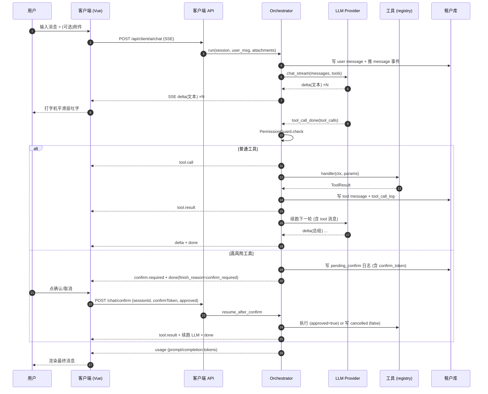

# 企业端 - AI 数字人模块总览

> **所属阶段**：阶段五 - 平台 AI 能力建设
>
> **文档状态**：已完成（基于现有实现反向补全）
>
> **优先级**：高（核心智能交互入口）

## 一、模块定位

「AI 数字人模块」是企业端用户与 AI 数字员工对话的工作区，提供**自然语言驱动业务操作**的能力。用户可以与录单员、数据分析员等不同角色的数字员工聊天：让 AI 帮忙查运单 / 车辆 / 客户、上传 Excel 自动批量录入、执行多步骤业务流程，并在涉及高风险动作（批量入库等）前由用户显式确认。

模块由 1 个主入口页面 + 4 张租户库表 + 后端 SSE 流式编排引擎 + 多个内置工具构成。

## 二、入口与配套

### 2.1 客户端入口

| 项 | 值 |
|----|----|
| 路由 | `/dashboard/ai-assistant` |
| 主组件 | `frontend/client/src/views/dashboard/ai-assistant/index.vue` |
| 菜单编码 | `dashboard:ai-assistant` |
| 菜单 ID | `302`（由 `backend/scripts/seed/_build_v2_menus.py` 注入） |
| 父菜单 | `164`（智能工作台） |
| 图标 | `AI` |
| 产品功能 | `feature_code = ai_assistant` |
| 默认开通版本 | `enterprise` |

### 2.2 子文档分组

| 文档 | 说明 |
|------|------|
| [01.数字员工对话页.md](01.数字员工对话页.md) | 三栏布局、子组件契约、SSE 9 类事件、打字机平滑层 |
| [02.高风险确认与权限.md](02.高风险确认与权限.md) | confirm_token 状态机、PermissionGuard 三层校验、限流与 Token 配额 |
| [03.附件与文件解析.md](03.附件与文件解析.md) | 上传约束、parse_excel/map_columns、录单工作流 |

通用机制（SSE 协议详细字段、权限守卫实现、加密/脱敏 等）在运营端总览中统一描述，本组文档以指针引用：[../../01.运营后台/04.AI 数字员工/00.模块总览.md](../../01.运营后台/04.AI%20数字员工/00.模块总览.md)。

## 三、三栏布局

```
┌──────────────┬─────────────────────────────────┬──────────────┐
│  左 260px     │            中 1fr               │   右 280px    │
│              │                                 │ (<1200 隐藏)  │
│  ┌─员工列表─┐ │  ┌──────会话主区────────────┐  │  ┌─可用工具─┐ │
│  │ 录单员    │ │  │ 欢迎语 + 建议提问 chip    │  │  │ 工具1   │ │
│  │ 数据分析员 │ │  │                          │  │  │ 工具2   │ │
│  │ ...      │ │  │ 消息气泡 (用户右/AI左)     │  │  │ ...    │ │
│  └─────────┘ │  │   ├─ 文本+附件             │  │  └────────┘ │
│              │  │   └─ 工具时间线             │  │              │
│  ┌─历史会话─┐ │  │      (tool.call/result)   │  │              │
│  │ 会话1    │ │  │                          │  │              │
│  │ 会话2    │ │  ├──────输入栏──────────────┤  │              │
│  │ ...      │ │  │ 文本输入 + 附件 + 发送/中止│  │              │
│  └─────────┘ │  └──────────────────────────┘  │              │
└──────────────┴─────────────────────────────────┴──────────────┘
```

- **左栏**：上半屏数字员工列表（横向滚动 chip 形式或列表），下半屏当前员工的历史会话列表（含「新建」「重命名」「删除」）。
- **中栏**：会话主区，自上而下=空状态欢迎卡片 + 消息流 + 输入栏。
- **右栏**：当前选中员工的可用工具列表（只读展示，含名称 / 描述 / 风险标签）；视口宽度 < 1200px 自动隐藏。

详细组件契约见 [01.数字员工对话页.md](01.数字员工对话页.md)。

## 四、整体调用时序



## 五、与运营端的协作

| 数据/能力 | 来自哪 | 谁维护 |
|----------|--------|--------|
| 数字员工角色（含提示词、模型配置、绑定工具） | 平台库 `ai_employee` / `ai_employee_tool` | 运营 |
| 工具实现 | 后端 `tools/*.py` + 平台库 `ai_tool` | 开发（注册）+ 运营（启停） |
| LLM Provider（apiKey、base_url、model） | 平台库 `ai_model_provider` | 运营 |
| 提示词模板 | 平台库 `ai_prompt_template` | 运营 |
| 会话 / 消息 / 工具调用日志 | 租户库 `biz_ai_*` 4 张表 | 当前用户 |
| 跨租户审计入口 | 运营端「调用观测」页 | 运营 |

详细数据模型与运营端 CRUD 行为见运营端文档：

- 数字员工：[../../01.运营后台/04.AI 数字员工/01.数字员工管理.md](../../01.运营后台/04.AI%20数字员工/01.数字员工管理.md)
- 工具中心：[../../01.运营后台/04.AI 数字员工/02.工具中心.md](../../01.运营后台/04.AI%20数字员工/02.工具中心.md)
- 提示词：[../../01.运营后台/04.AI 数字员工/03.提示词模板.md](../../01.运营后台/04.AI%20数字员工/03.提示词模板.md)
- Provider：[../../01.运营后台/04.AI 数字员工/04.模型 Provider.md](../../01.运营后台/04.AI%20数字员工/04.模型%20Provider.md)
- 调用观测：[../../01.运营后台/04.AI 数字员工/05.调用观测.md](../../01.运营后台/04.AI%20数字员工/05.调用观测.md)

## 六、产品功能与表自愈

### 6.1 产品功能开关

`sys_product_feature` 中：

| feature_code | 名称 | required_tables | 默认开通版本 |
|--------------|------|-----------------|--------------|
| `ai_assistant` | AI 数字员工 | `["biz_ai_session", "biz_ai_message", "biz_ai_tool_call_log", "biz_ai_context"]` | `enterprise` |

只有开通了 `ai_assistant` 的租户：

- 客户端菜单 `dashboard:ai-assistant` 可见。
- `/api/client/ai/employee`、`/api/client/ai/session`、`/api/client/ai/chat` 可用。
- 运营端「调用观测」中能查到该租户。

### 6.2 租户表首访自愈

后端 `app.core.dependencies.ensure_biz_ai_tables` 依赖项：

- 进程内缓存 `_ai_checked_tenants`，每个租户 code 只检查一次。
- 用 SQLAlchemy `MetaData.create_all` 按需创建 4 张 `biz_ai_*` 表（已存在不重复创建）。
- 仅挂在 `chat` / `session` 路由组（`employee` / `file` 不读业务表）。

老租户（在 `ai_assistant` 上线前已开通 `enterprise`）由 `backend/scripts/fix/fix_ai_tenant_tables.py` 一次性批量补建。

## 七、客户端 API 总览

前缀：`/api/client/ai`，全部需要租户 JWT。

| 方法 | 路径 | 说明 | 详细文档 |
|------|------|------|----------|
| GET | `/employee` | 列出当前租户可见的数字员工 | [01.数字员工对话页.md](01.数字员工对话页.md) §5 |
| GET | `/employee/{code}/tools` | 列出某员工的可用工具 | [01.数字员工对话页.md](01.数字员工对话页.md) §5 |
| GET | `/session` | 当前用户的会话分页 | [01.数字员工对话页.md](01.数字员工对话页.md) §5 |
| GET | `/session/{id}/messages` | 会话历史消息 | [01.数字员工对话页.md](01.数字员工对话页.md) §5 |
| PUT | `/session/{id}` | 重命名会话 | [01.数字员工对话页.md](01.数字员工对话页.md) §5 |
| DELETE | `/session/{id}` | 删除会话 | [01.数字员工对话页.md](01.数字员工对话页.md) §5 |
| POST | `/chat` | 发送消息（SSE 流式） | [01.数字员工对话页.md](01.数字员工对话页.md) §3、§4 |
| POST | `/chat/confirm` | 高风险确认续跑（SSE 流式） | [02.高风险确认与权限.md](02.高风险确认与权限.md) §4 |
| POST | `/file/upload` | 上传附件 | [03.附件与文件解析.md](03.附件与文件解析.md) §3 |

## 八、SSE 9 类事件速查

完整字段定义见 [01.数字员工对话页.md](01.数字员工对话页.md) §3。这里只列名字与触发时机：

| 事件 | 触发时机 |
|------|---------|
| `session` | 会话建立或识别 |
| `message` | 用户消息落库 |
| `delta` | LLM 文本增量 |
| `tool.call` | 工具开始调用 |
| `tool.result` | 工具执行完成（含 success/failed/denied/cancelled） |
| `confirm.required` | 高风险工具待用户确认 |
| `usage` | LLM 用量回报 |
| `done` | 一轮对话完成 |
| `error` | 异常 |

## 九、相关代码索引

| 子模块 | 路径 | 职责 |
|--------|------|------|
| 主页面 | `frontend/client/src/views/dashboard/ai-assistant/index.vue` | 三栏布局、SSE 处理、打字机层、状态机 |
| 子组件 | `frontend/client/src/views/dashboard/ai-assistant/components/` | employee-list / session-list / message-bubble / tool-call-item / chat-input |
| API SDK | `frontend/client/src/api/ai/index.ts` + `chat-stream.ts` | REST + 自定义 SSE 客户端 |
| 类型 | `frontend/client/src/api/ai/model/index.ts` | TS 接口定义 |
| 后端 API | `backend/app/modules/ai/api/client/` | chat / session / employee / file |
| 引擎 | `backend/app/modules/ai/engine/` | orchestrator / prompt_builder / streaming / context |
| 工具 | `backend/app/modules/ai/tools/` | waybill / vehicle / customer / file |
| 安全 | `backend/app/modules/ai/security/` | permission_guard / quota / desensitize / crypto |
| 服务 | `backend/app/modules/ai/services/chat_service.py` | 会话 CRUD |
| 模型 | `backend/app/modules/ai/models/tenant/` | biz_ai_* 4 张表 |
