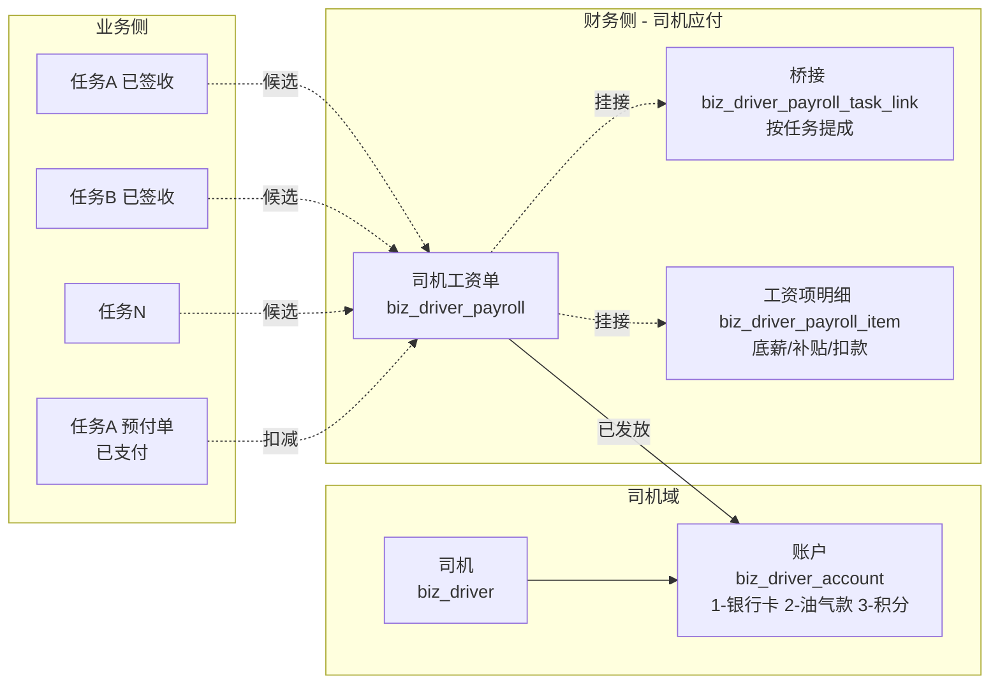

# 自有司机工资单（按周期聚合任务）

> **所属阶段**：阶段六 - 财务结算模块
>
> **文档状态**：方案确认（首版）
>
> **创建日期**：2026-05-19
>
> **优先级**：中高（影响自有车队薪资发放周期）
>
> **关联文档**：
>
> - 同目录 [00.模块总览](00.模块总览.md)
> - 同目录 [01.财务单据体系与业务单据联动设计](01.财务单据体系与业务单据联动设计.md)
> - [02.资源管理模块/02.驾驶员管理](../02.资源管理模块/02.驾驶员管理.md)
> - [06.运营调度模块/01.运输任务单管理](../06.运营调度模块/01.运输任务单管理.md)

## 一、业务背景

### 1.1 现状问题

| # | 问题 | 影响 |
|---|------|------|
| 1 | 自有司机薪资完全 Excel | 月底人工汇总司机本月任务、按台/按趟计提，常漏算补贴 |
| 2 | 任务级预付/补款（[`biz_task_finance_doc`](../../backend/app/modules/client/models/task/task_finance_doc.py)）能管单任务，但**无法按周期聚合发放工资** | 月薪司机的"底薪+提成"模式无承载 |
| 3 | 司机账户表（[`biz_driver_account`](../../backend/app/modules/client/models/capacity/self_capacity/driver/driver_account.py)）已有，但**未与发薪闭环** | 余额字段不自动随发薪/扣款变化 |
| 4 | 油卡 / 油气款核销缺位 | 发薪时常常忘记扣减"油气款已支付" |

### 1.2 与"任务级预付/补款"的关系定位

| 单据 | 角色 | 何时用 |
|------|------|--------|
| 任务级预付/补款（任务级费用单） | 单任务高时效付款（出车前预付、装车后补款），可向司机付款 | 任务执行中需要即时拿钱 |
| **司机工资单（本文）** | 周期聚合发薪（底薪 + 任务提成 + 补贴 - 扣项） | 按月/周/趟发薪 |

> **核心约束**：一张任务可同时存在"任务级预付/补款"和"司机工资单"——预付/补款是即时性付款，工资单是周期性发薪。工资单会扣减预付/补款的已支付金额，避免重复发。

### 1.3 设计目标

| 目标 | 落地 |
|------|------|
| 月薪/计件/混合三种薪资模型 | 主表 `payroll_model` 字段 + 工资项灵活配置 |
| 任务聚合 + 工资项灵活组合 | 桥接表存任务级提成 + 工资项表存补贴/扣款 |
| 司机账户联动 | 发放时按 `account_type` 写流水（远期） |
| 工资条留痕 | 工资条 PDF 自动生成（远期） |

## 二、单据全景



## 三、单据模型

### 3.1 业务模型

| 概念 | 定义 |
|------|------|
| 司机工资单 | 一段时间（月/周/趟）内某司机的薪资发放总单 |
| 工资模型 | 月薪固定 / 计件提成 / 混合（底薪 + 提成） |
| 工资项 | 底薪、出勤、提成、油补、餐补、安全奖、违章扣款、油气款抵账、社保代扣 等 |
| 任务提成 | 按签收台数 × 单价聚合，作为"计件提成"工资项的明细行 |
| 范围维度 | `driver_id` + `period_start` + `period_end`，同维度同时只允许一张"非撤销"工资单 |

### 3.2 数据模型

#### `biz_driver_payroll`（司机工资单主表）

继承 `FinanceDocBaseMixin`；本表特有字段：

| 字段 | 类型 | 备注 |
|------|------|------|
| `doc_kind` | `'driver_payroll'` | 常量 |
| `driver_id` | BigInt | 关联 `biz_driver.id` |
| `driver_name` | VARCHAR(50) | 冗余 |
| `driver_phone` | VARCHAR(20) | 冗余 |
| `payroll_model` | TinyInt | 1-月薪固定 2-计件提成 3-混合 |
| `period_type` | TinyInt | 1-月薪 2-周薪 3-趟薪 |
| `period_start` / `period_end` | DateTime | 周期，必填 |
| `task_count` | Int | 关联任务数 |
| `total_signed_quantity` | Int | 已签收总台数 |
| `total_commission_amount` | Numeric(12,2) | 任务提成合计（来自桥接行） |
| `total_base_amount` | Numeric(12,2) | 底薪 + 补贴合计（来自工资项） |
| `total_deduction_amount` | Numeric(12,2) | 扣款合计（违章/社保/油气款抵账） |
| `total_prepaid_offset_amount` | Numeric(12,2) | **已发放的任务级预付/补款金额合计**（扣减项） |
| `gross_amount` | Numeric(14,2) | 应发合计 = base + commission |
| `net_amount` | Numeric(14,2) | 实发合计 = gross - deduction - prepaid_offset |
| `account_id` | BigInt | 发薪账户 `biz_driver_account.id` |
| `account_type` | TinyInt | 账户类型快照（1-银行卡 2-油气款 3-积分） |
| `account_name_snapshot` | VARCHAR(100) | 账户名快照 |
| `account_no_masked` | VARCHAR(50) | 账户号脱敏快照 |
| `payslip_pdf_url` | VARCHAR(500) | 工资条 PDF |
| `status` | 0/1/2/3/4 | 0 草稿 / 1 待审批 / 2 已审批 / 3 已发放 / 4 已撤销 |

#### `biz_driver_payroll_task_link`（桥接表 - 任务提成行）

| 字段 | 类型 | 备注 |
|------|------|------|
| `payroll_id` | BigInt | 关联 `biz_driver_payroll.id` |
| `task_id` | BigInt | 关联 `biz_task.id` |
| `task_no` | VARCHAR(50) | 冗余 |
| `signed_at` | DateTime | 签收时间快照 |
| `billing_base` | TinyInt | 1-按台 2-按吨 3-按趟 |
| `quantity` | Numeric(10,2) | 计件数量（按台=已签收台数） |
| `unit_price` | Numeric(12,2) | 计件单价 |
| `commission_amount` | Numeric(12,2) | 该任务提成 = quantity × unit_price ± adjust |
| `adjust_amount` | Numeric(12,2) | 调整额（绩效折扣、罚款） |
| `adjust_reason` | VARCHAR(255) | 调整原因 |
| `signed_quantity_snapshot` | Int | 写入时已签收台数快照 |
| `locked_snapshot_at` | DateTime | 快照时间 |
| 唯一约束 | `(payroll_id, task_id)` | 防重复 |

#### `biz_driver_payroll_item`（工资项明细表）

| 字段 | 类型 | 备注 |
|------|------|------|
| `payroll_id` | BigInt | 关联 `biz_driver_payroll.id` |
| `item_type` | VARCHAR(30) | 字典 `payroll_item_type`：`base_salary`/`attendance`/`commission_total`/`oil_subsidy`/`meal_subsidy`/`safety_award`/`fine`/`social_insurance`/`oil_card_offset`/`other_deduction`/`other_addition` |
| `item_name` | VARCHAR(50) | 字典 label（冗余） |
| `category` | TinyInt | 1-应发项（加项） 2-扣减项 3-抵账项 |
| `amount` | Numeric(12,2) | 项目金额（>0） |
| `formula` | VARCHAR(255) | 计算说明（如"出勤22天 × ¥150/天 = ¥3300"） |
| `sort_order` | Int | 排序 |
| `remark` | VARCHAR(255) | 备注 |

> **注意**：`commission_total` 项的 `amount = Σ commission_amount`（汇总从任务桥接行回填）。`oil_card_offset` 用于油气款抵账场景（见 §3.5）。

### 3.3 状态机

完全遵循 §01 §2.2 通用状态机。

| from | to | 触发 | 校验 |
|------|----|------|------|
| - | 0 | 创建草稿 | 必填 driver_id + period |
| 0 | 1 | 提交审批 | `net_amount > 0`（除非全部扣款抵账） |
| 1 | 2 | 审批通过 | 财务主管 |
| 1 | 4 | 审批拒绝 | 留 reason |
| 2 | 0 | 退回修改 | 留 reason |
| 2 | 3 | 发放登记 | `account_id` 必填且账户 status=1 |
| 3 | 2 | 撤销发放 | 高权限 + reason；联动账户流水冲销（远期） |
| 0/1/2 | 4 | 撤销 | reason |
| 3 | 4 | 强制撤销 | 高权限 + reason |

### 3.4 候选生成规则

| 触发 | 候选范围 |
|------|---------|
| 司机列表"生成工资"按钮 | `task.carrier_type=1 自有车` AND `task.capacity_id IN (该司机所在 capacity)` AND `task.status>=5 已签收` AND 未挂在其他工资单 AND `period_start<=signed_at<=period_end` |
| 月薪定时任务 | 每月固定日（默认 5 号）批量生成候选 |
| 单张任务"加入工资单"按钮 | 任务详情页 |

定义：

```python
# services/finance/driver/driver_payroll_service.py
def list_candidate_tasks(driver_id, period_start, period_end) -> list[TaskCandidate]:
    ...

def calculate_prepaid_offset(driver_id, period_start, period_end) -> Decimal:
    """该司机本周期已收到的任务级预付/补款已发金额合计（payee_type=1 司机）"""
```

### 3.5 油气款抵账机制

油气款是常见的"先消费后抵扣"模式：司机平时在加油站使用公司油卡或油气款账户消费，发薪时从工资里扣回：

| 步骤 | 动作 | 数据 |
|------|------|------|
| 1 | 平时油卡消费 | 日常在司机账户 `account_type=2 油气款` 的 balance 上累计扣减 |
| 2 | 发薪时自动汇总 | 生成草稿工资单时自动加一行 `item_type='oil_card_offset' category=3 抵账项 amount=本期油气款消费合计` |
| 3 | 发薪登记 | `net_amount` 已扣除抵账项；仅"实发金额"打入 `account_type=1 银行卡` |
| 4 | 撤销发放 | 反向冲销油气款抵账，恢复账户余额（远期严格落实） |

抵账金额来源：本期油气款流水（远期独立"司机账户流水"子模块；本期通过冗余字段或手工录入承载）。

### 3.6 业务规则细节

| 规则 | 说明 |
|------|------|
| 同司机同周期唯一 | `(driver_id, period_start, period_end, status != 4)` 至多 1 张 |
| 月薪固定模式 | 工资项强制包含 `base_salary` 与 `attendance`；任务提成可为 0 |
| 计件提成模式 | 工资项可不含 `base_salary`；必须有至少 1 行任务提成 |
| 混合模式 | 同时含两者 |
| 任务挂入软锁 | 任务 `is_payroll_bound=1`，禁止修改 `signed_at` 与挂接行；撤销工资单解除 |
| 单笔工资 net < 0 | 警示但允许（如本月扣款大于应发，下月结转） |
| 油气款抵账金额来源 | 本期通过手工录入；远期对接司机账户流水自动汇总 |
| 跨企业司机 | `driver.enterprise_id` 与当前租户企业一致，否则排除 |

## 四、与业务侧的联动闸口

| # | 触发 | 影响 | 实现 |
|---|------|------|------|
| 1 | 任务 `status` 4→5 签收 | 加入候选池（仅 `carrier_type=1` 自有车） | `linkage/task_to_finance.on_task_signed_for_driver` |
| 2 | 任务挂入工资单（草稿态） | `task.is_payroll_bound=1`（软锁，新增字段） | `driver_payroll_service.add_task` |
| 3 | 工资单撤销 / 退回草稿 | 解除 `is_payroll_bound=0` | 同上 |
| 4 | 工资单发放（→3） | 关联任务记录 `payroll_settled=1`（冗余字段） | `lock_orchestrator.mark_task_payroll_settled` |
| 5 | 任务 `force_cancel` 已挂草稿工资单 | 自动从工资单移除 | `linkage/task_to_finance.on_task_force_cancelled` |
| 6 | 任务 `force_cancel` 已挂已审批/已发放工资单 | 422 拒绝 | 同上 |
| 7 | 业务侧改"已挂工资单"任务的 `signed_at` 或挂接 | 422 拒绝 | `task_service.update_status` 套断言 |

> 新字段 `biz_task.is_payroll_bound` / `payroll_settled` 与 `is_locked` / `is_recon_bound` 分语义。

## 五、与"任务级预付/补款"的扣减规则

工资单发放金额需扣除该司机本周期已通过任务级预付/补款收到的金额：

```text
工资单 net_amount = gross_amount (应发)
                  - 扣减项合计 (社保/罚款/油气款抵账)
                  - 已发放的任务级预付/补款 (payee_type=1 该司机)
```

实现：在生成草稿时计算并写入 `total_prepaid_offset_amount`；后续即使预付单被撤销，工资单的扣减不漂移（事实快照原则），差额通过手工调整工资项补回。

## 六、API 设计（概览）

```text
POST   /api/finance/driver-payroll                       创建草稿
PUT    /api/finance/driver-payroll/{id}                  编辑草稿
POST   /api/finance/driver-payroll/{id}/tasks            添加任务行
DELETE /api/finance/driver-payroll/{id}/tasks/{tid}      移除任务行
PATCH  /api/finance/driver-payroll/{id}/tasks/{tid}      调整提成
POST   /api/finance/driver-payroll/{id}/items            添加工资项
PATCH  /api/finance/driver-payroll/{id}/items/{iid}      编辑工资项
DELETE /api/finance/driver-payroll/{id}/items/{iid}      删除工资项
POST   /api/finance/driver-payroll/{id}/submit           草稿 → 待审批
POST   /api/finance/driver-payroll/{id}/approve          待审批 → 已审批
POST   /api/finance/driver-payroll/{id}/reject           待审批 → 已撤销
POST   /api/finance/driver-payroll/{id}/withdraw         已审批 → 草稿
POST   /api/finance/driver-payroll/{id}/pay              已审批 → 已发放
POST   /api/finance/driver-payroll/{id}/cancel-pay       已发放 → 已审批（高权限）
POST   /api/finance/driver-payroll/{id}/cancel           撤销
POST   /api/finance/driver-payroll/{id}/force-cancel     强制撤销
POST   /api/finance/driver-payroll/{id}/generate-payslip 生成工资条 PDF（远期）
GET    /api/finance/driver-payroll/{id}                  详情
GET    /api/finance/driver-payroll                       列表
GET    /api/finance/driver-payroll/candidates            候选任务池
GET    /api/finance/driver-payroll/{id}/events           事件流
```

## 七、前端蓝图

### 7.1 菜单与页面

| 路径 | 页面 |
|------|------|
| `/finance/driver-payroll` | 司机工资单列表 + 详情 |
| `/finance/driver-payroll/create` | 新建工资单（司机 + 周期选择，任务候选） |

### 7.2 关键组件

| 组件 | 用途 |
|------|------|
| `<driver-payroll-candidate-picker>` | 任务候选选择器（按司机 + 周期过滤） |
| `<driver-payroll-task-table>` | 任务提成表格 |
| `<driver-payroll-item-editor>` | 工资项编辑（按 `category` 分组，1-应发项 / 2-扣减项 / 3-抵账项） |
| `<driver-payroll-account-selector>` | 司机账户选择（按 `driver_id` 过滤） |
| `<driver-payroll-pay-dialog>` | 发放登记（凭证上传） |
| `<driver-payroll-payslip-preview>` | 工资条预览 |

### 7.3 列表关键字段

| 列 |
|----|
| 单据号 / 司机 / 周期 / 任务数 / 提成 / 应发 / 扣减 / 抵账 / 实发 / 账户类型 / 状态 / 操作 |

### 7.4 工资条结构

```text
═══════════════════════════════
       司机工资条 - 2026 年 4 月
═══════════════════════════════
姓名： 张三            司机编号： D001
周期： 2026-04-01 ~ 2026-04-30
任务数： 18 张           已签收台数： 92 台
───────────────────────────────
【应发项】
  底薪              ¥ 3,000.00  （22天 × ¥150）
  出勤奖            ¥   500.00
  任务提成          ¥ 6,440.00  （92台 × ¥70）
  油补              ¥   300.00
  安全奖            ¥   200.00
  --------------------------------
  应发合计          ¥10,440.00
【扣减项】
  违章扣款          ¥-  150.00
  社保代扣          ¥-  600.00
【抵账项】
  油气款抵账        ¥-1,200.00
  任务级预付抵扣    ¥-2,000.00
───────────────────────────────
  实发合计          ¥ 6,490.00
═══════════════════════════════
发放至账户： 银行卡  ****1234
发放时间： 2026-05-05
```

## 八、权限矩阵

| 角色 | 司机工资 |
|------|---------|
| 调度员 | 只读列表（仅本人所在 capacity 司机） |
| 财务专员 | 创建/编辑/提交 |
| HR | 工资项调整、补贴录入 |
| 财务主管 | 审批 / 撤销发放 / 强制撤销 / 解锁 |
| 出纳 | 发放登记 |

权限点：

```text
finance:driver-payroll:list / detail / create / edit / add-task / remove-task / add-item /
                      submit / approve / reject / withdraw / pay / cancel-pay /
                      cancel / force-cancel / generate-payslip / export
```

## 九、后端代码蓝图

### 9.1 新建文件

| 文件 | 内容 |
|------|------|
| `models/finance/driver_payroll.py` | `DriverPayroll` + `DriverPayrollTaskLink` + `DriverPayrollItem` |
| `services/finance/driver/driver_payroll_service.py` | 候选生成、CRUD、状态切换、提成计算、抵账汇总 |
| `services/finance/linkage/task_to_finance.py` 补 | `on_task_signed_for_driver` / `on_task_force_cancelled_for_payroll` |
| `schemas/finance/driver_payroll.py` / `api/finance/driver_payroll.py` | DTO + API |

### 9.2 现有文件改动

| 文件 | 改动 |
|------|------|
| `models/task/task.py` | 新增 `is_payroll_bound` / `payroll_settled` 字段（默认 0） |
| `services/task/task_service.py` `update_status` / `force_cancel` | 套用 `assert_unbound_from_payroll` |
| 字典初始化脚本 | 新增字典 `payroll_item_type`：base_salary / attendance / commission_total / oil_subsidy / meal_subsidy / safety_award / fine / social_insurance / oil_card_offset / other_deduction / other_addition |

### 9.3 数据库迁移

| 表 | 迁移 |
|----|------|
| `biz_driver_payroll` 等 | 新建 |
| `biz_task` | `ADD COLUMN is_payroll_bound / payroll_settled DEFAULT 0` |

## 十、测试要点

1. **候选过滤**：自有车任务才进候选，承运商任务不进
2. **同期唯一**：同司机同周期已存在非撤销工资单 → 422
3. **挂入软锁**：草稿工资单挂任务 A → 修改 A 的 signed_at → 422
4. **撤销解锁**：撤销工资单 → A 可改
5. **提成计算**：92 台 × ¥70 = ¥6440，写入桥接行
6. **工资项汇总**：`commission_total.amount` 自动等于 Σ 桥接行 commission_amount
7. **抵账项计算**：本期油气款消费 ¥1200 → 自动一行 `category=3 amount=1200`
8. **预付扣减**：本期任务 A 有已支付预付 ¥2000 → `total_prepaid_offset_amount=2000`，发薪 net 自动扣减
9. **预付撤销不漂移**：撤销该预付单 → 工资单扣减不变，需手工补回
10. **发放校验**：账户 status=0 → 422
11. **发放联动**：→3 后任务 `payroll_settled=1`
12. **撤销发放**：→2 后 task `payroll_settled=0`；油气款抵账回滚（远期）
13. **任务 force_cancel**：已挂草稿工资 → 自动移除；已挂已审批 → 拒绝
14. **跨企业**：`driver.enterprise_id` 不一致 → 候选排除

## 十一、远期演进锚点

| 远期能力 | 本文档预留 |
|---------|----------|
| 司机账户流水子模块 | `account_id` / `account_type` 已留；远期写流水表 |
| 工资条 PDF 自动生成 | `payslip_pdf_url` 字段已留；远期对接 PDF 服务 |
| 多账户拆分发放（例：底薪打卡 / 提成打油卡） | 当前单账户；远期改桥接表 `biz_driver_payroll_account_split` |
| 与考勤系统对接 | 工资项 `attendance` 可手填，远期对接考勤模块 |
| 自动计税 / 个税计算 | 暂不做；远期独立"薪资计税"工具 |
| 多发放周期合并 | 通过 period_start/end 自由配置即可 |
