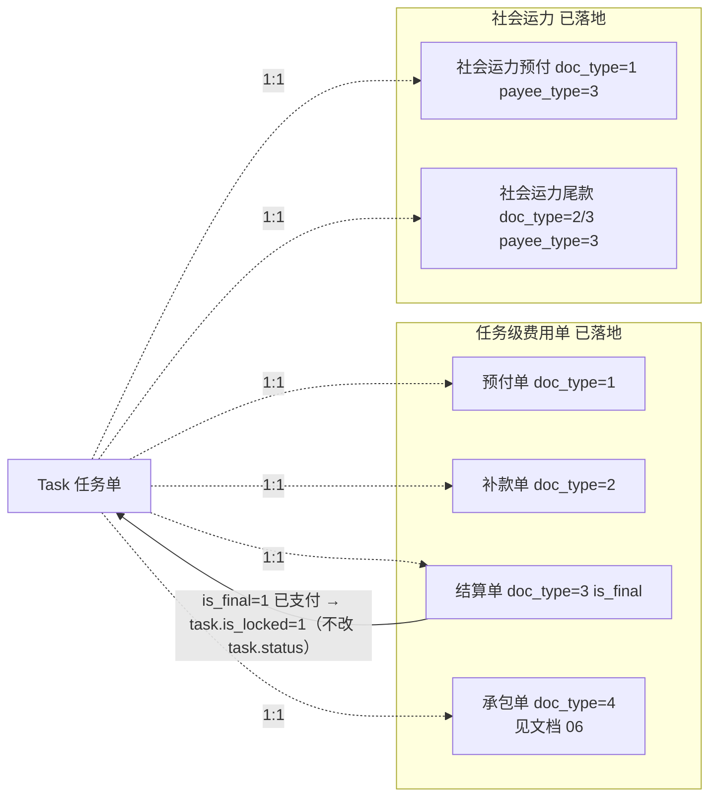

# 任务级费用单演进与社会运力预付尾款

> **所属阶段**：阶段六 - 财务结算模块
>
> **文档状态**：R1~R3 已落地（`cadcc0c`）——字段补齐、审计事件流、锁定编排、承包单已上线；R4（与承运商对账/司机工资联动）待实现
>
> **创建日期**：2026-05-19
>
> **最近更新**：2026-07-06（同步落地实况：审计/锁定/幂等字段已 ALTER；`pay_doc` 改为锁定 `task.is_locked` 而非 `task.status` 5→6；新增承包单 `doc_type=4`，独立成文见 `06`）
>
> **优先级**：高（与既有代码兼容、且为承运商对账提供扣减基础）
>
> **关联文档**：
>
> - 同目录 [00.模块总览](00.模块总览.md)
> - 同目录 [01.财务单据体系与业务单据联动设计](01.财务单据体系与业务单据联动设计.md)
> - 同目录 [03.承运商侧-对账与结算](03.承运商侧-对账与结算.md)
> - 同目录 [04.自有司机工资单](04.自有司机工资单.md)
> - 同目录 [06.任务级承包单与司机承包结算](06.任务级承包单与司机承包结算.md)
> - [06.运营调度模块/02.运单与任务单状态机联动设计](../06.运营调度模块/02.运单与任务单状态机联动设计.md)

## 一、文档定位

本文做两件事：

1. **演进既有 [`biz_task_finance_doc`](../../../../backend/app/modules/client/models/task/task_finance_doc.py)**：把现有"任务级预付/补款/结算"对接到通用基座（[01.通用基座](01.财务单据体系与业务单据联动设计.md)），保持向后兼容，**不推倒重来**；
2. **扩展社会运力预付/尾款**：复用同一表 + 同一服务，通过 `payee_type=3 其他` 或新增枚举值承载。

并明确"任务级单据"与"承运商对账"/"司机工资单"的边界。

> 第三类演进——**承包单 `doc_type=4`**（承包制司机的周期承包费）也复用 `biz_task_finance_doc`，但业务规则独立，已拆分到同目录 [06.任务级承包单与司机承包结算](06.任务级承包单与司机承包结算.md)。本文其余章节仍以预付/补款/结算/社会运力为主线。

## 二、现状摘要（一图流）



> ✅ 现状（2026-07，`cadcc0c` 后）：以下条目均已落地。

| 项 | 现状 | 评估 |
|----|------|------|
| 表结构 [`biz_task_finance_doc`](../../../../backend/app/modules/client/models/task/task_finance_doc.py) | 已 ALTER 补齐 `direction` / `doc_kind` / `is_locked` / `locked_at` / `locked_by_doc_id` / `idempotency_key` / `period_start` / `period_end` 等，与基座 §01 §2.1 **完全对齐** | ✅ `20260703_001` |
| 状态机 [`task_finance_service`](../../../../backend/app/modules/client/services/task/task_finance_service.py) | 统一走 `FinanceStateMachine`（`doc_kind='task_finance'`，可用状态集 `{0,1,2,3,4}`） | ✅ |
| `pay_doc` 支付后锁定 | `is_final=1` 支付 → `LockOrchestrator.lock_task_if_final` 置 `task.is_locked=1`（**不再驱动 task.status 5→6**） | ✅ |
| `cancel_payment`(3→2) / `force_cancel`(3→4) | 高权限撤销已支付单据，先 `unlock_task` 解锁 | ✅ |
| `cancel_doc`(未支付→4) / `cancel_all_unpaid_docs` | 未支付撤销 + 随任务取消批量撤销 | ✅ |
| 审计事件流 | 每次状态切换经 `_change_status` 写 `biz_finance_doc_event`；`list_events` 可查 | ✅ |
| `is_locked` 联动 | `LockOrchestrator`（`lock_task_if_final` / `unlock_task`） | ✅ |
| 承包单 `doc_type=4` | 收款人限司机、必填结算周期、与结算单互斥；配套 `biz_driver_settlement_config` | ✅（详见 `06`） |
| 幂等 | `idempotency_key` 字段已备；网关强制下发为远期 | 🕒 字段就绪 |

## 三、演进策略

### 3.1 原则

| 原则 | 说明 |
|------|------|
| **零数据迁移** | 现有数据保留，新字段 ALTER 时 DEFAULT NULL / 0；保留 `biz_task_finance_doc` / `biz_task_finance_item` 表名 |
| **服务接口稳定** | 现有 service 方法保留；新增方法承接通用基座能力 |
| **向后兼容 API** | 现有 `POST /business/task/{id}/finance-doc` 等接口保留 |
| **逐步对接基座** | 状态切换 → 写事件、支付 → 触发锁定，分两步上线 |

### 3.2 路径

| 阶段 | 动作 | 风险 |
|------|------|------|
| **R1** | ALTER 表字段：增 `direction` / `is_locked` / `locked_at` / `locked_by_doc_id` / `idempotency_key` / `period_start` / `period_end`（默认值兼容）；新建 `biz_finance_doc_event` 表 | 无（向后兼容） |
| **R2** | service 层在每次状态切换补写事件；`pay_doc` 内联调用 `lock_orchestrator.lock_task` | 兼容性测试 |
| **R3** | 新增"社会运力预付/尾款"枚举值与服务方法 | 与现有冲突点小 |
| **R4** | 与承运商对账（[03](03.承运商侧-对账与结算.md)）和司机工资单（[04](04.自有司机工资单.md)）的联动闸口落地（候选排除、is_recon_bound 校验） | 需要先有 03/04 |
| **R5**（远期） | 幂等键投入使用；多账户拆分 | 远期 |

## 四、表演进清单

### 4.1 `biz_task_finance_doc` 字段补齐

| 字段 | 类型 | 是否新增 | 默认值 | 用途 |
|------|------|---------|--------|------|
| 现有字段 | - | - | - | 全部保留 |
| `direction` | TinyInt | 新增 | 2 | 收/付方向；任务级单据固定 2 付款 |
| `is_locked` | TinyInt | 新增 | 0 | 是否锁定（已支付且加入承运商对账时为 1） |
| `locked_at` | DateTime | 新增 | NULL | 锁定时间 |
| `locked_by_doc_id` | BigInt | 新增 | NULL | 锁定来源单据 ID（承运商结算单 id） |
| `idempotency_key` | VARCHAR(64) | 新增 | NULL | 幂等键，远期写库唯一索引 |
| `period_start` / `period_end` | DateTime | 新增 | NULL | 任务级单据不强制周期，但承运商对账模式下使用 |

### 4.2 `biz_task_finance_item`（费用项明细）

保持不变。明细子表与基座无关，沿用既有结构。

### 4.3 `payee_type` 枚举扩展

现有 [`task_finance_doc.payee_type`](../../../../backend/app/modules/client/models/task/task_finance_doc.py) L48-L51 定义：

```text
1-司机 2-承运商 3-其他
```

本期不变。社会运力按 `payee_type=3` + `payee_name` 自由文本 + 远期对接"社会运力池"模块后改为 `payee_type=4 社会运力司机`。

## 五、社会运力预付/尾款（扩展）

### 5.1 业务背景

社会运力是非签约承运商的临时运力（如个体司机、平台拉单），与签约承运商对账模式不同：

| 维度 | 签约承运商 | 社会运力 |
|------|----------|---------|
| 关系 | 长期合作 | 单次/短期 |
| 结算 | 月结 / 票结，纳入承运商对账 | 1 任务 1 结算，必现金或即时转账 |
| 数据 | 主档 `biz_carrier` | `task.social_driver_id`（远期独立池） |
| 风险 | 公司信用风险低 | 现金流出风险高，需预付 + 尾款两段 |

### 5.2 业务模式

```text
任务派车（task→1）
  ↓ 即时
预付单 doc_type=1（社会运力预付） payee_type=3 ──支付─→  司机收钱开车
  ↓ 在途
[可选] 补款单 doc_type=2 payee_type=3 ──支付─→  司机收油补
  ↓ 签收（task→5）
尾款单 doc_type=3 is_final=1 payee_type=3 ──支付─→  司机收尾款；task 5→6
```

### 5.3 数据约定

| 字段 | 社会运力填法 | 备注 |
|------|------------|------|
| `payee_type` | 3 其他 | 远期改为 4 |
| `payee_id` | NULL | 远期对接社会运力池后填 ID |
| `payee_name` | 司机姓名（自由文本） | 必填 |
| `payee_account_type` | 3 自由文本 | 或 0 未指定 |
| `payee_account_id` | NULL | - |
| `payee_bank_name` / `payee_bank_account_masked` | 自由文本 | 必填（合规） |
| `pay_method` | 4-现金 / 5-微信 / 6-支付宝 / 1-银行转账 | 必填 |

### 5.4 业务规则

| 规则 | 说明 |
|------|------|
| 派车前可建预付 | `task.status >= 1` 即可，与签约承运商相同 |
| 强制凭证 | `pay_method ∈ {4,5,6}` 时 `pay_voucher_url` 必填，便于稽核 |
| 不进入承运商对账 | 候选过滤排除 `payee_type=3` 任务 |
| 与签约承运商在同一报表 | 通过 `task.carrier_type=3 社会运力` 区分；财务报表按 carrier_type 切片 |

### 5.5 与现有服务的复用

完全复用 [`task_finance_service`](../../../../backend/app/modules/client/services/task/task_finance_service.py) 的所有方法，**不新增专用服务**。仅在以下点加规则：

```python
# services/task/task_finance_service.py
def _validate_payee_for_social_capacity(payload):
    """payee_type=3 + task.carrier_type=3 时必填 payee_name 与 payee_bank_account_masked"""
```

## 六、与其他单据的边界（再强调）

| 单据 | 用于 | 与任务级单据互斥? |
|------|------|------------------|
| 任务级预付单 doc_type=1 | 派车前/装车前付款 | 否，可并存 |
| 任务级补款单 doc_type=2 | 装车后付款 | 否 |
| 任务级最终结算单 doc_type=3 `is_final=1` | 单任务最终结清，支付后锁定 `task.is_locked=1`（不改 `task.status`） | 与"承运商对账"互斥（一张任务二选一） |
| 任务级非最终结算单 doc_type=3 `is_final=0` | 部分结算（罕见） | 否 |
| **任务级承包单 doc_type=4（见 [06](06.任务级承包单与司机承包结算.md)）** | 承包制司机周期承包费 | 与"任务级结算单"互斥（同任务不可同时有有效结算单） |
| **承运商对账单（[03](03.承运商侧-对账与结算.md)）** | 跨任务批量结清 | 与"任务级最终结算单"互斥 |
| **司机工资单（[04](04.自有司机工资单.md)）** | 自有司机周期发薪 | 与任务级预付/补款可并存；扣减规则见 [04](04.自有司机工资单.md) §五 |
| **社会运力预付/尾款** | 社会运力任务的两段付款 | 复用本表，不进入承运商对账 |

## 七、对接通用基座的具体改造点

### 7.1 服务层

| 文件 | 改动 |
|------|------|
| `services/task/task_finance_service.create_doc` | 写 `direction=2`；写 `biz_finance_doc_event`（事件类型 1-创建） |
| `services/task/task_finance_service.update_doc` | 草稿态编辑后写事件 |
| `services/task/task_finance_service.submit_doc` | 0→1 写事件（事件类型 2-提交） |
| `services/task/task_finance_service.approve_doc` | 1→2 写事件（3-审批通过） |
| `services/task/task_finance_service.reject_doc` | 1→4 写事件（4-审批拒绝） |
| `services/task/task_finance_service.pay_doc` | 2→3 写事件（6-支付）；调用 `lock_orchestrator.lock_task_if_final` 若 `doc_type=3 is_final=1` 锁定任务（不改 task.status） |
| `services/task/task_finance_service.cancel_doc` / `force_cancel` / `cancel_payment` | 撤销未支付（8）/ 强制撤销已支付（9）/ 撤销支付（7）写事件；`force_cancel` 与 `cancel_payment` 经 `lock_orchestrator.unlock_task` 解锁任务 |
| `services/task/task_finance_service.cancel_all_unpaid_docs` | 批量写事件（8 撤销，原因=`task force_cancel by {operator}`） |
| `services/task/task_finance_service` 新增 `withdraw_to_draft` | 2→0 退回修改，写事件（5-退回） |
| `services/finance/linkage/lock_orchestrator.py` 新增 `lock_task_if_final` | 当 `doc_type=3 is_final=1 status=3` 时设置 `task.is_locked=1`、`locked_by_doc_id=doc.id` |
| 候选排除（承运商对账） | [03](03.承运商侧-对账与结算.md) §3.4 已说明：候选过滤"已存在已支付的 doc_type=3 is_final=1" |
| 候选排除（司机工资单） | [04](04.自有司机工资单.md) §三：候选不排除 |

### 7.2 Schema 改动

| Schema | 改动 |
|--------|------|
| `TaskFinanceDocOut` | 增加 `direction` / `isLocked` / `lockedByDocId` |
| `TaskFinanceDocCancelRequest` | `reason` 改为强制 + 最少 5 字 |
| `TaskFinanceDocCreate` | 当 `task.carrier_type=3 社会运力` 时校验 §5.4 字段集 |

### 7.3 API 路径

保持现有 `/business/task/{task_id}/finance-doc/*`；同时支持新的通用路径别名：

```text
旧（保留）：
POST   /business/task/{task_id}/finance-doc
PUT    /business/task/{task_id}/finance-doc/{doc_id}
POST   /business/task/{task_id}/finance-doc/{doc_id}/pay
POST   /business/task/{task_id}/finance-doc/{doc_id}/cancel

新（与通用基座对齐）：
POST   /api/finance/task-finance                       创建草稿（含 task_id 字段）
POST   /api/finance/task-finance/{id}/submit
POST   /api/finance/task-finance/{id}/approve
POST   /api/finance/task-finance/{id}/reject
POST   /api/finance/task-finance/{id}/withdraw
POST   /api/finance/task-finance/{id}/pay
POST   /api/finance/task-finance/{id}/cancel-pay
POST   /api/finance/task-finance/{id}/cancel
POST   /api/finance/task-finance/{id}/force-cancel
GET    /api/finance/task-finance/{id}/events           # 事件流
```

前端逐步切换，后端两套并存，远期废弃旧路径。

### 7.4 数据库迁移

```sql
ALTER TABLE biz_task_finance_doc
  ADD COLUMN direction TINYINT DEFAULT 2 COMMENT '收/付方向 1-收 2-付',
  ADD COLUMN is_locked TINYINT DEFAULT 0 COMMENT '是否锁定',
  ADD COLUMN locked_at DATETIME NULL,
  ADD COLUMN locked_by_doc_id BIGINT NULL,
  ADD COLUMN idempotency_key VARCHAR(64) NULL,
  ADD COLUMN period_start DATETIME NULL,
  ADD COLUMN period_end DATETIME NULL;

-- 暂不加唯一索引；远期幂等键投入使用后加
-- CREATE UNIQUE INDEX uk_tfd_idem ON biz_task_finance_doc(idempotency_key)
--   WHERE idempotency_key IS NOT NULL;
```

## 八、前端改造点

### 8.1 现有 `views/operation/task/components/task-finance-doc-*`

| 改动 | 内容 |
|------|------|
| 详情抽屉新增"审计事件流"区块 | 复用 `<finance-doc-event-timeline>` |
| 详情头部增加锁定徽章 | `is_locked=1` 时显示"已纳入承运商结算 ###" |
| 创建对话框 | 当 `task.carrier_type=3 社会运力` 时启用 §5.4 字段校验 |
| 操作按钮 | 已审批态新增"退回草稿"；已支付态新增"撤销支付"（高权限） |
| 撤销原因 | 已支付撤销最少 5 字 |

### 8.2 列表筛选

任务费用单列表（`/finance/task-finance`，由现有任务详情子页 + 新独立列表组成）：

| 筛选项 | 说明 |
|------|------|
| 任务号 / 任务名 | 模糊匹配 |
| 单据类型 | 预付/补款/结算 |
| 收款人类型 | 司机/承运商/其他 |
| 状态 | 草稿/待审批/已审批/已支付/已撤销 |
| 是否锁定 | 0/1 |
| 收款人姓名 | 模糊 |
| 时间范围 | 创建/支付时间 |
| `carrier_type` | 自有车/承运商/社会运力 |

### 8.3 社会运力专属 UI

- 创建对话框增加"社会运力模式"标识徽章
- `payee_bank_account_masked` 字段强提示"合规要求必填"
- `pay_method=4 现金` 时强制提示上传现金签收照片

## 九、权限矩阵

沿用现有任务级费用单权限点：

```text
operation:task:finance-doc:list / detail / create / edit / submit / approve /
                              reject / withdraw / pay / cancel-pay /
                              cancel / force-cancel / unlock
```

补充：

| 角色 | 新增能力 |
|------|---------|
| 财务主管 | `cancel-pay` 撤销支付（任务级、需高权限）；`unlock` 解锁 |
| 财务专员 | `withdraw` 已审批退回草稿 |

## 十、测试要点

### 10.1 兼容性

1. **现有数据零迁移**：升级后旧 doc 全部可正常显示、走原流程
2. **现有 API 兼容**：旧路径 `/business/task/{id}/finance-doc/{doc_id}/pay` 行为不变
3. **新事件落表**：升级后任何状态切换写 `biz_finance_doc_event`
4. **锁定字段**：旧 doc `is_locked=NULL` → service 视为 0

### 10.2 任务级最终结算单锁定

5. **`is_final=1` 已支付**：task `is_locked=1`、`locked_at`、`locked_by_doc_id=doc.id`；**不改 `task.status`**（"已结算"枚举已移除）
6. **撤销该结算单**（`cancel_payment` 3→2 或 `force_cancel` 3→4）：task `is_locked=0`、`locked_at=NULL`、`locked_by_doc_id=NULL`
7. **`is_final=0` 已支付**：锁定**不**触发；task 各状态不变

### 10.3 社会运力专项

8. **`payee_type=3` + `carrier_type=3`**：缺 `payee_name` → 422
9. **现金/微信/支付宝支付**：缺凭证 URL → 422
10. **社会运力任务不进入承运商对账候选**：候选过滤排除 `carrier_type=3`

### 10.4 与承运商对账冲突

11. **已存在已支付的 `is_final=1`**：尝试纳入承运商对账候选 → 排除
12. **已挂承运商对账（草稿态）**：尝试创建 `doc_type=3 is_final=1` → 422
13. **预付/补款 允许并存**：纳入对账后扣减项自动写入

### 10.5 与司机工资单互动

14. **任务级预付（payee_type=1 司机）已支付**：纳入司机工资单时自动作为"预付抵扣"扣减
15. **撤销该预付**：工资单已发放则扣减不漂移；草稿态工资单允许重算

### 10.6 审计

16. **创建到撤销**：事件表能拼出完整轨迹（10+ 条事件）
17. **撤销原因长度**：少于 5 字 → 422
18. **批量撤销（cancel_all_unpaid_docs）**：事件原因含 `task force_cancel by {operator}`

## 十一、远期演进锚点

| 远期能力 | 本文档预留 |
|---------|----------|
| 社会运力池模块上线 | `payee_type` 扩展枚举值 4；`payee_id` 关联池 |
| 幂等键投入使用 | 字段已增；远期网关层强制下发 |
| 多账户拆分付款（如部分打银行卡部分打油卡） | 远期改桥接表 `biz_task_finance_doc_pay_split` |
| 财务凭证号 | `approval_no` 已留 |
| 与计费引擎反向校验承运成本 | 创建结算单时若 `actual_amount ≠ task.carrier_cost_amount` 触发警示 |
| 跨任务"调度提成单"（与司机工资单分离） | 可在本表用 `doc_type=4 调度提成`，但建议独立模块，避免单表过载 |
