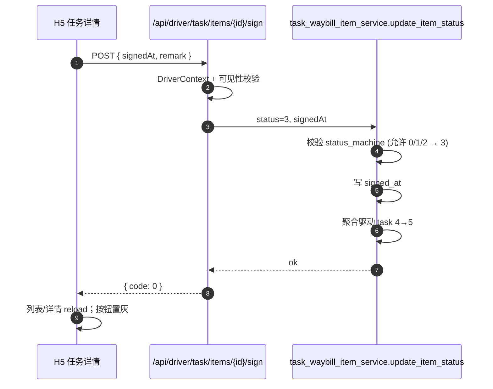

# 回单签收与凭证上传

## 一、范围与一期边界

| 子能力 | v0.1 状态 | 说明 |
|--------|-----------|------|
| item 级签收 | ✅ 已实现 | `POST /task/items/{itemId}/sign` 推动 item 0/1/2→3 |
| 装/卸车照片 | ✅ 已实现 | 复用 `task_loading_record.photo_urls` 字段 |
| 整票回单图片单独落表 | ⏳ 占位 | `POST /task-receipt/upload` 接口已就位，落表表 `biz_task_receipt` v0.2 引入 |
| 电子回单 OCR | 🚧 远期 | 与轻舟回单服务对接 |

## 二、签收主链路



### 签收时的字段写入

- `task_waybill_item.signed_at` = 入参 `signedAt`（默认服务器时间）
- `task_waybill_item.remark` 追加 H5 端备注（若有）
- 当所有 item 都 `status=3` 时：
  - `task.status` 4→5
  - `waybill.status` 由 `WaybillStatusAggregator.aggregate_by_task` 推算

## 三、装/卸车照片

### 3.1 上传时机

- 「确认装车」弹层：可选上传 1-9 张照片，作为本次装车记录的现场凭证
- 「确认到达」弹层：同上，可作为卸车凭证

### 3.2 存储位置

照片 URL 写入 `biz_task_loading_record.photo_urls`（JSON 数组），不单独建表。

```json
{
  "event_type": 1,
  "items": [{ "itemId": 100, "quantity": 1 }],
  "photo_urls": ["https://.../upload/...jpg", "..."]
}
```

### 3.3 文件上传通道

复用 `POST /api/open/files/upload`（与 PC 端共用），返回 `fileUrl` 后再回写到
本接口的请求体；H5 端使用 Vant `Uploader` 组件。

## 四、回单接口（占位）

`POST /api/driver/task-receipt/upload` 一期为占位实现：

- 仅校验当前驾驶员对该 task 的可见性
- 不落表（response 携带 `stored: false` 与提示）
- 待 v0.2 引入 `biz_task_receipt` 后无感升级，前端无需改动

预留表结构草案（v0.2 落地时确认）：

```sql
CREATE TABLE biz_task_receipt (
    id BIGINT PRIMARY KEY AUTO_INCREMENT,
    task_id BIGINT NOT NULL,
    item_id BIGINT NULL COMMENT '可选，挂到 item 级',
    file_url VARCHAR(255) NOT NULL,
    file_type SMALLINT DEFAULT 1 COMMENT '1-图片 2-PDF',
    uploaded_by BIGINT NOT NULL COMMENT 'sys_user.id',
    uploaded_at DATETIME DEFAULT CURRENT_TIMESTAMP,
    remark VARCHAR(255),
    is_deleted SMALLINT DEFAULT 0
);
```

## 五、合规与防舞弊

- **签收时间**：默认取服务器时间，不接受司机端覆盖到未来时间（前端校验 + 后端校验）
- **撤销签收**：必须填写 reason；写入 `item.remark`，留下审计轨迹
- **同一 item 多次签收**：被 `ItemStateMachine.assert_transition` 自动拒绝
- **拍照防伪**：v0.2 引入水印（时间戳 + 司机姓名）；v0.3 接 OCR 校验

## 六、UI 关键点

- 签收按钮：仅当 `task.status === 4 && item.status < 3` 时显示
- 全部签收：详情页顶部"批量签收"快捷动作（循环 sign-item，每次后 reload）
- 撤销签收：单独菜单项，二次确认 + 必填原因
- 上传照片：Vant `Uploader` `max-count="9"`，限定 `accept="image/*"`，单图 <= 5MB
